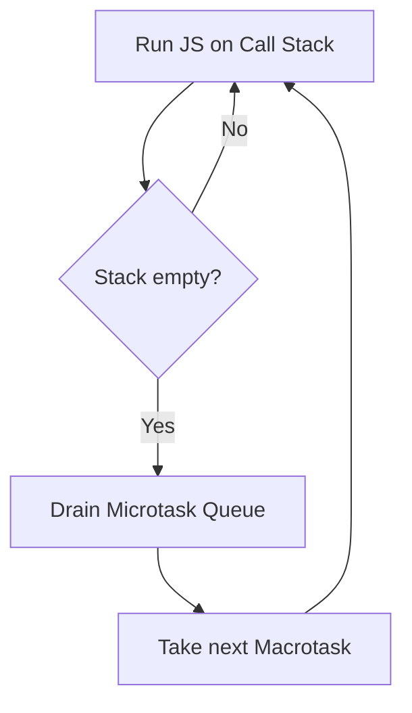
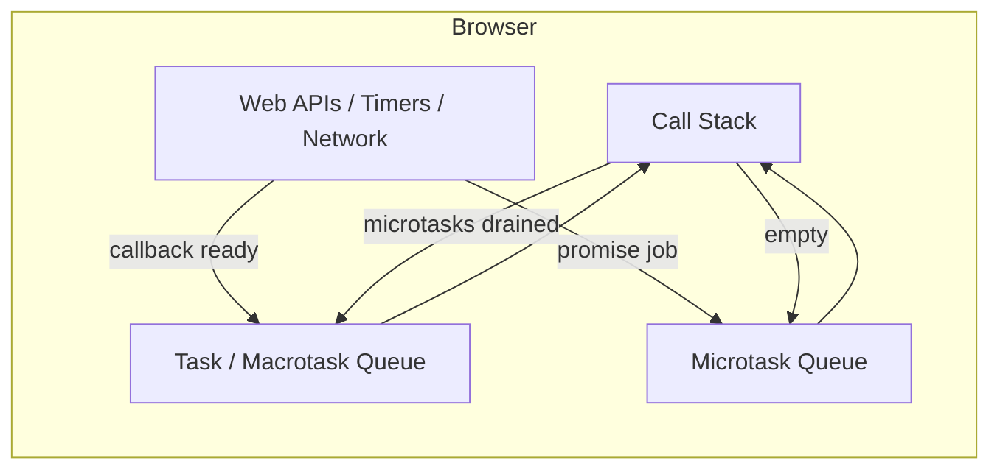

# JavaScript Complete Interview Guide

A production-oriented, interview-focused handbook from fundamentals to advanced topics—useful for frontend, MERN, full-stack, and JavaScript coding interviews.

---

## Table of Contents

1. [Introduction to JavaScript](#1-introduction-to-javascript)
2. [Variables and Data Types](#2-variables-and-data-types)
3. [Operators](#3-operators)
4. [Control Flow](#4-control-flow)
5. [Functions](#5-functions)
6. [Scope and Closures](#6-scope-and-closures)
7. [Hoisting](#7-hoisting)
8. [The `this` Keyword](#8-the-this-keyword)
9. [Objects](#9-objects)
10. [Arrays](#10-arrays)
11. [Strings](#11-strings)
12. [ES6+ Features](#12-es6-features)
13. [The DOM](#13-the-dom)
14. [The Event Loop](#14-the-event-loop)
15. [Promises](#15-promises)
16. [Async/Await](#16-asyncawait)
17. [Error Handling](#17-error-handling)
18. [OOP in JavaScript](#18-oop-in-javascript)
19. [Prototypes and Prototype Chain](#19-prototypes-and-prototype-chain)
20. [Memory Management](#20-memory-management)
21. [Modules](#21-modules)
22. [Advanced Concepts](#22-advanced-concepts)
23. [Functional Programming](#23-functional-programming)
24. [Browser Storage](#24-browser-storage)
25. [Fetch API and AJAX](#25-fetch-api-and-ajax)
26. [Best Practices](#26-best-practices)
27. [Common Interview Questions (100+)](#27-common-interview-questions-100)
28. [Coding Interview Problems (30)](#28-coding-interview-problems-30)
29. [JavaScript Tricky Questions](#29-javascript-tricky-questions)
30. [JavaScript in React](#30-javascript-in-react)
31. [Revision Summaries](#31-revision-summaries)

---

## 1. Introduction to JavaScript

### What is JavaScript?

JavaScript is a **high-level, dynamic programming language** that powers interactivity on the web. Originally built for browsers, it now runs on servers (Node.js), mobile apps, desktops, and more.

**Interview tip:** Say “ECMAScript (ES)” is the *language specification*; JavaScript is the most common *implementation*.

### Short history

- **1995:** Brendan Eich creates Mocha/LiveScript in ~10 days at Netscape; renamed JavaScript for marketing.
- **1997:** ECMA standardizes it as **ECMAScript**.
- **2009:** **Node.js** brings JavaScript to the server.
- **2015:** **ES6 (ES2015)** adds `let`, `const`, classes, modules, promises, arrow functions—modern JS begins.

### How JavaScript works (big picture)

1. You write `.js` source code.
2. A **JavaScript engine** (V8 in Chrome/Node, SpiderMonkey in Firefox, etc.) parses it into an internal representation.
3. The engine optimizes and **executes** code, coordinating with the **host environment** (browser or Node).

**Analogy:** The engine is like a chef reading a recipe (your code), preparing ingredients (data), and cooking (running instructions) while assistants (Web APIs, OS tasks) handle side work.

### JavaScript engine

Engines typically include:

- **Parser:** turns text into an **Abstract Syntax Tree (AST)**.
- **Interpreter:** runs bytecode quickly (baseline execution).
- **JIT compiler:** identifies “hot” code paths and compiles them to faster machine code.
- **Garbage collector:** frees unused memory.

### Compilation vs interpretation

- **Pure interpreter:** reads and runs line-by-line; startup can be fast; steady-state speed may be lower.
- **Ahead-of-time (AOT) compiler:** compiles all code before running; can optimize globally but slower iteration.
- **JavaScript in practice:** engines use **mixed strategies**—not “purely interpreted.”

### JIT compilation

**JIT (Just-In-Time)** means the engine compiles **during execution**, often after profiling shows which functions run often.

**Why it matters in interviews:** JS is often described as “interpreted,” but modern engines **compile hot code** for performance.

### Single-threaded nature

JavaScript in a browser tab (and the main thread in Node’s event loop model) runs **one call stack** at a time for your JS code.

**Common mistake:** Thinking “single-threaded” means the *entire computer* does one thing. Browsers use **other threads** for networking, timers, rendering pipelines—but **your JS callbacks** are scheduled back onto the main thread via the **event loop**.

### Event-driven programming

Programs react to **events**: clicks, keyboard input, HTTP responses, timers, messages.

You register **handlers**; when an event fires, the engine runs the associated callback **when the stack is clear**.

---

## 2. Variables and Data Types

### `var`, `let`, `const`

```javascript
var x = 1;      // function-scoped, hoisted, can be redeclared
let y = 2;      // block-scoped, not redeclarable in same scope
const z = 3;    // block-scoped, binding cannot be reassigned
```

**`const` nuance:** You cannot reassign the **binding**, but if the value is an object, you can still **mutate** its properties.

```javascript
const user = { name: "A" };
user.name = "B"; // OK
user = {};       // TypeError
```

### Comparison table: `var` vs `let` vs `const`

| Feature | `var` | `let` | `const` |
|--------|-------|-------|---------|
| Scope | Function | Block | Block |
| Hoisting | Yes (initializes as `undefined`) | Yes (TDZ until declaration) | Yes (TDZ until declaration) |
| Redeclaration in same scope | Allowed | SyntaxError | SyntaxError |
| Reassignment | Allowed | Allowed | Not allowed |
| Must initialize at declare | No | No | Yes |
| Global object property | Creates on `globalThis` (non-strict nuances exist) | Does not create global property | Does not create global property |

**Best practice:** Prefer **`const`** by default, **`let`** when you must reassign, **avoid `var`** in new code.

### Primitive types

Primitives are **immutable** and compared **by value**:

- `string`
- `number` (IEEE 754 double; includes `NaN`, `Infinity`)
- `bigint`
- `boolean`
- `undefined`
- `symbol`
- `null` (historical bug: `typeof null === "object"`)

### Reference types

Objects (including arrays, functions, dates) are **mutable** and compared **by reference** (unless you compare contents yourself).

```javascript
const a = [1];
const b = [1];
a === b; // false (different objects)
```

### Dynamic typing

Variables are not bound to a type; **values** have types.

```javascript
let x = 5;
x = "hello"; // allowed
```

**Interview tip:** Contrast with TypeScript, which adds **static types at compile time**.

### Type coercion

JS may convert values using **Abstract Equality (`==`)** rules or explicit operations.

```javascript
0 == "0";        // true (string coerced to number)
0 === "0";       // false (no coercion) — prefer ===
[] == false;     // true (tricky)
```

**Best practice:** Use **`===` and `!==`** unless you have a very specific reason.

### `typeof` gotchas

```javascript
typeof NaN;           // "number"
typeof null;          // "object" (legacy)
typeof function(){};  // "function" (special case)
```

---

## 3. Operators

### Arithmetic

`+`, `-`, `*`, `/`, `%`, `**` (power).  
**Note:** `+` also **concatenates** strings if either operand is a string.

```javascript
"5" + 2;   // "52"
"5" - 2;   // 3 (subtraction coerces to number)
```

### Assignment

`=`, `+=`, `-=`, `*=`, `/=`, `&&=`, `||=`, `??=`, etc.

### Comparison

- **`===` / `!==`**: no coercion (preferred).
- **`==` / `!=`**: allows coercion (common interview trap).

### Logical

`&&`, `||`, `!` — also short-circuit:

```javascript
const name = input || "guest"; // if input is falsy, use guest
```

### Nullish coalescing (`??`)

Returns right side only when left is **`null` or `undefined`** (not other falsy values).

```javascript
0 ?? 42;        // 0
null ?? 42;     // 42
undefined ?? 42; // 42
```

**Compare:**

```javascript
0 || 42;  // 42
0 ?? 42;  // 0
```

### Optional chaining (`?.`)

Safely access nested properties / call optional methods.

```javascript
user?.profile?.email;
arr?.[0];
maybeFn?.();
```

### Ternary

`condition ? a : b`

### Spread (`...`) and rest (`...`)

**Spread:** expand iterables/objects.

```javascript
const nums = [1, ...[2, 3]];
const clone = { ...obj, x: 1 };
```

**Rest:** collect remaining arguments/items.

```javascript
function sum(...xs) { return xs.reduce((a,b)=>a+b,0); }
const [first, ...rest] = arr;
```

---

## 4. Control Flow

### `if / else`

Standard branching; favor clarity over cleverness.

### `switch`

Compares with **strict equality** (`===`) internally.

**Common mistake:** Forgetting `break` (fall-through).

### Loops

- `while`, `do...while`
- `for (init; cond; update)`
- `for...of` — values of **iterables** (arrays, strings, Maps, etc.)
- `for...in` — **enumerable property keys** (objects; arrays include indices as strings)

```javascript
for (const v of [10, 20]) console.log(v);
for (const k in { a: 1 }) console.log(k); // "a"
```

**Best practice:** Avoid `for...in` on arrays if order and prototype noise matter; prefer `for...of` or classic `for`.

### `break` and `continue`

`break` exits the nearest loop/switch; `continue` skips to next iteration.

---

## 5. Functions

### Function declarations

Hoisted fully (can be called before textual declaration in its scope).

```javascript
function add(a,b){ return a+b; }
```

### Function expressions

Assigned to a variable; **not** hoisted like declarations.

```javascript
const add = function(a,b){ return a+b; };
```

### Arrow functions

```javascript
const add = (a,b) => a + b;
const id = x => x;
```

### Parameters vs arguments

```javascript
function f(a, b = 2, ...rest) {}
```

### Callbacks

Functions passed to other functions—core to async and array methods.

### Higher-order functions (HOF)

Functions that take/return functions.

```javascript
function withLog(fn) {
  return (...args) => {
    console.log("call", args);
    return fn(...args);
  };
}
```

### Pure functions

Same inputs → same output; **no** observable side effects.

### IIFE

Immediately Invoked Function Expression (legacy module pattern / scope isolation).

```javascript
(function () {
  const secret = 1;
})();
```

### Regular functions vs arrow functions (deep comparison)

| Topic | Regular `function` | Arrow `=>` |
|------|-------------------|------------|
| `this` | Dynamic (call site / binding rules) | Lexical (`this` from enclosing scope) |
| `arguments` | Has `arguments` object | No own `arguments` (use rest `...args`) |
| `new` | Can be used as constructor | Cannot be called with `new` |
| `super` | Can use in class methods | Only in specific class field contexts; arrows don’t bind `super` like methods |
| Use as methods | Typical for object methods needing `this` | Good for short callbacks that should inherit outer `this` |

**When to use arrows:** Inline callbacks, functional style, when you want lexical `this`.

**When to avoid arrows:** Object methods that rely on `this` from the object, prototypes meant to be `new`’d historically.

---

## 6. Scope and Closures

### Global scope

Top-level bindings visible everywhere (modulo modules—**ES modules** have their own scope).

### Function scope (`var`)

`var` is visible throughout the entire function, even if declared inside a block.

### Block scope (`let`, `const`, `class`)

Exists only inside `{ ... }`.

### Lexical scope

Inner functions “see” outer variables based on **where they are written**, not where they run.

```javascript
function outer() {
  const x = 1;
  return function inner() {
    return x;
  };
}
```

### Closures (interview definition)

A closure is a function **together with its surrounding lexical environment** (captured variables).

**Real-world examples**

- **Module pattern / factory:** hide private state.
- **React hooks:** `useEffect` callbacks capture state from render.
- **Memoization:** cache stored in outer scope.
- **Event listeners:** handler remembers config.

```javascript
function makeCounter() {
  let n = 0;
  return {
    inc() { n++; },
    get() { return n; }
  };
}
```

**Common mistake:** Capturing loop variables incorrectly before `let`:

```javascript
// Bug with var + async callbacks
for (var i = 0; i < 3; i++) {
  setTimeout(() => console.log(i), 0); // prints 3,3,3
}
// Fix: use let, or bind IIFE, or pass i as parameter
```

---

## 7. Hoisting

### Variable hoisting

- `var x = 2;` is two phases conceptually: declare `x` (scope start), then assign at runtime.
- Before assignment, `var` reads as `undefined`.

### Function hoisting

```javascript
foo(); // works
function foo() {}
```

Function declarations are hoisted **with body** (creates callable binding early).

### Temporal Dead Zone (TDZ)

From scope start until `let`/`const` initializer runs, accessing the variable throws **`ReferenceError`**.

```javascript
console.log(x); // ReferenceError
let x = 1;
```

**Interview script:** “TDZ exists because `let/const` are hoisted for *temporal* correctness but not initialized—unlike `var`.”

---

## 8. The `this` Keyword

`this` is **not** “where function is defined” for regular functions—it depends on **how the function is called** (with exceptions).

### Global context

Non-strict: `this` may be `globalThis` in sloppy global calls.  
Strict: `this` is `undefined` in a plain function call.

### Function context

```javascript
function f() { return this; }
f();          // undefined (strict) or global (sloppy)
```

### Object methods

```javascript
const obj = { name: "A", greet() { return this.name; } };
obj.greet(); // "A"
```

### Lost `this` when extracting method

```javascript
const greet = obj.greet;
greet(); // undefined this.name (strict)
```

**Fixes:** `obj.greet.bind(obj)`, arrow wrapper, or `greet.call(obj)`.

### Arrow functions

Arrows ignore call-site `this`; use lexical outer `this`.

### Event handlers

DOM handlers often set `this` to the element (classic `onclick="..."` or `addEventListener` with normal function). Arrows won’t.

### `call`, `apply`, `bind`

```javascript
fn.call(ctx, a, b);
fn.apply(ctx, [a, b]);
const g = fn.bind(ctx, a);
```

---

## 9. Objects

### Creation

```javascript
const o1 = {};
const o2 = Object.create(proto);
const o3 = new Constructor();
```

### Properties

Computed keys, shorthand, symbols as keys.

```javascript
const k = "id";
const o = { [k]: 10, name, run() {} };
```

### Methods

Functions stored as property values.

### Destructuring

```javascript
const { name, age = 18 } = user;
const { name: n } = user;
```

### Optional chaining

See Operators section.

### `Object.freeze` vs `Object.seal`

| Method | Add props | Delete props | Change existing values |
|--------|-----------|--------------|------------------------|
| `Object.seal` | No | No | Yes (if writable) |
| `Object.freeze` | No | No | No (shallow freeze) |

**Note:** Freezing is **shallow**—nested objects can still mutate unless frozen too.

---

## 10. Arrays

### Core methods (typical interview set)

- **`map`:** transform each element → new array (**O(n)**).
- **`filter`:** keep elements matching predicate (**O(n)**).
- **`reduce`:** fold to one value (**O(n)**; can implement map/filter).
- **`find` / `findIndex`:** first match (**O(n)** worst case).
- **`some` / `every`:** boolean short-circuit queries (**O(n)** worst).
- **`flat(depth)`:** flatten nested arrays (**O(n)** over total elements with default flattening rules).
- **`sort(compareFn)`:** in-place sort; **default comparator is string-like** (number pitfall!).

```javascript
[10, 2, 1].sort(); // may surprise: [1, 10, 2] as strings
[10, 2, 1].sort((a,b)=>a-b); // numeric ascending
```

**`sort` complexity:** Engine-dependent; often **O(n log n)** for typical cases—treat as interview-safe to say “typically O(n log n)” rather than guarantee.

### Shallow copy patterns

```javascript
const copy = arr.slice();
const copy2 = [...arr];
```

---

## 11. Strings

### Immutability

Strings cannot be changed in place; “mutating” methods return **new** strings.

### Template literals

```javascript
const msg = `Hi ${name}, total: ${(a+b).toFixed(2)}`;
```

### Common methods

`includes`, `startsWith`, `endsWith`, `slice`, `substring`, `split`, `trim`, `replace`, `replaceAll`.

---

## 12. ES6+ Features

High-impact list for interviews:

- **Destructuring** (arrays/objects)
- **Default parameters**
- **Rest/spread**
- **Template literals** + tagged templates
- **Modules** (`import`/`export`)
- **Classes** (syntactic sugar over prototypes)
- **Promises** + **`async/await`**
- **`Symbol`, `Map`, `Set`, `WeakMap`, `WeakSet`**
- **Optional chaining / nullish coalescing**

```javascript
export const x = 1;
export default function f() {}
```

```javascript
import f, { x } from "./mod.js";
```

---

## 13. The DOM

### DOM tree

HTML parsed into a tree of **nodes**: elements, text, comments.

### Selecting elements

```javascript
document.querySelector("#app");
document.querySelectorAll(".item");
document.getElementById("app");
```

### Manipulation

`textContent`, `innerHTML` (XSS risk), `classList`, `setAttribute`, `append`.

### Events

`addEventListener(type, handler, options)`

### Bubbling vs capturing

- **Bubbling:** event travels **up** from target to ancestors (default for most events).
- **Capturing:** travels **down** (`addEventListener(..., true)`).

### Event delegation

Attach one listener on a parent; use `event.target` to handle children—good for dynamic lists.

---

## 14. The Event Loop

### Mental model

1. **Call stack** runs synchronous JS.
2. Async work (timers, network, I/O) is handled by **host APIs** / threads.
3. When ready, tasks enqueue callbacks:
   - **Microtasks:** Promise `.then`, `queueMicrotask`, `MutationObserver`.
   - **Macrotasks:** `setTimeout`, `setInterval`, I/O, UI rendering tasks (browser scheduling details vary).

**Rule of thumb:** **Microtasks run before the next macrotask** when the stack is empty.

### Diagram: high-level flow



### Diagram: queues



**Interview tip:** If asked “what prints first?”—walk through stack → microtasks → next macrotask.

---

## 15. Promises

### States

- **pending**
- **fulfilled** (resolved value)
- **rejected** (reason)

### Creating

```javascript
const p = new Promise((resolve, reject) => {
  resolve(1);
});
```

### Chaining

```javascript
fetch(url)
  .then(r => r.json())
  .then(data => console.log(data))
  .catch(err => console.error(err));
```

### Static combinators

- **`Promise.all`:** fail-fast; rejects if any rejects.
- **`Promise.allSettled`:** wait for all; never rejects (each settled).
- **`Promise.race`:** first settled wins.
- **`Promise.any`:** first fulfilled wins; `AggregateError` if all reject.

---

## 16. Async/Await

### Syntax

`async` functions return a **Promise**. `await` pauses **only the async function**, not the whole thread.

### Error handling

```javascript
try {
  const r = await fetch(url);
  if (!r.ok) throw new Error("HTTP " + r.status);
  const data = await r.json();
} catch (e) {
  console.error(e);
}
```

### Sequential vs parallel

```javascript
// Sequential (slower): B waits for A
const a = await fetchA();
const b = await fetchB();

// Parallel (faster): start both immediately
const [a2, b2] = await Promise.all([fetchA(), fetchB()]);
```

---

## 17. Error Handling

```javascript
try {
  risky();
} catch (e) {
  console.error(e.message);
} finally {
  cleanup();
}
```

```javascript
throw new Error("bad");
```

### Custom errors

```javascript
class ValidationError extends Error {
  constructor(message) {
    super(message);
    this.name = "ValidationError";
  }
}
```

---

## 18. OOP in JavaScript

JS is **prototype-based**, with **`class` syntax** as ergonomic sugar.

### Constructor functions (legacy style)

```javascript
function User(name) {
  this.name = name;
}
User.prototype.sayHi = function () { return "Hi " + this.name; };
```

### ES6 classes

```javascript
class User {
  constructor(name) { this.name = name; }
  sayHi() { return `Hi ${this.name}`; }
}
class Admin extends User {
  sayHi() { return super.sayHi() + " (admin)"; }
}
```

### Pillars (how interviewers map them to JS)

- **Encapsulation:** hide internals (`#privateFields`), closures, module scope.
- **Inheritance:** prototype chain / `extends`.
- **Polymorphism:** same interface, different implementations (method overriding).
- **Abstraction:** expose simple API, hide complexity.

---

## 19. Prototypes and Prototype Chain

Every object has an internal link to another object (its prototype). Property lookup **walks the chain** until found or `null`.

```javascript
const o = {};
o.toString; // inherited from Object.prototype
```

**Classes:** methods live on `Constructor.prototype`; instances delegate to it.

**Interview line:** “Inheritance in JS is **delegation**, not copying.”

---

## 20. Memory Management

### Stack vs heap

- **Stack:** frames for function calls, primitives (often represented compactly), references.
- **Heap:** objects, closures’ captured environments.

### Garbage collection

Modern engines use tracing GC (conceptually: start from roots, mark reachable, sweep unreachable).  
Algorithms vary (generational, incremental, concurrent).

### Memory leaks (common sources)

- Forgotten **event listeners** / intervals.
- **Global caches** that grow forever.
- **Detached DOM** nodes still referenced.
- **Closures** accidentally retaining huge objects.

---

## 21. Modules

### CommonJS (Node legacy default)

```javascript
const fs = require("fs");
module.exports = { x: 1 };
```

- **Dynamic** `require` (historically).
- **Synchronous** loading on Node.

### ES Modules

```javascript
import x from "./a.js";
export const y = 2;
```

- **Static graph** enables tree-shaking (bundlers).
- In browsers: `<script type="module">`.

---

## 22. Advanced Concepts

### Debouncing

Wait until activity stops for `delay` (search-as-you-type).

```javascript
function debounce(fn, delay) {
  let t;
  return (...args) => {
    clearTimeout(t);
    t = setTimeout(() => fn(...args), delay);
  };
}
```

### Throttling

At most once per interval (scroll handlers).

```javascript
function throttle(fn, wait) {
  let last = 0;
  return (...args) => {
    const now = Date.now();
    if (now - last >= wait) {
      last = now;
      fn(...args);
    }
  };
}
```

### Currying

Transform `f(a,b,c)` into `f(a)(b)(c)`.

### Memoization

Cache results by inputs (fibonacci, expensive pure calls).

### Partial application

Fix some arguments early: `const add5 = x => add(5, x)`.

### Composition

`compose(f,g)(x) => f(g(x))` — build pipelines.

---

## 23. Functional Programming

### Immutability

Prefer returning new structures instead of mutating (especially in React state).

### Pure functions / HOF

See Functions section—interviews love “predictable, testable code.”

**When you need side effects:** isolate them (I/O at boundaries).

---

## 24. Browser Storage

| Feature | `localStorage` | `sessionStorage` | Cookies |
|--------|----------------|------------------|---------|
| Lifetime | Until cleared | Tab session | Set by expiry / session |
| Capacity | ~5–10MB typical | ~5MB typical | ~4KB per cookie |
| Sent to server automatically? | No | No | Yes (if not HttpOnly/SameSite tuned) |
| Access from JS | Yes | Yes | Yes (unless HttpOnly) |
| Scope | Per origin | Per tab per origin | Domain/path scoped |

**Security notes:** Never store secrets in any of these for untrusted environments; prefer **HttpOnly secure cookies** for session tokens when appropriate.

---

## 25. Fetch API and AJAX

### `fetch` basics

```javascript
const res = await fetch("/api/users", {
  method: "POST",
  headers: { "Content-Type": "application/json" },
  body: JSON.stringify({ name: "A" }),
});
```

### JSON

```javascript
const data = await res.json();
```

### Errors

`fetch` **does not reject** on HTTP 404/500—check `res.ok` or `res.status`.

---

## 26. Best Practices

### Clean code

- Small functions, descriptive names, avoid deep nesting.
- Prefer explicit returns in complex logic.

### Performance

- Measure first (DevTools Performance).
- Avoid accidental **O(n²)** in loops + `Array.includes`.
- Batch DOM updates; use `DocumentFragment` when relevant.

### Security

- Sanitize/escape when using `innerHTML`.
- Avoid `eval`.
- CSRF/XSS awareness in full-stack roles.

### Maintainability

- Modules, consistent style, linters/formatters, tests for critical logic.

---

## 27. Common Interview Questions (100+)

> **How to use this section:** read the question aloud, answer in your own words, then compare.  
> The numbered items below are **flash-card** answers (dense recall). For **full-sentence** answers you can deliver in a real interview, study the **model answers** first.

### Model answers (how to explain out loud)

**Explain the event loop in one minute.**  
JavaScript runs your code on a **single call stack**. When something asynchronous finishes—like a timer, network response, or a resolved promise—the runtime does not interrupt the stack mid-function. Instead it queues a **callback**. When the stack becomes empty, the engine first **drains the microtask queue** (for example `Promise.then` jobs), then takes the next **macrotask** (for example a `setTimeout` callback). That pattern repeats. So synchronous code always finishes before pending promise reactions run, and promise reactions usually run before the next timer—unless you are in environments with extra queues like Node’s `process.nextTick`, which you should mention as “even higher priority than ordinary microtasks” in Node-specific interviews.

**Explain closures with a real use case.**  
A **closure** is a function plus the variables from outer scopes that it still “remembers” after those outer functions returned. I use closures when I need **private state** without classes—for example a `createCounter()` that returns `{ inc, get }` where `n` is not exposed—or when I attach **event listeners** that need configuration from setup time. Interviewers often probe whether you know the **loop + `var` bug**: `var` has one binding per function, so async callbacks can all see the final value; `let` creates a binding per loop iteration, which fixes it.

**Explain `this` without memorizing tables.**  
For a normal function, `this` is determined by **how the function is called**: as a method (`obj.f()`), plain call (`f()`), with `new`, or via `call`/`apply`/`bind`. For an **arrow function**, `this` is **lexical**: it uses the `this` value of the enclosing scope where the arrow was defined. That is why arrows are great for callbacks inside a class field or method when you want the outer `this`, and why they are a poor default for object methods that need their own `this`.

**Explain Promises vs async/await.**  
A Promise is a **standardized placeholder** for a future value. Chaining `then` builds a pipeline and routes errors to `catch`. `async/await` is **syntax** that compiles to Promises: `await` pauses the **async function** until the Promise settles, but it does not block the thread—other work still runs. Error handling parallels synchronous code with `try/catch`. For multiple independent requests I would run them with `Promise.all` instead of awaiting sequentially.

**Explain the prototype chain.**  
When I read `obj.x`, the engine looks for `x` on `obj`. If it is missing, it follows the internal link to its **prototype**, then that object’s prototype, until `null`. That is why `obj.toString` “exists” even on `{}`—it is inherited. Classes are mostly **syntactic sugar** on top of this: methods live on `Constructor.prototype`, and instances delegate to that object.

### Beginner (1–35)

**Q1.** What is JavaScript?  
**A.** A high-level, dynamic language standardized as ECMAScript; runs in browsers and on servers via engines like V8.

**Q2.** What is ECMAScript?  
**A.** The official specification of the JavaScript language; new features arrive as yearly ES releases.

**Q3.** What is Node.js?  
**A.** A JavaScript runtime built on V8 for server-side programs, tooling, and scripting.

**Q4.** Difference between `let`, `const`, and `var`?  
**A.** `var` is function-scoped and allows redeclaration; `let/const` are block-scoped; `const` prevents rebinding.

**Q5.** What is hoisting?  
**A.** A mental model where declarations are processed before execution: `var` initializes `undefined`; `function` declarations are fully hoisted; `let/const` enter TDZ.

**Q6.** What is TDZ?  
**A.** The period before a `let/const` line executes where accessing the variable throws `ReferenceError`.

**Q7.** What are primitives?  
**A.** Immutable value types: string, number, bigint, boolean, undefined, symbol, null (with `typeof` quirks).

**Q8.** Why is `typeof null` “object”?  
**A.** A historical bug in the first JS implementation; still preserved for backward compatibility.

**Q9.** Difference between `==` and `===`?  
**A.** `==` coerces types; `===` does not—prefer `===`.

**Q10.** What is coercion?  
**A.** Implicit type conversion performed by operations like `==`, `+`, or `Number(x)`.

**Q11.** What is `NaN`?  
**A.** “Not a Number” from invalid numeric operations; `NaN !== NaN`; use `Number.isNaN`.

**Q12.** Difference between `undefined` and `null`?  
**A.** `undefined` means uninitialized/missing; `null` is an explicit empty assignment (loosely).

**Q13.** What is `const` immutability?  
**A.** The variable binding is immutable; object contents may still change unless deep-frozen.

**Q14.** What is a closure?  
**A.** A function that retains access to outer lexical variables after the outer function returns.

**Q15.** What is `this` in JS?  
**A.** A runtime binding to an execution context; depends on call style for normal functions; lexical for arrows.

**Q16.** How do you manually set `this`?  
**A.** `call`, `apply`, `bind`.

**Q17.** What is an arrow function?  
**A.** A concise function with lexical `this` and no `arguments` object.

**Q18.** What is an IIFE?  
**A.** Immediately invoked function expression used to create a private scope.

**Q19.** What is a callback?  
**A.** A function passed to another to run later.

**Q20.** Synchronous vs asynchronous?  
**A.** Sync blocks until done; async schedules continuation and returns control to caller.

**Q21.** What is the event loop?  
**A.** Mechanism coordinating call stack, tasks, and microtasks for non-blocking concurrency on the main thread.

**Q22.** What is a Promise?  
**A.** An object representing eventual completion/failure with standardized `.then/.catch` APIs.

**Q23.** What does `async/await` do?  
**A.** Syntactic sugar over Promises, letting you write async code with `try/catch`.

**Q24.** Why does `fetch` not throw on 404?  
**A.** It resolves a Response; HTTP errors are represented by status codes—check `res.ok`.

**Q25.** What is JSON?  
**A.** A string format for data interchange; parsed with `JSON.parse`, serialized with `JSON.stringify`.

**Q26.** What is DOM?  
**A.** Browser’s in-memory tree representation of HTML for programmatic access.

**Q27.** What is event bubbling?  
**A.** Events propagate from target element upward by default.

**Q28.** What is event delegation?  
**A.** One listener on a parent handles events from children via `event.target`.

**Q29.** Difference `textContent` vs `innerText`?  
**A.** `textContent` is raw text; `innerText` considers CSS rendering and can trigger reflow.

**Q30.** `map` vs `forEach`?  
**A.** `map` returns a new array; `forEach` returns `undefined` (side effects only).

**Q31.** `slice` vs `splice`?  
**A.** `slice` non-mutating copy range; `splice` mutates in place.

**Q32.** What is immutability?  
**A.** Not changing data in place; create new values.

**Q33.** What is `use strict`?  
**A.** Opt-in stricter mode that catches more errors and tightens `this` rules in functions.

**Q34.** What is a module?  
**A.** A file with explicit imports/exports forming a dependency graph.

**Q35.** Difference CommonJS vs ESM?  
**A.** `require/module.exports` vs `import/export`; ESM supports static analysis/tree-shaking.

### Intermediate (36–75)

**Q36.** Lexical vs dynamic scope?  
**A.** JS uses lexical (static) scope based on source structure, not caller chain.

**Q37.** Explain prototype chain lookup.  
**A.** `obj.prop` checks `obj`, then its prototype, recursively until `null`.

**Q38.** What does `Object.create` do?  
**A.** Creates a new object with a specified prototype.

**Q39.** Difference `class` and constructor function?  
**A.** `class` is mainly syntactic sugar with clearer inheritance syntax.

**Q40.** What are symbols used for?  
**A.** Unique property keys, avoiding name collisions; used by built-ins (iterators).

**Q41.** Iterable vs array-like?  
**A.** Iterables implement `Symbol.iterator`; array-likes have indexed elements + length but may not iterate.

**Q42.** `for...in` pitfalls?  
**A.** Includes enumerable inherited properties unless filtered; string keys for array indices.

**Q43.** What is shallow vs deep copy?  
**A.** Shallow duplicates top level; nested objects shared; deep clones nested structure.

**Q44.** How do engines optimize JS?  
**A.** Parsing, bytecode, profiling, JIT compiling hot functions, inline caches, hidden classes.

**Q45.** Microtasks vs macrotasks?  
**A.** Microtasks drain fully before the next macrotask (Promises vs timers, generally).

**Q46.** What is `requestAnimationFrame`?  
**A.** Browser API scheduling work before repaint—good for smooth animations.

**Q47.** `Promise.all` vs `allSettled`?  
**A.** `all` rejects early; `allSettled` returns outcomes for every input promise.

**Q48.** `Promise.race` vs `any`?  
**A.** `race` first settled; `any` first fulfilled (or aggregate error).

**Q49.** Error: “Cannot access before initialization”?  
**A.** TDZ for `let/const` (or class).

**Q50.** What is function arity?  
**A.** Number of parameters; `fn.length` counts parameters before rest/default quirks.

**Q51.** Default parameter evaluation timing?  
**A.** Evaluated at call time when omitted, in own scope (not outer var shadowing older pitfalls).

**Q52.** What is TDZ for parameters?  
**A.** Later parameters can’t read earlier parameters’ default expressions incorrectly—edge cases exist; know defaults run left-to-right.

**Q53.** Explain destructuring defaults.  
**A.** `const { a = 1 } = obj` applies default when `a` is `undefined`.

**Q54.** `Object.freeze` shallow meaning?  
**A.** Only top-level properties frozen; nested objects still mutable.

**Q55.** What is spreading a string?  
**A.** `[...'ab']` → `['a','b']`.

**Q56.** Tagged templates?  
**A.** `fn`strings` calls `fn` with template raw/cooked strings + interpolations.

**Q57.** `Array.from` use case?  
**A.** Convert iterables/array-likes to real arrays.

**Q58.** `Set` vs `Array` for uniqueness?  
**A.** `Set` gives O(1) average insertion/lookup for membership vs scanning arrays.

**Q59.** Big-O of `includes` on array?  
**A.** O(n) linear scan; use `Set` for many queries on static data.

**Q60.** Why sort bugs with numbers?  
**A.** Default sort converts to strings unless comparator provided.

**Q61.** Stable sort?  
**A.** Modern engines usually stable; don’t rely on unstable behavior in interviews—state comparator defines order.

**Q62.** `var` in loops + timeouts?  
**A.** One shared binding → classic closure bug; use `let`.

**Q63.** What is memoization tradeoff?  
**A.** Speed vs memory; stale cache if inputs include changing objects by reference.

**Q64.** Pure function benefits?  
**A.** Easier testing, reasoning, parallelization, caching.

**Q65.** What is higher-order function?  
**A.** Accepts/returns functions (`map`, `filter`, decorators).

**Q66.** Explain currying benefit.  
**A.** Partial configuration, reusable specialized functions.

**Q67.** Compose vs pipe?  
**A.** Compose applies right-to-left; pipe left-to-right (convention).

**Q68.** `WeakMap` keys?  
**A.** Must be objects; keys are weakly held—good for auxiliary metadata without leaks.

**Q69.** `try/finally` with `return`?  
**A.** `finally` runs before the return completes—can override return in some languages; in JS `finally` return can override try’s return (know for quizzes).

**Q70.** Custom `instanceof` story?  
**A.** Checks prototype chain against `Ctor.prototype`.

**Q71.** `new` operator steps?  
**A.** Create object; set prototype; bind `this`; run constructor; return object unless primitive returned.

**Q72.** What is a polyfill?  
**A.** Code implementing newer APIs on older environments.

**Q73.** What is transpilation?  
**A.** Source-to-source compile (Babel): ESNext → older JS.

**Q74.** Tree shaking requirements?  
**A.** ESM static imports + bundler analysis + side-effect-free modules.

**Q75.** `globalThis`?  
**A.** Cross-environment reference to global object (`window`, `global`, `self`).

### Advanced (76–105)

**Q76.** Explain hidden classes (V8 concept).  
**A.** Objects with same property layout share hidden class for faster property access.

**Q77.** Inline caches?  
**A.** JIT caches observed types at call sites to speed repeated operations.

**Q78.** Deoptimization triggers?  
**A.** Type instability, megamorphic call sites, eval, certain patterns defeating assumptions.

**Q79.** What is structured cloning?  
**A.** Algorithm used by `postMessage`/`structuredClone` copying many object types (not functions).

**Q80.** `Proxy` use cases?  
**A.** Validation, logging, reactive systems, mocking.

**Q81.** `Reflect` purpose?  
**A.** Default forwarding meta-operations usable with proxies.

**Q82.** Generator functions?  
**A.** `function*` yields lazy iteration; integrates with `for...of`.

**Q83.** Async iterators?  
**A.** `Symbol.asyncIterator` for streams with `for await...of`.

**Q84.** Top-level await (modules)?  
**A.** `await` at module scope blocks module evaluation graph.

**Q85.** Event loop in Node vs browser differences?  
**A.** Similar concepts; Node has phases (timers, I/O callbacks, check, close) and `process.nextTick` microtask-like queue (ordering nuances).

**Q86.** `setImmediate` vs `setTimeout(0)` in Node?  
**A.** Different scheduling phases—interview detail varies; say “phase ordering differs.”

**Q87.** What is a race condition in async UI?  
**A.** Later requests resolve faster and overwrite earlier correct state—use abort controllers or sequence ids.

**Q88.** AbortController with fetch?  
**A.** Cancels fetch when signal aborted.

**Q89.** How to avoid floating point surprises?  
**A.** Use integers (cents), `decimal.js`, or aware formatting—0.1+0.2≠0.3.

**Q90.** What is ReDoS?  
**A.** Regex catastrophic backtracking causing CPU spikes—validate patterns.

**Q91.** `with` statement?  
**A.** Deprecated/bad practice; not available in strict mode—wrecks optimization.

**Q92.** `eval` risks?  
**A.** Security + deoptimization + scope leaking.

**Q93.** `Function` constructor risks?  
**A.** Similar to eval if built from user strings.

**Q94.** What is same-origin policy?  
**A.** Browser isolation of documents by origin unless CORS allows.

**Q95.** CORS preflight?  
**A.** OPTIONS request for non-simple cross-origin requests.

**Q96.** CSRF basics?  
**A.** Malicious site triggers authenticated actions on another site—mitigate with tokens, SameSite cookies.

**Q97.** XSS basics?  
**A.** Inject script via untrusted HTML; escape/sanitize + CSP.

**Q98.** Content Security Policy?  
**A.** Browser policy restricting script sources.

**Q99.** Why immutability helps React?  
**A.** Easier change detection and predictable renders with shallow compares.

**Q100.** Describe fiber/concurrency at high level?  
**A.** React can interrupt rendering work—understanding scheduling helps with async state stories (framework-level).

**Q101.** What is a temporal dead zone in parameters? (edge)  
**A.** Accessing parameter before initialization in its own default expression errors.

**Q102.** `new.target`?  
**A.** Meta-property identifying how function was invoked (construct vs call).

**Q103.** `Symbol.species`?  
**A.** Lets subclasses control constructor for derived collections.

**Q104.** Iterator protocol?  
**A.** `next()` returns `{ value, done }`.

**Q105.** What is a macrotask in browsers commonly?  
**A.** Timer callbacks, message events, rendering tasks scheduled as tasks—exact ordering is host-defined but exercises follow patterns.

---

## 28. Coding Interview Problems (30)

For each problem: know **edge cases**, **complexity**, and **mutate vs new**.

### 1) Reverse string

```javascript
const rev = s => [...s].reverse().join(""); // O(n) time, O(n) extra space
// Two-pointer in place on char array: O(n) time, O(n) for array of chars
const rev2 = s => {
  const a = [...s];
  for (let i = 0, j = a.length - 1; i < j; i++, j--) [a[i], a[j]] = [a[j], a[i]];
  return a.join("");
};
```

**Best:** array buffer or two-pointer on array of chars.

### 2) Palindrome check

```javascript
const isPal = s => {
  const t = s.toLowerCase().replace(/[^a-z0-9]/g, "");
  return t === [...t].reverse().join("");
};
```

### 3) Anagram grouping

```javascript
function groupAnagrams(strs) {
  const m = new Map();
  for (const s of strs) {
    const k = [...s].sort().join("");
    if (!m.has(k)) m.set(k, []);
    m.get(k).push(s);
  }
  return [...m.values()];
}
// Time: O(n * k log k) where k is max string length
```

### 4) Flatten array

```javascript
function flat(arr, d = Infinity) {
  return arr.flat(d);
}
function flatIter(a) {
  const out = [], st = [...a];
  while (st.length) {
    const x = st.pop();
    if (Array.isArray(x)) st.push(...x);
    else out.push(x);
  }
  return out.reverse();
}
```

### 5) Deep clone (safe JSON subset)

```javascript
function deepCloneJson(x) { return JSON.parse(JSON.stringify(x)); } // loses Date/Map/functions
```

### 6) Deep clone (structured clone)

```javascript
function deepClone(x) { return structuredClone(x); } // modern environments
```

### 7) Debounce

See Advanced Concepts section.

### 8) Throttle

See Advanced Concepts section.

### 9) Unique array

```javascript
const uniq = a => [...new Set(a)]; // O(n)
```

### 10) Frequency map

```javascript
function freq(a) {
  const m = new Map();
  for (const x of a) m.set(x, (m.get(x) ?? 0) + 1);
  return m;
}
```

### 11) Two sum (indices)

```javascript
function twoSum(nums, target) {
  const seen = new Map();
  for (let i = 0; i < nums.length; i++) {
    const need = target - nums[i];
    if (seen.has(need)) return [seen.get(need), i];
    seen.set(nums[i], i);
  }
}
// O(n) time, O(n) space
```

### 12) Merge sorted arrays

```javascript
function merge(a, b) {
  const out = [];
  let i = 0, j = 0;
  while (i < a.length && j < b.length) out.push(a[i] <= b[j] ? a[i++] : b[j++]);
  return out.concat(a.slice(i), b.slice(j));
}
// O(n+m)
```

### 13) Binary search

```javascript
function bisect(a, t) {
  let lo = 0, hi = a.length - 1;
  while (lo <= hi) {
    const mid = (lo + hi) >> 1;
    if (a[mid] === t) return mid;
    if (a[mid] < t) lo = mid + 1;
    else hi = mid - 1;
  }
  return -1;
}
// O(log n)
```

### 14) Clamp

```javascript
const clamp = (x, lo, hi) => Math.max(lo, Math.min(hi, x));
```

### 15) Once function

```javascript
function once(fn) {
  let called = false, v;
  return (...args) => {
    if (called) return v;
    called = true;
    v = fn(...args);
    return v;
  };
}
```

### 16) Curry binary add

```javascript
const curryAdd = a => b => a + b;
```

### 17) Compose

```javascript
const compose = (...fns) => x => fns.reduceRight((v, f) => f(v), x);
```

### 18) Memo fib

```javascript
function fib(n, memo = new Map()) {
  if (n < 2) return n;
  if (memo.has(n)) return memo.get(n);
  memo.set(n, fib(n - 1, memo) + fib(n - 2, memo));
  return memo.get(n);
}
// O(n) time
```

### 19) LRU cache outline (interview)

Use `Map` preserving insertion order: get reinserts to mark recent; evict oldest.

### 20) Promise polyfill (minimal skeleton)

```javascript
function MyPromise(executor) {
  let state = "pending", value, handlers = [];
  const resolve = v => { if (state !== "pending") return; state = "fulfilled"; value = v; run(); };
  const reject = e => { if (state !== "pending") return; state = "rejected"; value = e; run(); };
  function run() {
    queueMicrotask(() => handlers.splice(0).forEach(h => h()));
  }
  this.then = (onF, onR) => new MyPromise((res2, rej2) => {
    const step = () => {
      try {
        if (state === "fulfilled") {
          const next = onF ? onF(value) : value;
          res2(next);
        } else {
          const next = onR ? onR(value) : value;
          rej2(next);
        }
      } catch (e) { rej2(e); }
    };
    if (state === "pending") handlers.push(step); else step();
  });
  executor(resolve, reject);
}
```

**Interview note:** Production polyfills also handle thenables, microtask timing, and rejection chaining precisely.

### 21) `Array.prototype.map` polyfill sketch

```javascript
Array.prototype.mymap = function (fn, thisArg) {
  const out = [];
  for (let i = 0; i < this.length; i++) {
    if (i in this) out[i] = fn.call(thisArg, this[i], i, this);
  }
  return out;
};
```

### 22) `bind` polyfill sketch

```javascript
function myBind(fn, ctx, ...a) {
  return function (...b) {
    return fn.apply(ctx, [...a, ...b]);
  };
}
```

### 23) Deep equal (limited)

```javascript
function deepEqual(a,b) {
  if (a === b) return true;
  if (typeof a !== typeof b) return false;
  if (a == null || b == null) return false;
  if (typeof a !== "object") return false;
  if (Array.isArray(a) !== Array.isArray(b)) return false;
  const ak = Object.keys(a), bk = Object.keys(b);
  if (ak.length !== bk.length) return false;
  return ak.every(k => deepEqual(a[k], b[k]));
}
```

### 24) Sleep

```javascript
const sleep = ms => new Promise(r => setTimeout(r, ms));
```

### 25) Retry with backoff

```javascript
async function retry(fn, { tries=3, base=100 } = {}) {
  let err;
  for (let i = 0; i < tries; i++) {
    try { return await fn(); } catch (e) { err = e; await sleep(base * 2 ** i); }
  }
  throw err;
}
```

### 26) Chunk array

```javascript
function chunk(a, size) {
  const out = [];
  for (let i = 0; i < a.length; i += size) out.push(a.slice(i, i + size));
  return out;
}
```

### 27) Shuffle (Fisher–Yates)

```javascript
function shuffle(a) {
  for (let i = a.length - 1; i > 0; i--) {
    const j = Math.floor(Math.random() * (i + 1));
    [a[i], a[j]] = [a[j], a[i]];
  }
  return a;
}
```

### 28) Max subarray sum (Kadane)

```javascript
function maxSub(nums) {
  let best = -Infinity, cur = 0;
  for (const x of nums) {
    cur = Math.max(x, cur + x);
    best = Math.max(best, cur);
  }
  return best;
}
// O(n)
```

### 29) Valid parentheses

```javascript
function validParen(s) {
  const st = [], map = { ")": "(", "]": "[", "}": "{" };
  for (const ch of s) {
    if (!map[ch]) st.push(ch);
    else if (st.pop() !== map[ch]) return false;
  }
  return st.length === 0;
}
```

### 30) `debounce` leading/trailing variant (talk-through)

Interviewers may ask for options `{ leading, trailing }`—outline behavior and edge cases (cancel, flush).

---

## 29. JavaScript Tricky Questions

### Output puzzle: hoisting + types

```javascript
console.log(typeof a); // undefined (var hoisted)
var a = 1;

console.log(typeof b); // ReferenceError (TDZ)
let b = 2;
```

### Output puzzle: closure loop

```javascript
for (var i = 0; i < 3; i++) {
  setTimeout(() => console.log(i), 0);
}
// Prints 3 three times: one binding mutated to 3 before timeouts run.
```

**Line-by-line:** `var i` is shared; timeouts schedule after loop completes; each logs final `i`.

```javascript
for (let i = 0; i < 3; i++) {
  setTimeout(() => console.log(i), 0);
}
// Prints 0,1,2: per-iteration binding
```

### Output puzzle: implicit returns + object literal

```javascript
const f = () => { foo: 1 };
console.log(f()); // undefined — block body with label `foo`, not object
const g = () => ({ foo: 1 });
console.log(g()); // { foo: 1 }
```

### Output puzzle: `this`

```javascript
const o = {
  name: "x",
  g: function () { return this.name; },
  h: () => this?.name
};
console.log(o.g()); // "x"
console.log(o.h()); // undefined (arrow uses outer this, not o)
```

### Event loop ordering

```javascript
console.log("A");
setTimeout(() => console.log("B"), 0);
Promise.resolve().then(() => console.log("C"));
console.log("D");
// A D C B (microtask before next macrotask)
```

### Hoisting puzzle: function vs var

```javascript
console.log(x); // [Function: x]
function x() {}
var x = 5;
```

**Explain:** `var` and `function` declarations collide per name in scope; function declaration hoist can interact with `var` binding—engine-dependent nuances exist; treat as “know it’s a common interview trap; verify in engine.”

**Interview safe story:** In global scope/function scope, duplicate declarations are messy—**avoid** patterns; rely on `let/const` and one declaration.

---

## 30. JavaScript in React

### How JS supports React mentally

- **Components are functions** returning UI descriptions.
- **Hooks** are functions relying on **call order** and **closures**.
- **Immutability** patterns for state updates (`setState` merges or replaces depending API; prefer explicit new objects for complex state).
- **Event handlers** are callbacks; `this` rarely used in functional components.
- **Lists** need **stable keys**—pure JS identity concepts matter.

### Closures in hooks

A `useEffect` callback captures variables from its render. Stale closures happen if you omit dependencies—`exhaustive-deps` lint rule encodes correctness.

```javascript
useEffect(() => {
  const id = setInterval(() => setCount(c => c + 1), 1000);
  return () => clearInterval(id);
}, []);
```

### Event handling

`onClick` passes a function reference; avoid `onClick={handler()}` unless it returns a handler.

```javascript
<button onClick={() => doThing(id)}>ok</button>
```

### Async state updates

Batches updates for performance; don’t assume immediate DOM/`state` read after `setState`.

```javascript
setCount(c => c + 1); // functional updater avoids stale reads
```

---

## 31. Revision Summaries

### 30-second JS model

Single main-thread JS executes on the stack; async completions enqueue tasks/microtasks; Promises run microtasks; timers run as tasks; UI stays responsive by not blocking long work.

### Variables cheat card

`const` default, `let` if reassigned, never `var`; `===` always; mind TDZ.

### Functions cheat card

Regular function for dynamic `this`; arrow for lexical `this`; rest replaces `arguments`.

### Async cheat card

`async` returns Promises; parallelize independent awaits with `Promise.all`; handle HTTP errors on `fetch`.

### Data cheat card

Primitives by value; objects by reference; shallow vs deep copy; `sort` needs comparator for numbers.

### DOM cheat card

Delegate events; understand bubbling; sanitize HTML.

### Interview performance cheat card

State time/space complexity; clarify mutability; write edge cases, then implement, then test mentally.

### Security cheat card

XSS, CSRF, CORS at high level; never trust user HTML.

---

**End of guide.** Revisit Sections **14** (event loop), **6–8** (closures/`this`), **15–16** (async), and **27–29** weekly for spaced repetition.
