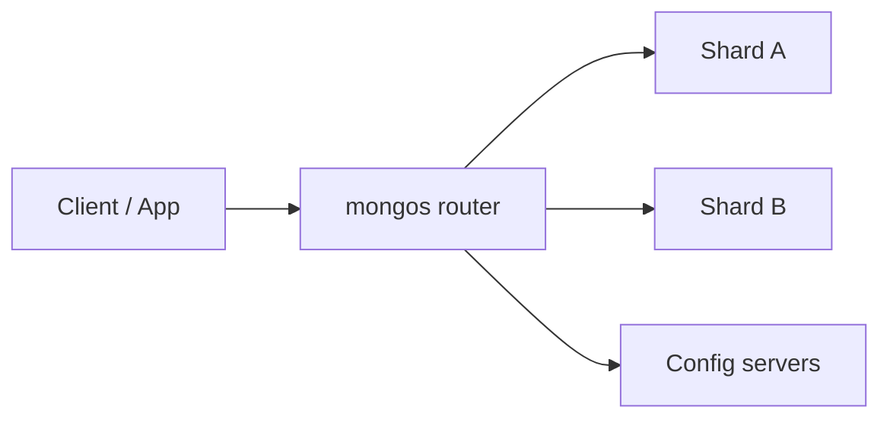
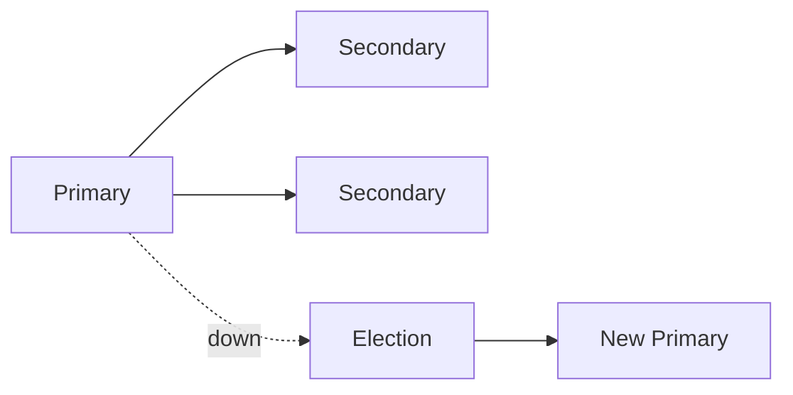

# MongoDB Complete Interview Guide

An interview-focused handbook for MongoDB—from documents and indexes to replica sets, aggregation, Mongoose, and MERN production patterns.

---

## Table of Contents

1. [Introduction to MongoDB](#1-introduction-to-mongodb)
2. [MongoDB Architecture](#2-mongodb-architecture)
3. [Installing MongoDB](#3-installing-mongodb)
4. [CRUD Operations](#4-crud-operations)
5. [Query Operators](#5-query-operators)
6. [Projection](#6-projection)
7. [Sorting, Limiting, Skipping](#7-sorting-limiting-skipping)
8. [Indexing](#8-indexing)
9. [Aggregation Framework](#9-aggregation-framework)
10. [Schema Design](#10-schema-design)
11. [Relationships](#11-relationships)
12. [MongoDB Data Types](#12-mongodb-data-types)
13. [Mongoose Introduction](#13-mongoose-introduction)
14. [Mongoose Schemas](#14-mongoose-schemas)
15. [Mongoose Models](#15-mongoose-models)
16. [Mongoose Middleware](#16-mongoose-middleware)
17. [Virtuals](#17-virtuals)
18. [Population](#18-population)
19. [Transactions](#19-transactions)
20. [Replication](#20-replication)
21. [Sharding](#21-sharding)
22. [Performance Optimization](#22-performance-optimization)
23. [Security](#23-security)
24. [Backup and Restore](#24-backup-and-restore)
25. [MongoDB Atlas](#25-mongodb-atlas)
26. [Common MongoDB Design Patterns](#26-common-mongodb-design-patterns)
27. [MongoDB in MERN Stack](#27-mongodb-in-mern-stack)
28. [Pagination](#28-pagination)
29. [Soft Deletes](#29-soft-deletes)
30. [Audit Logging](#30-audit-logging)
31. [Common MongoDB Interview Questions (100+)](#31-common-mongodb-interview-questions-100)
32. [MongoDB Coding Questions (30+)](#32-mongodb-coding-questions-30)
33. [SQL vs MongoDB](#33-sql-vs-mongodb)
34. [Common Mistakes Developers Make](#34-common-mistakes-developers-make)
35. [Production Best Practices](#35-production-best-practices)
36. [Real-World Project Discussion](#36-real-world-project-discussion)
37. [Final Revision Cheatsheet](#37-final-revision-cheatsheet)

---

## 1. Introduction to MongoDB

### What is MongoDB?

**MongoDB** is a **document-oriented NoSQL database**. Data is stored as **BSON documents** (binary JSON-like) inside **collections**, which live inside **databases**. It scales from single-node dev setups to **replica sets** and **sharded clusters**.

**Interview tip:** Say “document database,” not “schema-less”—you still design structure; enforcement can be in the app or **JSON Schema** / **Mongoose**.

### Why MongoDB was created

Traditional RDBMS excel at **strict relational** workloads; MongoDB aimed for **developer agility**, **flexible schema** for evolving products, and **horizontal scaling** patterns friendly to large datasets.

### SQL vs NoSQL (high level)

| Aspect | SQL (e.g. PostgreSQL) | MongoDB (document) |
|--------|------------------------|---------------------|
| Model | Tables, rows, fixed columns | Collections, documents, nested fields |
| Joins | Native, mature | `$lookup` / app-side |
| Schema | Often rigid in DB | Flexible; optional validation |
| Scaling | Vertical; sharding possible | Replica sets + sharding story |
| Transactions | Mature ACID | Multi-doc transactions since 4.0+ (replica sets) |

### When to use MongoDB

- Rapidly evolving **product shape** with nested objects.
- **Read-heavy** workloads with document-shaped data (profiles, catalogs, content).
- **Geospatial** and **aggregation** pipelines as first-class features.
- Teams wanting **Atlas**-managed ops.

### When NOT to use MongoDB

- Heavy **multi-row transactional** banking ledgers where relational invariants dominate (often still Postgres).
- **Complex ad-hoc relational** queries across many entities without careful modeling.
- When **reporting** expects classic star schemas—may need ETL to a warehouse either way.

### Real-world use cases

Content management, catalogs, IoT telemetry (with **time-series** collections in modern MongoDB), user sessions, games, mobile backends, real-time analytics stages, and many **MERN** CRUD APIs.

---

## 2. MongoDB Architecture

### Database → Collection → Document

```mermaid
flowchart TB
  DB[(Database: e.g. shop)]
  DB --> C1[Collection: products]
  DB --> C2[Collection: orders]
  C1 --> D1[Document {_id, name, specs...}]
  C1 --> D2[Document {...}]
```

### BSON

**BSON** extends JSON with extra types (`ObjectId`, `Date`, `Decimal128`, `Binary`, etc.) and efficient binary encoding.

### Primary

In a **replica set**, exactly one node is **primary** at a time—accepts **writes** (and reads if allowed).

### Secondary

**Secondary** nodes replicate the primary’s **oplog**; can serve **reads** if configured (with **consistency** tradeoffs).

### Replica Set

A group of `mongod` processes with automatic **election** if the primary fails.

### Sharding

**Horizontal partitioning** of data across **shards**; **`mongos`** routers direct queries to the right shard(s) using the **shard key**.



### Mongod vs Mongos

| Process | Role |
|---------|------|
| **mongod** | Stores data (replica set member or shard) |
| **mongos** | Query router in sharded cluster (no storage) |

---

## 3. Installing MongoDB

- **Local:** Community Server from mongodb.com/docs/manual/installation/ (or Docker `mongo` image).
- **Atlas:** Managed cloud—free tier for learning; **SRV connection strings**, auto backups, monitoring.
- **mongosh:** Modern **MongoDB Shell** (JS REPL for DB commands).
- **Compass:** GUI for schema exploration, indexes, aggregation builder, **explain** plans.

---

## 4. CRUD Operations

Assumes `db` is current database and `users` is a collection.

### insertOne / insertMany

```javascript
db.users.insertOne({ name: "Ada", email: "ada@x.dev" });
db.users.insertMany([
  { name: "Bob", email: "bob@x.dev" },
  { name: "Cara", email: "cara@x.dev" },
]);
```

### find / findOne

```javascript
db.users.find({ name: "Ada" });
db.users.findOne({ email: "bob@x.dev" });
```

### updateOne / updateMany / replaceOne

```javascript
db.users.updateOne({ name: "Ada" }, { $set: { city: "London" } });
db.users.updateMany({ active: { $exists: false } }, { $set: { active: true } });
db.users.replaceOne({ _id: ObjectId("...") }, { name: "Ada2", email: "a@b.com" });
```

### deleteOne / deleteMany

```javascript
db.users.deleteOne({ email: "spam@x.dev" });
db.users.deleteMany({ banned: true });
```

### Upsert pattern

```javascript
db.counters.updateOne(
  { _id: "orders" },
  { $inc: { seq: 1 } },
  { upsert: true }
);
```

---

## 5. Query Operators

### Comparison

`$eq`, `$ne`, `$gt`, `$gte`, `$lt`, `$lte`, `$in`, `$nin`

```javascript
db.products.find({ price: { $gte: 10, $lte: 100 } });
db.products.find({ category: { $in: ["book", "game"] } });
```

### Logical

`$and`, `$or`, `$not`, `$nor`

```javascript
db.orders.find({ $or: [{ status: "paid" }, { vip: true }] });
```

### Element

`$exists`, `$type`

```javascript
db.users.find({ phone: { $exists: true } });
```

### Evaluation

`$regex`, `$expr` (aggregation expressions in query), `$jsonSchema`, `$mod`, `$text` (with text index)

```javascript
db.users.find({ name: { $regex: /^ada/i } });
```

### Array

`$all`, `$elemMatch`, `$size`

```javascript
db.students.find({ tags: { $all: ["mern", "mongo"] } });
db.grades.find({ scores: { $elemMatch: { subject: "math", score: { $gte: 90 } } } });
```

**Pitfall:** `$regex` without index can be slow—anchor or index carefully.

---

## 6. Projection

Return only needed fields (**reduce wire overhead**).

```javascript
db.users.find({ active: true }, { name: 1, email: 1, _id: 0 });
```

**Rule:** Mix of inclusion (`1`) and exclusion (`0`) is restricted—`_id` is special (can exclude while including others).

---

## 7. Sorting, Limiting, Skipping

```javascript
db.users.find().sort({ createdAt: -1 }).limit(20).skip(40);
```

**Interview note:** Large **`skip`** values are expensive—prefer **cursor** pagination for deep pages (Section 28).

---

## 8. Indexing

### How indexes work (interview mental model)

Indexes are **B-tree-like structures** mapping **indexed field values** → document locations. Without a matching index, queries may perform a **COLLSCAN** (full collection scan).

### Single field

```javascript
db.users.createIndex({ email: 1 }, { unique: true });
```

### Compound index

```javascript
db.orders.createIndex({ userId: 1, createdAt: -1 });
```

**ESR rule thumb** (Equality, Sort, Range): put **equality** fields first, then **sort**, then **range**—for many workloads.

### Text index

```javascript
db.articles.createIndex({ title: "text", body: "text" });
db.articles.find({ $text: { $search: "mongodb atlas" } });
```

### Multikey

Automatically used when indexing **array** fields—one index entry per array element.

### TTL index

Auto-delete documents after a time (date field + `expireAfterSeconds`).

```javascript
db.sessions.createIndex({ expiresAt: 1 }, { expireAfterSeconds: 0 });
```

### Unique

Enforces uniqueness; **sparse** option for optional fields.

### Covered queries

When **projection** can be satisfied **entirely from the index**—very fast.

---

## 9. Aggregation Framework

**Pipeline:** array of **stages**; each transforms documents flowing through.

### Core stages (cheat)

| Stage | Role |
|-------|------|
| `$match` | Filter early (use indexes) |
| `$group` | Aggregate by `_id` key |
| `$project` | Shape output |
| `$lookup` | Left outer join |
| `$unwind` | Deconstruct arrays |
| `$sort` | Sort (memory limits apply) |
| `$limit` / `$skip` | Pagination |
| `$facet` | Multiple sub-pipelines in one |

### Real-world: orders revenue by day

```javascript
db.orders.aggregate([
  { $match: { status: "completed", createdAt: { $gte: ISODate("2026-01-01") } } },
  {
    $group: {
      _id: { $dateToString: { format: "%Y-%m-%d", date: "$createdAt" } },
      revenue: { $sum: "$total" },
      count: { $sum: 1 },
    },
  },
  { $sort: { _id: 1 } },
]);
```

### Real-world: join users to orders with `$lookup`

```javascript
db.orders.aggregate([
  { $match: { createdAt: { $gte: ISODate("2026-01-01") } } },
  {
    $lookup: {
      from: "users",
      localField: "userId",
      foreignField: "_id",
      as: "buyer",
    },
  },
  { $unwind: { path: "$buyer", preserveNullAndEmptyArrays: true } },
  { $project: { orderId: "$_id", total: 1, "buyer.email": 1 } },
]);
```

### `$facet` (e.g. dashboard KPIs in one round-trip)

```javascript
db.orders.aggregate([
  { $match: { status: "completed" } },
  {
    $facet: {
      byStatus: [{ $group: { _id: "$status", n: { $sum: 1 } } }],
      revenue: [{ $group: { _id: null, total: { $sum: "$total" } } }],
    },
  },
]);
```

---

## 10. Schema Design

### Embedding vs referencing (decision framework)

| Prefer **embed** | Prefer **reference** |
|------------------|----------------------|
| Data is read **together** always | Unbounded **one-to-many** (millions of comments) |
| Document stays **under size limits** (~16MB max) | Many writers to **different** entities |
| **Atomic** updates on parent doc matter | Need **independent** queries / updates |

**One-to-one:** Usually embed unless huge binary or regulatory separation.

**One-to-many (few):** Embed array of subdocuments.

**One-to-many (many):** Child collection + `parentId`.

**Many-to-many:** Array of ids + secondary indexes, or join collection ` { aId, bId }` with unique compound index.

---

## 11. Relationships

### Manual references

Store `ObjectId` in `userId` field—application enforces integrity.

### Population (Mongoose)

Loads referenced docs in one HTTP round-trip from app—**not** a MongoDB server feature.

### Denormalization

Copy `authorName` into `post` for read speed—accept **write complexity** to update when author renames.

---

## 12. MongoDB Data Types

| Type | Notes |
|------|------|
| **ObjectId** | 12-byte id; includes timestamp; sortable roughly by creation |
| **String** | UTF-8 |
| **Number** | Double by default; `NumberDecimal` for money |
| **Bool** | true/false |
| **Date** | BSON Date |
| **Array** | Ordered list; drives **multikey** index |
| **Object** | Embedded document |
| **Null** | Explicit null |

Use **`Decimal128`** for currency to avoid float errors.

---

## 13. Mongoose Introduction

**Mongoose** is an **ODM** (Object Document Mapper) for Node.js: schemas, validation, middleware, population helpers.

```bash
npm i mongoose
```

```javascript
import mongoose from "mongoose";
await mongoose.connect(process.env.MONGO_URI);
```

---

## 14. Mongoose Schemas

```javascript
const userSchema = new mongoose.Schema(
  {
    email: { type: String, required: true, unique: true, lowercase: true, trim: true },
    age: { type: Number, min: 0, max: 150 },
    role: { type: String, enum: ["user", "admin"], default: "user" },
  },
  { timestamps: true }
);

userSchema.path("email").validate((v) => /@/.test(v), "bad email");
```

---

## 15. Mongoose Models

```javascript
export const User = mongoose.model("User", userSchema);
const u = await User.create({ email: "a@b.com" });
```

**Collection name:** `"users"` pluralized by default from model name.

---

## 16. Mongoose Middleware

```javascript
userSchema.pre("save", async function (next) {
  if (!this.isModified("password")) return next();
  this.password = await hash(this.password);
  next();
});

userSchema.post("save", function (doc) {
  // audit log, events — avoid heavy sync work
});
```

**Pitfall:** `this` in `pre("save")` is the document; in arrow functions `this` is wrong.

---

## 17. Virtuals

```javascript
userSchema.virtual("domain").get(function () {
  return this.email.split("@")[1] || "";
});
userSchema.set("toJSON", { virtuals: true });
```

---

## 18. Population

```javascript
const order = await Order.findById(id).populate("userId", "email name").lean();
```

**Nested:** `.populate({ path: "userId", populate: { path: "companyId" } })`

**Overuse** causes N+1-like patterns—sometimes **aggregate `$lookup`** is better.

---

## 19. Transactions

MongoDB supports **multi-document ACID** on replica sets.

```javascript
const session = await mongoose.startSession();
session.startTransaction();
try {
  await Account.updateOne({ _id: 1 }, { $inc: { balance: -50 } }, { session });
  await Account.updateOne({ _id: 2 }, { $inc: { balance: 50 } }, { session });
  await session.commitTransaction();
} catch (e) {
  await session.abortTransaction();
  throw e;
} finally {
  session.endSession();
}
```

**Interview note:** Transactions have **overhead**; design to minimize need (atomic single-doc updates when possible).

---

## 20. Replication

### Replica set

3+ nodes recommended (election **majority**). **Oplog** streams operations to secondaries.

### Failover

If primary dies, secondaries hold **election**; new primary chosen.

### Election (gist)

Nodes vote; need majority; **priority** and **votes** tune behavior.



---

## 21. Sharding

**Shard key** (indexed field(s)) determines document placement—**hot shard** if key is monotonic and all writes hit one chunk.

**Good shard keys:** high **cardinality**, good **distribution**, co-locates queries you care about.

**Bad:** always-incrementing single field alone (unless hashed shard key pattern).

---

## 22. Performance Optimization

1. **Explain:** `db.collection.find({...}).explain("executionStats")` — look for `COLLSCAN`, `totalDocsExamined`.
2. **Indexes** match query shape; compound indexes for common filters + sort.
3. **Projection** reduce payload.
4. **Aggregation:** `$match` early; avoid monstrous `$lookup` graphs without indexes on foreign keys.
5. **Batch** writes where possible (`bulkWrite`).

---

## 23. Security

- **Auth:** SCRAM users, least privilege roles (`readWrite` on one DB only in prod).
- **Network:** VPC peering, IP allowlist, **Atlas** network controls.
- **Encryption:** TLS in transit; CSFLE / field-level encryption for sensitive fields.
- **Injection:** Never concatenate user strings into `$where`; validate types; use **allowlists** for operators in dynamic queries.

---

## 24. Backup and Restore

```bash
mongodump --uri="$MONGO_URI" --out=./dump
mongorestore --uri="$MONGO_URI" ./dump
```

**Atlas:** Cloud Backup **continuous** snapshots—prefer for production.

---

## 25. MongoDB Atlas

- Create **M0/M2/M5** cluster; choose region near app.
- **Database user** + **network access** IP / VPC.
- **Connection string** (SRV); monitor **metrics**, **Profiler**, **Performance Advisor** (index suggestions).
- Enable **encryption**, optional **LDAP/OIDC** for enterprise.

---

## 26. Common MongoDB Design Patterns

| Pattern | Idea |
|---------|------|
| **Bucket** | Group time-series into buckets (hour/day doc) |
| **Subset** | Duplicate hot fields; cold data in separate collection |
| **Computed** | Store aggregates updated by triggers/app jobs |
| **Outlier** | Normal embed; move rare huge arrays/docs to side collection |

---

## 27. MongoDB in MERN Stack

- One **`mongoose.connect`** per Node process; reuse pool.
- **Controllers** thin; **services** hold business rules; **repositories** wrap models.
- Validate with **Zod/Joi** at HTTP boundary + Mongoose schema as second line of defense.
- Use **`lean()`** for read-mostly JSON APIs when you don’t need Mongoose documents.

---

## 28. Pagination

### Offset (`skip`/`limit`)

Simple; **slow** for deep pages because server walks skipped docs.

### Cursor-based

```javascript
db.posts.find({ _id: { $gt: ObjectId(lastId) } }).sort({ _id: 1 }).limit(20);
```

Stable with **immutable sort key**; store `createdAt + _id` tie-breaker if needed.

---

## 29. Soft Deletes

```javascript
{ deletedAt: { type: Date, default: null, index: true } }
// queries: { deletedAt: null }
```

**TTL** optional for purge-after-retention. **Partial index** `{ deletedAt: 1 }` with `partialFilterExpression: { deletedAt: null }` for active-only.

---

## 30. Audit Logging

- **Change Streams** watch insert/update/delete on collection (requires replica set).
- **Versioning:** `{ parentId, version, snapshot }` collection or event log.

```javascript
const changeStream = db.orders.watch();
changeStream.on("change", (c) => {
  /* push to audit queue */
});
```

---

## 31. Common MongoDB Interview Questions (100+)

> Flash-card style for speed; expand using **model answers** below.

### Model answers (speak in full sentences)

**What is a document database?**  
MongoDB stores **records as BSON documents** in collections. Documents can **nest** sub-objects and arrays, which maps well to JSON APIs. Unlike relational tables with strict rows, each document can differ in shape—though production apps usually enforce **schemas** with Mongoose or JSON Schema.

**When would you choose aggregation over find?**  
When I need **server-side** grouping, joins across collections (`$lookup`), reshaping, windowed calculations, or multi-stage filtering without pulling large result sets into the application.

**How do you avoid slow pagination?**  
For deep pages I avoid **large skip** values and use **cursor pagination** on an indexed field like `_id` or `createdAt` with a tie-breaker, returning the **next cursor** to the client.

### Beginner (1–40)

**Q1.** What is MongoDB? **A.** Document NoSQL database using BSON documents.  
**Q2.** What is a collection? **A.** Group of documents (like a table, loosely).  
**Q3.** `_id` field? **A.** Primary key; auto `ObjectId` if omitted.  
**Q4.** BSON vs JSON? **A.** BSON adds binary types (`Date`, `ObjectId`, `Decimal`).  
**Q5.** insertOne vs insertMany? **A.** Single vs bulk insert.  
**Q6.** update $set vs $inc? **A.** Set field vs increment number.  
**Q7.** deleteMany behavior? **A.** Removes all matching docs.  
**Q8.** What is `$in`? **A.** Match any value in array clause.  
**Q9.** Projection purpose? **A.** Limit returned fields.  
**Q10.** sort direction `1` / `-1`? **A.** Ascending / descending.  
**Q11.** Unique index? **A.** Enforces uniqueness on field(s).  
**Q12.** TTL index? **A.** Auto-deletes docs based on date field.  
**Q13.** Text index use? **A.** Full-text `$text` search.  
**Q14.** What is Mongoose? **A.** Node.js ODM for MongoDB.  
**Q15.** Schema vs model? **A.** Definition vs compiled constructor.  
**Q16.** lean()? **A.** Plain JS objects—faster reads.  
**Q17.** populate()? **A.** Join-like fetch of refs in app layer.  
**Q18.** Replica set? **A.** Cluster for HA; one primary.  
**Q19.** Primary role? **A.** Handles writes (by default).  
**Q20.** Secondary role? **A.** Replicates; can serve reads if configured.  
**Q21.** What is mongosh? **A.** MongoDB shell.  
**Q22.** Compass use? **A.** GUI for data + indexes + explain.  
**Q23.** Atlas? **A.** Managed MongoDB cloud.  
**Q24.** ObjectId time? **A.** First 4 bytes encode timestamp—rough creation order.  
**Q25.** 16MB limit? **A.** Max BSON document size.  
**Q26.** `$exists`? **A.** Query field presence.  
**Q27.** `$regex` cost? **A.** Can’t use index efficiently if leading wildcard.  
**Q28.** `$elemMatch`? **A.** Match array element by multiple conditions.  
**Q29.** upsert? **A.** Update or insert if not found.  
**Q30.** multi-document transaction requirement? **A.** Replica set; overhead vs single-doc atomic updates.  
**Q31.** `$lookup`? **A.** Join in aggregation.  
**Q32.** `$unwind`? **A.** One doc per array element.  
**Q33.** `$group` `_id`? **A.** Group key expression.  
**Q34.** `$match` first? **A.** Yes—reduce documents early.  
**Q35.** covered query? **A.** Served from index only.  
**Q36.** compound index? **A.** Multi-field single index.  
**Q37.** ESR rule? **A.** Equality, Sort, Range field order heuristic.  
**Q38.** COLLSCAN? **A.** Collection scan—no useful index.  
**Q39.** explain()? **A.** Shows winning plan + stats.  
**Q40.** sharding goal? **A.** Horizontal scale across machines.  

### Intermediate (41–80)

**Q41.** Write concern? **A.** Acknowledgment level (`w`, `j`).  
**Q42.** Read concern? **A.** Visibility/isolation of reads.  
**Q43.** Majority read/write? **A.** Wait for replication majority—stronger durability.  
**Q44.** Oplog? **A.** Operations log for replication.  
**Q45.** Election majority? **A.** Need most votes among healthy members.  
**Q46.** Split brain risk? **A.** Mitigated by majority + odd member count.  
**Q47.** jumbo chunk? **A.** Shard chunk too big to migrate—ops issue.  
**Q48.** Hashed shard key? **A.** Spread monotonic writes when hashed.  
**Q49.** Zone sharding? **A.** Pin ranges to regions or hardware.  
**Q50.** Change stream resume token? **A.** Continue after disconnect without gaps (when possible).  
**Q51.** pre-image/post-image (change streams)? **A.** Access document before/after change (config).  
**Q52.** Schema validation JSON Schema? **A.** DB-level enforcement in `validator`.  
**Q53.** Partial index? **A.** Index subset of documents via filter.  
**Q54.** Sparse index? **A.** Skip docs missing indexed field.  
**Q55.** Collation? **A.** Locale-aware string compare/sort.  
**Q56.** `$facet` benefit? **A.** Multiple sub-aggregations one round-trip.  
**Q57.** allowDiskUse? **A.** Aggregation can spill to disk for large sorts.  
**Q58.** `$addFields` vs `$set`? **A.** Same stage alias in modern versions.  
**Q59.** Aggregation memory limit? **A.** Limits exist—watch stages; add indexes.  
**Q60.** Why not embed unbounded arrays? **A.** Document size + write amplification.  
**Q61.** Polymorphic collections? **A.** `type` discriminator + indexes per subtype.  
**Q62.** Application-level joins pros? **A.** Control batching; avoid heavy `$lookup`.  
**Q63.** Idempotency keys with unique partial index? **A.** Dedup writes safely.  
**Q64.** Time-series collections? **A.** Optimized for metrics ingest (Mongo 5+).  
**Q65.** GridFS? **A.** Chunk large files across docs.  
**Q66.** Wildcard index? **A.** Index dynamic subfields pattern.  
**Q67.** `$expr` cross-field compare? **A.** Compare two fields in same doc.  
**Q68.** `$merge` stage? **A.** Write aggregation output to collection.  
**Q69.** `$function` risk? **A.** Custom JS in aggregation—security/perf caution.  
**Q70.** Retryable writes? **A.** Driver retries idempotent ops on network blip.  
**Q71.** Transient transaction errors? **A.** Retry pattern with backoff.  
**Q72.** `writeConcern` j:true? **A.** Journal flush durability.  
**Q73.** Causal consistency? **A.** Session tracks cluster time ordering.  
**Q74.** mongodump vs snapshot? **A.** Logical dump vs filesystem/Atlas snapshot.  
**Q75.** Encryption at rest Atlas? **A.** Cloud provider disk encryption.  
**Q76.** Field-level encryption? **A.** Client-side / Queryable Encryption paths.  
**Q77.** `$where` injection? **A.** Never pass user code there.  
**Q78.** Operator injection NoSQL? **A.** Sanitize objects passed to queries.  
**Q79.** `hint()`? **A.** Force index for troubleshooting.  
**Q80.** Hidden index? **A.** Exists for planner evaluation but not used yet.  

### Advanced (81–115)

**Q81.** WiredTiger cache? **A.** Engine uses RAM for pages; eviction matters.  
**Q82.** Checkpointing? **A.** Periodic durable snapshots in storage engine.  
**Q83.** Read vs write concern interaction? **A.** Defines durability vs visibility tradeoffs.  
**Q84.** Linearizable reads? **A.** Strongest read concern—latency cost.  
**Q85.** Global lock vs doc-level? **A.** Modern storage is more granular; know high-level.  
**Q86.** Two-phase chunk migration? **A.** Sharded cluster balancing atomicity story.  
**Q87.** Orphan documents? **A.** Rare post-migration cleanup topic.  
**Q88.** `$unionWith`? **A.** Combine collections in pipeline like union.  
**Q89.** Window functions $setWindowFields? **A.** Rank, moving avg in aggregation.  
**Q90.** Materialized view pattern? **A.** `$merge` scheduled pipeline to summary collection.  
**Q91.** Outbox pattern with Mongo? **A.** Same TX write domain + outbox event doc.  
**Q92.** Saga pattern? **A.** Compensations across services—not single TX always.  
**Q93.** BSON decimal vs double? **A.** Money—use decimal128.  
**Q94.** Collations + indexes? **A.** Index must match collation or not used.  
**Q95.** Index intersection? **A.** Multiple single indexes combined—often worse than compound plan.  
**Q96.** `$text` score? **A.** `meta: "textScore"` sort relevance.  
**Q97.** Geospatial index types? **A.** `2d` vs `2dsphere`.  
**Q98.** `$geoNear` requires? **A.** A geospatial index.  
**Q99.** `$graphLookup`? **A.** Recursive graph traversal in aggregation.  
**Q100.** Performance Advisor? **A.** Atlas suggests indexes from slow queries.  
**Q101.** Queryable Encryption (concept)? **A.** Server processes encrypted fields in newer offerings—high-level awareness.  
**Q102.** KMS integration? **A.** Key management for encryption at field/cluster level.  
**Q103.** Atlas Search vs `$text`? **A.** Lucene-based relevance features in Atlas.  
**Q104.** Data lake (Atlas)? **A.** Query S3 data with Mongo SQL API—ecosystem awareness.  
**Q105.** Multi-region replica set? **A.** DR + locality; write concern tuning.  
**Q106.** Election metric `electionsCalled`? **A.** Ops monitor churn—unstable network.  
**Q107.** Rollback data? **A.** Rare older primary writes not replicated—ops topic.  
**Q108.** `readPreference` secondary? **A.** Stale reads possible—acceptable for dashboards?  
**Q109.** tag sets? **A.** Route reads to nodes with tags.  
**Q110.** maxTimeMS? **A.** Kill long-running queries.  
**Q111.** index builds foreground/background history? **A.** Know rolling builds online in modern versions.  
**Q112.** **validate** command? **A.** Check collection integrity—maintenance.  
**Q113.** compact command? **A.** Reclaim space—offline implications historically.  
**Q114.** cap collections? **A.** Fixed size FIFO—logs.  
**Q115.** tailable cursor? **A.** Stream capped collection like a queue.  

---

## 32. MongoDB Coding Questions (30+)

### 1) Find active users created last week

```javascript
const weekAgo = new Date(Date.now() - 7 * 864e5);
db.users.find({ active: true, createdAt: { $gte: weekAgo } });
```

### 2) Top 5 products by total sold quantity (aggregation)

```javascript
db.orderlines.aggregate([
  { $group: { _id: "$productId", qty: { $sum: "$quantity" } } },
  { $sort: { qty: -1 } },
  { $limit: 5 },
]);
```

### 3) Average order value by month (aggregation)

```javascript
db.orders.aggregate([
  { $match: { status: "completed" } },
  {
    $group: {
      _id: { y: { $year: "$createdAt" }, m: { $month: "$createdAt" } },
      avgTotal: { $avg: "$total" },
    },
  },
  { $sort: { "_id.y": 1, "_id.m": 1 } },
]);
```

### 4) Users who ordered more than 3 times

```javascript
db.orders.aggregate([
  { $group: { _id: "$userId", n: { $sum: 1 } } },
  { $match: { n: { $gt: 3 } } },
]);
```

### 5) `$lookup` + filter paid orders

```javascript
db.users.aggregate([
  { $match: { active: true } },
  {
    $lookup: {
      from: "orders",
      let: { uid: "$_id" },
      pipeline: [
        { $match: { $expr: { $and: [{ $eq: ["$userId", "$$uid"] }, { $eq: ["$status", "paid"] }] } } },
        { $limit: 5 },
      ],
      as: "recentPaid",
    },
  },
]);
```

### 6) Unwind tags and count tag frequency

```javascript
db.posts.aggregate([{ $unwind: "$tags" }, { $group: { _id: "$tags", n: { $sum: 1 } } }, { $sort: { n: -1 } }]);
```

### 7) Paginate by `_id` cursor

```javascript
function pageAfter(lastId, limit = 20) {
  const q = lastId ? { _id: { $gt: ObjectId(lastId) } } : {};
  return db.items.find(q).sort({ _id: 1 }).limit(limit).toArray();
}
```

### 8) Compound unique: `(workspaceId, email)`

```javascript
db.members.createIndex({ workspaceId: 1, email: 1 }, { unique: true });
```

### 9) Partial index: active users only

```javascript
db.users.createIndex(
  { lastLogin: -1 },
  { partialFilterExpression: { active: true } }
);
```

### 10) Text search + score sort

```javascript
db.articles.find({ $text: { $search: "mongodb interview" } }, { score: { $meta: "textScore" } }).sort({ score: { $meta: "textScore" } });
```

### 11) `$addToSet` unique tags

```javascript
db.posts.updateOne({ _id: 1 }, { $addToSet: { tags: "mongo" } });
```

### 12) `$pull` remove tag

```javascript
db.posts.updateOne({ _id: 1 }, { $pull: { tags: "old" } });
```

### 13) `$setUnion` in aggregation (if version supports in `$setField` path—pattern)

Use `$setUnion` in 5.0+ for array union in aggregation; alternatively `$concatArrays` + `$reduce` unique—interview: mention driver version.

### 14) Bucket pattern sketch (hourly metrics)

```javascript
// App rounds current time to hour start (no aggregation ops in filter)
const hour = new Date();
hour.setMinutes(0, 0, 0);

db.metrics.updateOne(
  { sensorId: 1, hour },
  { $push: { readings: { t: new Date(), v: 42 } }, $inc: { count: 1 } },
  { upsert: true }
);
```

*Alternative: use **time-series collections** (MongoDB 5+) for native bucketing.*

### 15) Soft delete update

```javascript
db.users.updateOne({ _id: id }, { $set: { deletedAt: new Date() } });
```

### 16) Find duplicates by email

```javascript
db.users.aggregate([
  { $group: { _id: "$email", ids: { $push: "$_id" }, n: { $sum: 1 } } },
  { $match: { n: { $gt: 1 } } },
]);
```

### 17) `$replaceRoot` after `$arrayElemAt`

```javascript
db.orders.aggregate([
  { $lookup: { from: "users", localField: "userId", foreignField: "_id", as: "u" } },
  { $set: { user: { $arrayElemAt: ["$u", 0] } } },
  { $replaceRoot: { newRoot: { order: "$$ROOT", user: "$user" } } },
]);
```

*Simplify in interview to show `$arrayElemAt` extract.*

### 18) `$facet` + paging metadata

```javascript
db.products.aggregate([
  { $match: { category: "book" } },
  {
    $facet: {
      data: [{ $skip: 40 }, { $limit: 20 }],
      total: [{ $count: "n" }],
    },
  },
]);
```

### 19) `$bucket` price ranges

```javascript
db.products.aggregate([
  {
    $bucket: {
      groupBy: "$price",
      boundaries: [0, 10, 50, 100, 1000],
      default: "1000+",
      output: { n: { $sum: 1 } },
    },
  },
]);
```

### 20) Regex case-insensitive anchored index-friendly

```javascript
db.users.find({ name: /^ada/i }); // prefix can use index if case-insensitive collation/index configured
```

### 21) Validate schema at collection (server)

```javascript
db.createCollection("customers", {
  validator: {
    $jsonSchema: {
      bsonType: "object",
      required: ["email"],
      properties: { email: { bsonType: "string" } },
    },
  },
});
```

### 22) `$merge` into summary

```javascript
db.orders.aggregate([
  { $group: { _id: "$userId", spent: { $sum: "$total" } } },
  { $merge: { into: "userSpendSummary", on: "_id", whenMatched: "replace", whenNotMatched: "insert" } },
]);
```

### 23) Transaction sketch (Mongoose) — two balances

*(See Section 19 for pattern.)*

### 24) `bulkWrite` mixed ops

```javascript
db.products.bulkWrite([
  { insertOne: { document: { sku: "a", price: 1 } } },
  { updateOne: { filter: { sku: "b" }, update: { $set: { price: 2 } } } },
]);
```

### 25) Explain winning plan (shell)

```javascript
db.users.find({ email: "a@b.com" }).explain("executionStats");
```

### 26) Index for sort + filter

```javascript
db.events.createIndex({ userId: 1, createdAt: -1 });
// find({userId}).sort({createdAt:-1}) uses index
```

### 27) `$graphLookup` org tree (depth cap)

```javascript
db.employees.aggregate([
  { $match: { _id: "ceo" } },
  {
    $graphLookup: {
      from: "employees",
      startWith: "$_id",
      connectFromField: "_id",
      connectToField: "managerId",
      as: "subs",
      maxDepth: 3,
    },
  },
]);
```

### 28) Subset pattern: hot card + cold detail

```javascript
// productCard: { _id, title, price, thumb }
// productDetail: { productId, longDescription, seo... }
```

### 29) Outlier pattern flag

```javascript
db.users.updateOne({ _id: id }, { $set: { followerCount: 1e6, followerCountOutlier: true } });
// move followers to edge collection when true
```

### 30) Change stream filter inserts only

```javascript
db.orders.watch([{ $match: { operationType: "insert" } }]);
```

### 31–32) Mongoose schema tasks

**31:** Add **unique sparse** index for optional `phone`.  
**32:** `orderSchema.index({ userId: 1, createdAt: -1 });`

---

## 33. SQL vs MongoDB

### Interview scenarios

- **“Reporting across 10 joined tables”:** SQL may model faster; Mongo might ETL to warehouse either way.
- **“User profile JSON blobs evolving weekly”:** Mongo + Mongoose validation fits well.
- **“Strict financial ledger”:** relational invariants often win unless carefully modeled with transactions.
- **“Geospatial nearby search”:** Mongo **2dsphere** is a strong pitch.

### Quick comparison table

| SQL | Mongo |
|-----|-------|
| JOIN | `$lookup` / app join |
| GROUP BY | `$group` |
| LIKE | `$regex` / Atlas Search |
| Transactions | Yes (replica set) with caveats |
| Schema | Table vs flexible documents |

---

## 34. Common Mistakes Developers Make

| Mistake | Why it hurts |
|---------|----------------|
| Unbounded arrays embedded | 16MB limit + hot document writes |
| Missing compound index for real queries | Sort step + COLLSCAN |
| `skip(100000)` pagination | High latency + load |
| Over-`populate` chains | Slow API, memory spikes |
| Floats for money | Rounding errors |
| Trusting user objects in filters | NoSQL injection |
| Global unbounded `find()` | OOM / SLA miss |

---

## 35. Production Best Practices

- **Pooling:** one client per process; tune `maxPoolSize` with Atlas limits.
- **Retries:** idempotent writes + driver retryable behavior.
- **Observability:** Atlas metrics, **slow query log**, APM traces on mongoose layer.
- **Scaling:** vertical first; sharding when data size / throughput demands; **choose shard key** early intentionally.
- **Security:** least privilege DB user; private network; rotate passwords; audit access.

---

## 36. Real-World Project Discussion

### STAR framing

**Situation:** MERN app with orders and inventory.  
**Task:** You owned data modeling + performance.  
**Action:** Chose **referenced** line items; compound indexes on `userId+createdAt`; cursor pagination; aggregation dashboards; Atlas + TLS; change streams for email triggers.  
**Result:** p95 read latency X ms; zero injection incidents; index advisor adoption.

### Be ready to justify

- Embed vs ref for **one feature** you built.  
- One **`explain()`** story fixing a COLLSCAN.  
- How you’d **rotate** secrets and **least privilege** users.

---

## 37. Final Revision Cheatsheet

- **Find shape + sort** → design **compound index** (ESR heuristic).  
- **Large skip** → **cursor** pagination.  
- **Join heavy** → `$lookup` with indexes on both sides or denormalize hot fields.  
- **Money** → **Decimal128**.  
- **TTL** for ephemeral sessions.  
- **Transactions** sparingly; **single-doc atomic** operators preferred.  
- **Atlas:** Performance Advisor + Search + backups.  
- **Security:** never `$where` with user strings; validate operator maps.

---

**End of guide.** Complements `NodeJS-ExpressJS-Complete-Interview-Guide.md` for MERN backend depth.
