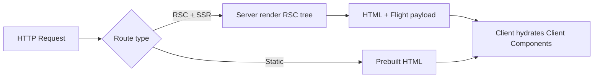

# Next.js Complete Interview Guide

An interview-focused handbook for Next.js—from rendering models and the App Router to caching, Server Actions, auth, and production deployment.

---

## Table of Contents

1. [Introduction to Next.js](#1-introduction-to-nextjs)
2. [Core Architecture](#2-core-architecture)
3. [Installation and Project Setup](#3-installation-and-project-setup)
4. [Routing System](#4-routing-system)
5. [Layouts and Templates](#5-layouts-and-templates)
6. [React Server Components](#6-react-server-components)
7. [Client Components](#7-client-components)
8. [Data Fetching](#8-data-fetching)
9. [Rendering Strategies](#9-rendering-strategies)
10. [API Routes](#10-api-routes)
11. [Server Actions](#11-server-actions)
12. [Metadata API](#12-metadata-api)
13. [Middleware](#13-middleware)
14. [Authentication](#14-authentication)
15. [Authorization](#15-authorization)
16. [Styling](#16-styling)
17. [Image Optimization](#17-image-optimization)
18. [Fonts Optimization](#18-fonts-optimization)
19. [Navigation](#19-navigation)
20. [Loading UI and Error Handling](#20-loading-ui-and-error-handling)
21. [Caching](#21-caching)
22. [Revalidation](#22-revalidation)
23. [State Management](#23-state-management)
24. [Database Integration](#24-database-integration)
25. [Forms](#25-forms)
26. [Performance Optimization](#26-performance-optimization)
27. [Security Best Practices](#27-security-best-practices)
28. [Deployment](#28-deployment)
29. [Testing](#29-testing)
30. [Next.js Internals](#30-nextjs-internals)
31. [Common Design Patterns](#31-common-design-patterns)
32. [Production Folder Structure](#32-production-folder-structure)
33. [Next.js with MERN](#33-nextjs-with-mern)
34. [Common Next.js Interview Questions (100+)](#34-common-nextjs-interview-questions-100)
35. [Practical Coding Questions (30+)](#35-practical-coding-questions-30)
36. [Common Mistakes Developers Make](#36-common-mistakes-developers-make)
37. [React vs Next.js](#37-react-vs-nextjs)
38. [Real-World Project Discussion](#38-real-world-project-discussion)
39. [Migration Guide](#39-migration-guide)
40. [Final Revision Cheatsheet](#40-final-revision-cheatsheet)

---

## 1. Introduction to Next.js

### What is Next.js?

**Next.js** is a **React framework** for production: routing, rendering (SSR/SSG/ISR), API/route handlers, bundling, and deployment conventions—built on React and deployed widely on **Vercel** or any Node host.

**Interview tip:** Say “framework on top of React,” not “replacement for React.”

### Why Next.js was created

To give teams **file-system routing**, **optimized rendering**, **code splitting by route**, and **first-class full-stack patterns** without assembling dozens of tools manually.

### Problems it solves

| Problem | Next.js helps with |
|--------|---------------------|
| SPA SEO gaps | SSR/SSG + metadata |
| Slow first paint | Streaming, image/font optimization |
| Routing boilerplate | File-based App/Pages Router |
| Data + UI colocation | RSC + `fetch` caching semantics |
| Deploy complexity | `next start`, Vercel, Docker |

### React vs Next.js

**React** is a UI library. **Next.js** adds **routing, rendering modes, build pipeline, and server runtime** opinionation.

### When to use Next.js

Marketing sites, dashboards with SEO, e-commerce, content sites, **full-stack** apps in one repo, teams wanting **RSC** and **edge** options.

### Real-world use cases

E-commerce catalogs, docs portals, blogs with ISR, SaaS marketing + app shell, B2B admin with server-side data access.

---

## 2. Core Architecture

### SSR (Server-Side Rendering)

HTML is generated **on each request** (or per cache policy) on the server for dynamic data.

### SSG (Static Site Generation)

HTML is generated **at build time**—fast CDN delivery; good for stable pages.

### ISR (Incremental Static Regeneration)

Static pages **rebuilt in the background** after a time interval or on-demand—combines static speed with freshness.

### CSR (Client-Side Rendering)

Initial shell loads; browser fetches data and renders—good for heavy interactivity behind auth.

### React Server Components (RSC)

Components run on the **server by default** in App Router; send a **serialized** UI description to the client without shipping all server logic as JS bundles.

### Rendering flow (conceptual)



**Analogy:** SSR is a **chef plating each order**; SSG is **meal-prep** in advance; ISR is **refreshing batches** when the timer hits; CSR is **buffet** where the diner assembles the plate in the browser.

---

## 3. Installation and Project Setup

```bash
npx create-next-app@latest my-app
# Options: TypeScript, ESLint, Tailwind, App Router, src/ dir
```

### Project structure (App Router, typical)

```
app/
  layout.tsx
  page.tsx
  api/...
  (marketing)/...
components/
lib/
public/
next.config.ts
```

### TypeScript

First-class: `tsconfig.json`, types for metadata, route handlers, and `'use client'` components.

### Configuration overview

`next.config`—images remote patterns, redirects/rewrites, experimental flags, `eslint`/`typescript` build behavior.

---

## 4. Routing System

### App Router (modern, `app/`)

- **File-based routes:** `app/dashboard/page.tsx` → `/dashboard`
- **Nested routes:** folders mirror URL segments
- **Dynamic:** `app/posts/[slug]/page.tsx`
- **Catch-all:** `[...slug]` ; optional catch-all `[[...slug]]`
- **Route groups:** `(folder)` **does not** affect URL—organize layouts
- **Parallel routes:** `@slot` folders for simultaneous views (advanced dashboards)
- **Intercepting routes:** `(.)photo` patterns for modal-style overlays

### Pages Router (legacy, `pages/`)

- `pages/index.tsx` → `/`
- `pages/blog/[id].tsx` → dynamic

### Comparison table

| Topic | App Router | Pages Router |
|-------|------------|--------------|
| Default component type | Server Components | Client pages (often) |
| Data fetching | async Server Components, `fetch` | `getServerSideProps`, `getStaticProps` |
| Layouts | nested `layout.tsx` | `_app`, nested manual |
| API | Route Handlers `route.ts` | `pages/api` |

**Interview stance:** Prefer **App Router** for new work; maintain Pages where needed.

---

## 5. Layouts and Templates

### Root layout

```tsx
// app/layout.tsx
export default function RootLayout({ children }: { children: React.ReactNode }) {
  return (
    <html lang="en">
      <body>{children}</body>
    </html>
  );
}
```

**Required:** `app` folder must define `layout.tsx` with `<html>` and `<body>` (root).

### Nested layouts

`app/dashboard/layout.tsx` wraps `/dashboard/*` segments—**preserves state** (unlike templates).

### Templates (`template.tsx`)

**Remounts** children when navigating—use for animations or resetting internal state on nav.

### Shared UI patterns

Slot **parallel routes** or **composition** with `children` and small client islands.

---

## 6. React Server Components

### What they are

Server Components render on the server; their code is **not** sent as client JS (only results). They can read files, DB, secrets—**not** use browser-only APIs.

### Benefits

Smaller client bundles, direct backend access, secrets stay server-side, streaming UI.

### Limitations

No `useState`, `useEffect`, `onClick`, or DOM APIs—must be **Client Components** for that.

### When to use them

Default for **data reads**, composition, static structure; push interactivity down to leaf **client** components.

---

## 7. Client Components

```tsx
"use client";

import { useState } from "react";

export function Counter() {
  const [n, setN] = useState(0);
  return <button onClick={() => setN(n + 1)}>{n}</button>;
}
```

### When required

Hooks, event handlers, browser APIs, third-party libs that touch `window`.

### Trade-offs

**More JS** shipped; consider **splitting** so only leaves are client.

---

## 8. Data Fetching

### `fetch` in Server Components

```tsx
export default async function Page() {
  const res = await fetch("https://api.example.com/items", { next: { revalidate: 60 } });
  if (!res.ok) throw new Error("Failed");
  const items = await res.json();
  return <List items={items} />;
}
```

### Async components

Server Components can be **`async`**—await directly.

### Caching behavior (App Router)

Controlled via `fetch` **`cache`**, **`next.revalidate`**, **`tags`**, and route segment config—see Section 21.

### Revalidation

Time-based or on-demand (`revalidatePath` / `revalidateTag`).

### Streaming

`loading.tsx` + **Suspense** boundaries stream HTML as parts resolve.

---

## 9. Rendering Strategies

| Strategy | Freshness | TTFB / CDN | Best for |
|----------|-----------|------------|----------|
| **SSG** | Build-time | Excellent | Marketing, docs |
| **ISR** | TTL / on-demand | Excellent | Product grids, blogs |
| **SSR** | Per-request | Good (server work) | User-specific home |
| **CSR** | Client-only | Varies | Heavy dashboards post-login |
| **Edge** | Low-latency regions | Great global | auth gate, geo, A/B |

**Edge rendering:** run in edge runtime (limited Node APIs)—great for middleware-style logic at the edge when supported.

### Decision framework

1. **Mostly public + same for everyone?** → SSG/ISR  
2. **Needs cookies/session per request?** → SSR (dynamic)  
3. **Mostly client state?** → CSR island  
4. **Global latency sensitive?** → evaluate **edge** for pieces (not full DB ORM always)

---

## 10. API Routes

### Route Handlers (App Router)

```ts
// app/api/hello/route.ts
import { NextResponse } from "next/server";

export async function GET() {
  return NextResponse.json({ ok: true });
}

export async function POST(req: Request) {
  const body = await req.json();
  return NextResponse.json({ received: body }, { status: 201 });
}
```

### REST shape

Use HTTP verbs; return `NextResponse` or `Response`; read `req.headers`, `cookies()`, `searchParams` on `NextRequest`.

### vs Pages API

`pages/api/*` is legacy pattern; prefer **`route.ts`** in App Router for new code.

---

## 11. Server Actions

```tsx
// app/actions.ts
"use server";

import { revalidatePath } from "next/cache";

export async function createTodo(formData: FormData) {
  const title = String(formData.get("title") || "");
  if (!title) return;
  await db.todo.create({ data: { title } });
  revalidatePath("/todos");
}
```

```tsx
import { createTodo } from "./actions";

export default function Page() {
  return (
    <form action={createTodo}>
      <input name="title" />
      <button type="submit">Add</button>
    </form>
  );
}
```

### Mutations

Use for **forms**, progressive enhancement; can be referenced from Client Components too (`action={...}`).

### Security

**Always authorize server-side**; validate inputs; **treat actions like API endpoints**—never trust hidden fields; use **CSRF protections** appropriate to hosting (Next sets `__NEXT_ACTIONS` etc.—still validate session).

---

## 12. Metadata API

### Static metadata

```tsx
export const metadata = {
  title: "Acme",
  description: "We ship widgets",
  openGraph: { title: "Acme", images: ["/og.png"] },
};
```

### Dynamic metadata

```tsx
export async function generateMetadata({ params }: { params: { slug: string } }) {
  const post = await getPost(params.slug);
  return { title: post.title, description: post.excerpt };
}
```

### SEO + Open Graph

Supports Twitter cards, `robots`, `alternates`—critical for share previews.

---

## 13. Middleware

```ts
// middleware.ts (project root)
import { NextResponse } from "next/server";
import type { NextRequest } from "next/server";

export function middleware(req: NextRequest) {
  if (!req.cookies.get("session")) {
    return NextResponse.redirect(new URL("/login", req.url));
  }
  return NextResponse.next();
}

export const config = { matcher: ["/dashboard/:path*"] };
```

### Uses

Auth gate, **A/B**, geo headers, **rewrites**, **bot** handling.

**Note:** Runs on **Edge** by default—avoid Node-only modules unless configured.

---

## 14. Authentication

### Patterns

- **Session cookie** + server session store (DB/Redis)
- **JWT** in **HttpOnly cookie** (preferred over `localStorage` for XSS)
- **OAuth** (Auth.js / NextAuth)

### Auth.js (NextAuth v5) sketch

Configure providers, callbacks, `session` strategy; use `auth()` helper in RSC to read session.

### Protected routes

`middleware` for coarse gate; **server checks** in layout/page for real authorization.

---

## 15. Authorization

### RBAC

Roles in session; **server** checks in RSC, Server Actions, Route Handlers.

### Middleware protection

Fast redirect for missing cookie—**not** a substitute for **server-side** resource checks.

### Server-side authorization

```tsx
export default async function AdminPage() {
  const session = await getServerSession(authOptions);
  if (session?.user?.role !== "admin") notFound();
  return <Admin />;
}
```

---

## 16. Styling

| Approach | Notes |
|----------|------|
| **CSS Modules** | `*.module.css`, scoped |
| **Tailwind** | Utility-first; very common with Next |
| **Styled Components** | CSS-in-JS; may need compiler / `'use client'` for some patterns |
| **Global** | `app/globals.css` imported in root layout |

**App Router:** Some CSS-in-JS libraries still catch up—check docs for RSC compatibility.

---

## 17. Image Optimization

```tsx
import Image from "next/image";

<Image src="/hero.png" alt="Hero" width={1200} height={600} priority />
```

Remote images: configure **`images.remotePatterns`** in `next.config`.

### Lazy loading

Default lazy except `priority` for LCP images.

### Responsive

`sizes` prop + layout fill patterns for responsive layouts.

---

## 18. Fonts Optimization

```tsx
import { Inter } from "next/font/google";

const inter = Inter({ subsets: ["latin"] });

export default function RootLayout({ children }: { children: React.ReactNode }) {
  return (
    <html lang="en" className={inter.className}>
      <body>{children}</body>
    </html>
  );
}
```

**Benefits:** self-hosted, no layout shift, subsetting.

---

## 19. Navigation

```tsx
import Link from "next/link";

<Link href="/dashboard">Dashboard</Link>
```

### `useRouter` (client)

```tsx
"use client";
import { useRouter } from "next/navigation";

const router = useRouter();
router.push("/done");
router.refresh(); // refresh server components data
```

**App Router:** import from **`next/navigation`**, not `next/router`.

---

## 20. Loading UI and Error Handling

- **`loading.tsx`:** instant fallback UI while segment loads (streaming)
- **`error.tsx`:** error boundary—must be **client component** (`"use client"`)
- **`not-found.tsx`:** `notFound()` helper triggers
- **Global:** root `error.tsx` for catastrophic failures

**Tip:** Pair **error boundaries** with meaningful logging and retry UI.

---

## 21. Caching

Next.js App Router has **several caches**—interviewers love this table.

| Layer | What it caches | Typical controls |
|-------|----------------|------------------|
| **Request memoization** | Same `fetch` URL/options within one render | automatic per request |
| **Data cache** | `fetch` responses across requests | `cache`, `revalidate`, `tags` |
| **Full Route Cache** | HTML+RSC payload of static routes | `dynamic`, `revalidate`, `fetch` opts |
| **Router cache** | Client-side RSC payload per segment | short TTL; `router.refresh()` |

**Dynamic by default?** Understand your version defaults: recent Next versions made **`fetch` uncached by default** in some contexts—**read docs for your pinned version** and verify in projects.

**Common mistake:** Assuming “everything static”—explicitly set **`dynamic = 'force-static'`** or **`force-dynamic`** when you need guarantees.

```tsx
export const dynamic = "force-dynamic"; // always dynamic segment
export const revalidate = 3600; // ISR-like segment revalidation (static-ish)
```

---

## 22. Revalidation

### Time-based

```ts
fetch(url, { next: { revalidate: 300 } });
// or segment: export const revalidate = 300;
```

### On-demand

```ts
import { revalidatePath, revalidateTag } from "next/cache";

revalidatePath("/posts");
revalidateTag("posts");
```

### `fetch` tags

```ts
fetch(url, { next: { tags: ["posts"] } });
```

Use when CMS/webhook says “content changed.”

---

## 23. State Management

| Tool | When |
|------|------|
| **`useState` / `useReducer`** | Local UI state in Client Components |
| **React Context** | Theme, light global client state (don’t overuse) |
| **Redux Toolkit** | Large client apps, DevTools, time-travel debugging |
| **Zustand** | Minimal global client state |

**Server-first:** Prefer **RSC + `fetch`** for server state; avoid duplicating server data in client stores without reason.

---

## 24. Database Integration

### Prisma (PostgreSQL, MySQL, Mongo…)

Great with Next: run queries in **Server Components**, **Route Handlers**, **Server Actions**—keep DB **off the client**.

### MongoDB + Mongoose

Works in Node runtime; not in **edge** middleware without compatible driver—use **Node** runtime routes.

### PostgreSQL

`pg`, Drizzle, Prisma—**connection pooling** (e.g. serverless pooler for Vercel).

**Pattern:** single shared Prisma client module to avoid exhausting connections in dev HMR.

---

## 25. Forms

### Server Actions + progressive enhancement

Plain HTML forms work without JS.

### React Hook Form

Client-heavy forms with great DX—pair with **Zod** resolver.

```tsx
"use client";
import { useForm } from "react-hook-form";
import { z } from "zod";
import { zodResolver } from "@hookform/resolvers/zod";

const schema = z.object({ email: z.string().email() });

export function Form() {
  const { register, handleSubmit, formState: { errors } } = useForm({
    resolver: zodResolver(schema),
  });
  return <form onSubmit={handleSubmit(console.log)}>...</form>;
}
```

**Zod** on server actions too—validate **`FormData`** or JSON.

---

## 26. Performance Optimization

- **Automatic code splitting** by route
- **`next/dynamic`** for client bundles: `dynamic(() => import("./Heavy"), { ssr: false })` when appropriate
- **Streaming** + Suspense
- **Partial Prerendering (experimental in some versions):** static shell + dynamic holes—know as evolving feature

---

## 27. Security Best Practices

- **XSS:** sanitize if you `dangerouslySetInnerHTML`; prefer React escaping; CSP headers
- **CSRF:** cookie session flows need tokens/SameSite; Server Actions have built-in mitigations—**still validate auth**
- **Secure cookies:** `HttpOnly`, `Secure`, `SameSite`
- **Secrets:** only in `process.env` **server-side**; `NEXT_PUBLIC_*` exposes to browser

---

## 28. Deployment

| Target | Notes |
|--------|------|
| **Vercel** | Zero-config Next; edge; analytics |
| **Docker** | `output: 'standalone'` for slim image |
| **Self-host** | `next build` + `next start` behind Nginx/Traefik |
| **Env** | Set vars per environment; never commit `.env.local` |

---

## 29. Testing

- **Jest** + **RTL** for components (more client-focused)
- **Playwright** / Cypress for E2E— **`next dev`** or preview URL
- **Integration:** test Route Handlers with `fetch` to local server

---

## 30. Next.js Internals

### Build

`next build` analyzes routes, emits optimized bundles, prerenders where possible.

### Bundling

Uses **Turbopack** (dev, evolving) / Webpack—tree shaking, React Flight client chunks for RSC.

### Hydration

Client Components **hydrate**; Server Components do **not** hydrate the same way—they stream serialized output.

### Flight protocol

**RSC payload** format that describes the server component tree to the client runtime—enables fine-grained updates and streaming.

---

## 31. Common Design Patterns

- **Feature folders:** `features/cart/{components,hooks,api}.ts`
- **Repository:** abstract Prisma/DB behind `UserRepository`
- **Service layer:** business rules callable from actions and API routes

---

## 32. Production Folder Structure

```
src/
  app/
  features/
  components/ui/
  lib/          # db, auth, utils
  styles/
  middleware.ts
public/
tests/
```

**Rule:** colocate **route-specific** UI under `app` when small; extract to `features` when it grows.

---

## 33. Next.js with MERN

- **BFF pattern:** Next calls **external Express** REST for heavy legacy services (`fetch` server-side).
- **Auth:** session cookie set by Express **or** central Auth provider; Next middleware checks cookie.
- **Deploy:** Next on Vercel + API on Railway/Azure—**CORS** only if browser calls API directly (prefer server-to-server from RSC).

---

## 34. Common Next.js Interview Questions (100+)

> Use the **model answers** for full sentences; Q/A blocks are rapid review.

### Model answers

**Explain the App Router vs Pages Router.**  
The **App Router** uses the `app` directory with **nested layouts**, **React Server Components by default**, **Route Handlers** in `route.ts`, and **`next/navigation`**. The **Pages Router** uses `pages/` with `getServerSideProps`/`getStaticProps` and `pages/api`. New projects should prefer the App Router; Pages remains supported for migration.

**What is a Server Component vs a Client Component?**  
Server Components render on the server and never ship their implementation JS to the browser—they can use secrets and the database. Client Components are marked with **`"use client"`** and support hooks and events. The interview trick is **minimizing** client boundaries.

**How does Next cache `fetch` in the App Router?**  
`fetch` participates in the **Data Cache** depending on options (`cache: 'force-cache' | 'no-store'`, `next.revalidate`, `next.tags`). Understanding **`revalidatePath`/`revalidateTag`** shows production readiness. Always verify behavior for the **exact Next version** you use.

### Beginner (1–40)

**Q1.** What is Next.js? **A.** Production React framework from Vercel.  
**Q2.** File-based routing? **A.** Folders/files in `app` define URLs.  
**Q3.** `page.tsx`? **A.** Route UI leaf.  
**Q4.** `layout.tsx`? **A.** Shared shell for segment + children.  
**Q5.** `loading.tsx`? **A.** Loading UI for segment streaming.  
**Q6.** `error.tsx`? **A.** Error boundary segment.  
**Q7.** `not-found.tsx`? **A.** 404 UI for segment.  
**Q8.** `use client`? **A.** Marks Client Component boundary.  
**Q9.** Default in App Router RSC or client? **A.** Server Component by default.  
**Q10.** `Link` prefetch? **A.** Prefetches routes in viewport (default on).  
**Q11.** `next/image` why? **A.** Optimization + responsive + lazy.  
**Q12.** `next/font` why? **A.** Self-host fonts, reduce CLS.  
**Q13.** Route Handlers path? **A.** `app/api/.../route.ts`.  
**Q14.** HTTP methods in handler? **A.** Named exports `GET`, `POST`, …  
**Q15.** `NextResponse`? **A.** Helper for `Response` with cookies helpers.  
**Q16.** `middleware.ts` runs where? **A.** Edge before request hits route.  
**Q17.** `matcher` config? **A.** Limit paths middleware runs on.  
**Q18.** SSR meaning? **A.** Server renders HTML per request/policy.  
**Q19.** SSG meaning? **A.** Pre-render at build.  
**Q20.** ISR meaning? **A.** Regenerate static over time or on-demand.  
**Q21.** `generateStaticParams`? **A.** Build-time paths for dynamic segments (static).  
**Q22.** `dynamicParams`? **A.** Allow/disallow unknown dynamic segments.  
**Q23.** `export const dynamic`? **A.** Force static/dynamic behavior hint.  
**Q24.** `export const revalidate`? **A.** Segment revalidate seconds.  
**Q25.** `Suspense` in App Router? **A.** Stream async server subtrees.  
**Q26.** `cookies()`/`headers()`? **A.** Server-only dynamic APIs—opt into dynamic rendering.  
**Q27.** `searchParams` on page props? **A.** Server read query string.  
**Q28.** `params` on page props? **A.** Dynamic route params.  
**Q29.** `generateMetadata`? **A.** Dynamic SEO metadata.  
**Q30.** Open Graph? **A.** Social preview tags in metadata.  
**Q31.** Absolute URLs in OG images? **A.** Often required for valid previews.  
**Q32.** `router.refresh()`? **A.** Re-fetch server components tree.  
**Q33.** `useRouter` import App Router? **A.** `next/navigation`.  
**Q34.** `redirect()` helper? **A.** Server redirect from server components/actions.  
**Q35.** `permanentRedirect()`? **A.** 308 semantics.  
**Q36.** `notFound()`? **A.** Trigger not-found boundary.  
**Q37.** Server Actions directive? **A.** `"use server"` at top of file or function.  
**Q38.** progressive enhancement forms? **A.** Work without JS using Server Actions.  
**Q39.** `next.config` remote images? **A.** `images.remotePatterns`.  
**Q40.** `NEXT_PUBLIC_` prefix? **A.** Exposed env to browser bundle.  

### Intermediate (41–80)

**Q41.** Flight protocol? **A.** RSC serialization stream.  
**Q42.** Why smaller bundles with RSC? **A.** Server code not shipped to client.  
**Q43.** Can Server Components import Client Components? **A.** Yes—children passed as props compose.  
**Q44.** Can Client import Server directly? **A.** No—only via composition (`children`).  
**Q45.** Server Action security model? **A.** Treat as public endpoint—authorize + validate.  
**Q46.** Edge runtime limits? **A.** Subset of Node APIs—check compatibility.  
**Q47.** `runtime = 'edge'` route? **A.** Run handler on edge.  
**Q48.** streaming benefits? **A.** Faster TTFB, better perceived perf.  
**Q49.** Full Route Cache eligibility? **A.** Static segments; voided by some dynamic APIs.  
**Q50.** Data cache vs router cache? **A.** Server fetch store vs client nav cache.  
**Q51.** `fetch` deduping? **A.** Memoized per request with same signature.  
**Q52.** `cache: 'no-store'`? **A.** Opt out of data cache.  
**Q53.** `revalidateTag` use? **A.** Invalidate tagged `fetch` calls.  
**Q54.** `revalidatePath` vs tag? **A.** Path coarse vs tag granular.  
**Q55.** What is draft mode? **A.** Preview unpublished CMS content.  
**Q56.** `robots.ts`/`sitemap.ts`? **A.** Metadata routes.  
**Q57.** Internationalization App Router? **A.** `[locale]` segment + middleware.  
**Q58.** Parallel routes use? **A.** Split dashboards / modals.  
**Q59.** Intercepting routes? **A.** Modal from soft nav patterns.  
**Q60.** `template.tsx` vs layout? **A.** Template remounts; layout persists.  
**Q61.** `default.js` parallel route? **A.** Fallback slot UI.  
**Q62.** **Turbopack**? **A.** Fast bundler for dev (future default).  
**Q63.** `output: 'standalone'`? **A.** Docker-friendly minimal server output.  
**Q64.** ISR on-demand webhook? **A.** `revalidatePath` in Route Handler.  
**Q65.** Auth session in RSC? **A.** Read cookie server-side—don’t expose secrets.  
**Q66.** CSRF with cookie sessions? **A.** SameSite + tokens.  
**Q67.** Content Security Policy? **A.** Reduce XSS impact.  
**Q68.** `headers()` costs? **A.** Makes route dynamic—understand caching impact.  
**Q69.** `dynamic = 'error'` static? **A.** Fails build if dynamic API used—guardrail.  
**Q70.** `fetchCache` (older)? **A.** Legacy segment config name—mind version docs.  
**Q71.** `loading.tsx` skeleton best practice? **A.** Match layout to reduce CLS.  
**Q72.** `error.tsx` reset()? **A.** Client boundary retry pattern.  
**Q73.** `Suspense` boundaries placement? **A.** Around slow independent subtrees.  
**Q74.** `next/headers` cookies set? **A.** Use Server Action or Route Handler.  
**Q75.** **Vercel KV/Postgres**? **A.** Ecosystem storage—interview awareness.  
**Q76.** **Route segment config** `preferredRegion`? **A.** Hosting hint.  
**Q77.** **Instrumentation** hook? **A.** Observability setup on server start.  
**Q78.** **React strict mode** dev? **A.** Double effects—expected.  
**Q79.** **Font CLS**? **A.** `next/font` sizes/line height control.  
**Q80.** **LCP element** choice? **A.** Hero image `priority`.  

### Advanced (81–120)

**Q81.** Partial Prerendering purpose? **A.** Static shell + dynamic holes—evolving.  
**Q82.** **Selective hydration** interplay? **A.** React advanced streaming—high-level awareness.  
**Q83.** **Server Actions** encryption / signing? **A.** Framework uses actionable IDs—don’t rely on obscurity.  
**Q84.** **Race** in RSC fetches? **A.** Parallelize independent `fetch`; watch for waterfalls.  
**Q85.** **Request deduplication** limits? **A.** Same URL/options only—understand pitfalls.  
**Q86.** **Multiple layouts duplicated fetch**? **A.** Consider caching or lift data to layout carefully.  
**Q87.** **Edge auth with JWT**? **A.** Verify signatures with Web Crypto—no Node crypto.  
**Q88.** **Microfrontends + Next**? **A.** Module Federation—complex; rare interview depth.  
**Q89.** **Monorepo** Turborepo? **A.** Shared UI packages imported into app.  
**Q90.** **i18n hreflang** metadata? **A.** `alternates.languages`.  
**Q91.** `next/script` strategy prop? **A.** Control load order (`afterInteractive`, `lazyOnload`, etc.).  
**Q92.** **optimizePackageImports**? **A.** Transpile barrel imports better.  
**Q93.** **Modularize imports** for large libs? **A.** tree-shake MUI/lodash patterns.  
**Q94.** **Edge stream timeouts**? **A.** Platform limits on long streams.  
**Q95.** **Cache poisoning** concerns? **A.** Vary headers, careful CDN config—advanced security.  
**Q96.** **OG image dynamic route** `opengraph-image.tsx`? **A.** OG as code (feature).  
**Q97.** **Icon / apple-app-route** metadata files? **A.** Convention-based metadata.  
**Q98.** **typedRoutes** experimental? **A.** Strongly typed `href`s.  
**Q99.** **server-only** package import guard? **A.** Build error if imported in client.  
**Q100.** **client-only** guard? **A.** Opposite pattern packages exist.  
**Q101.** **React cache()** wrapper? **A.** Dedup function calls per request in RSC.  
**Q102.** **unstable_noStore** historical? **A.** Replaced/renamed patterns—pin docs.  
**Q103.** **Segment config** interplay headers/cookies? **A.** Forces dynamic semantics.  
**Q104.** **Output file tracing**? **A.** Docker includes traced node_modules subset.  
**Q105.** **Experimental PPR** flag? **A.** Know it’s version-gated.  
**Q106.** **Vercel skew protection**? **A.** Deployment mismatch handling—platform feature.  
**Q107.** **ISR stale-while-revalidate** user-visible? **A.** First request may serve stale then refresh—explain.  
**Q108.** **On-demand ISR** e-commerce? **A.** Webhook from CMS/inventory.  
**Q109.** **Next + tRPC**? **A.** End-to-end types; mostly client callers or server context—know at high level.  
**Q110.** **Drizzle vs Prisma**? **A.** SQL-first vs schema migrations ergonomics.  
**Q111.** **PlanetScale/Vercel** branching DB? **A.** Preview DB per PR workflows.  
**Q112.** **Lambda timeout** vs SSR? **A.** Self-host serverless—keep server work bounded.  
**Q113.** **Cold start mitigation**? **A.** Edge, smaller SSR, warm pools—platform dependent.  
**Q114.** **Content-Disposition** file download Route Handler? **A.** Stream blobs.  
**Q115.** **App router cookies same-site** bridging subdomains? **A.** Domain attribute design.  
**Q116.** **Security headers** in `next.config`? **A.** `headers()` async config.  
**Q117.** **Reverse proxy** caching HTML? **A.** Careful with personalized pages—vary by cookie.  
**Q118.** **Cypress component testing Next**? **A.** Possible with webpack config—niche.  
**Q119.** **Storybook + RSC**? **A.** Tooling still maturing—honest interview answer.  
**Q120.** **Why Next over Remix**? **A.** Ecosystem, Vercel integration, hiring pool—tradeoffs both excellent.  

---

## 35. Practical Coding Questions (30+)

### 1) Minimal App Router page

```tsx
export default function Page() {
  return <main>Hello</main>;
}
```

### 2) Dynamic route `app/posts/[slug]/page.tsx`

```tsx
export default function Post({ params }: { params: { slug: string } }) {
  return <h1>{params.slug}</h1>;
}
```

### 3) `generateStaticParams`

```tsx
export async function generateStaticParams() {
  return [{ slug: "a" }, { slug: "b" }];
}
```

### 4) Basic Route Handler CRUD snippet

```ts
import { NextResponse } from "next/server";

let items = [{ id: "1", title: "Learn Next" }];

export async function GET() {
  return NextResponse.json(items);
}

export async function POST(req: Request) {
  const { title } = await req.json();
  const item = { id: crypto.randomUUID(), title };
  items.push(item);
  return NextResponse.json(item, { status: 201 });
}
```

### 5) Server Action form

```tsx
// actions.ts
"use server";
import { redirect } from "next/navigation";

export async function login(formData: FormData) {
  const email = String(formData.get("email") || "");
  if (!email.includes("@")) return;
  redirect("/dashboard");
}
```

```tsx
import { login } from "./actions";

export default function Login() {
  return (
    <form action={login}>
      <input name="email" />
      <button>Go</button>
    </form>
  );
}
```

### 6) Auth middleware sketch

```ts
import { NextResponse } from "next/server";
import type { NextRequest } from "next/server";

export function middleware(req: NextRequest) {
  const token = req.cookies.get("token");
  if (!token && req.nextUrl.pathname.startsWith("/app")) {
    return NextResponse.redirect(new URL("/login", req.url));
  }
  return NextResponse.next();
}

export const config = { matcher: ["/app/:path*"] };
```

### 7) ISR-style fetch revalidate

```tsx
export default async function Page() {
  const res = await fetch("https://api.example.com/quote", { next: { revalidate: 60 } });
  const data = await res.json();
  return <p>{data.text}</p>;
}
```

### 8) On-demand revalidate route

```ts
import { NextResponse } from "next/server";
import { revalidateTag } from "next/cache";

export async function POST(req: Request) {
  const secret = req.headers.get("x-secret");
  if (secret !== process.env.REVALIDATE_SECRET) return new NextResponse("nope", { status: 401 });
  revalidateTag("posts");
  return NextResponse.json({ ok: true });
}
```

### 9) Metadata static

```tsx
export const metadata = { title: "Shop", description: "We sell things" };
```

### 10) `generateMetadata` dynamic

```tsx
export async function generateMetadata({ params }: { params: { id: string } }) {
  return { title: `Product ${params.id}` };
}
```

### 11) Client counter imported into server page

```tsx
import { Counter } from "./counter";

export default function Page() {
  return (
    <main>
      <Counter />
    </main>
  );
}
```

```tsx
"use client";
import { useState } from "react";

export function Counter() {
  const [n, setN] = useState(0);
  return <button onClick={() => setN(n + 1)}>{n}</button>;
}
```

### 12) `next/image` remote pattern config note

```ts
// next.config.ts
const config = {
  images: {
    remotePatterns: [{ protocol: "https", hostname: "cdn.example.com", pathname: "/images/**" }],
  },
};
export default config;
```

### 13) `next/font` local

```tsx
import localFont from "next/font/local";

const sans = localFont({ src: "./Sans.woff2" });
```

### 14) Loading skeleton

```tsx
export default function Loading() {
  return <div className="pulse">Loading…</div>;
}
```

### 15) Error boundary client

```tsx
"use client";

export default function Error({ error, reset }: { error: Error; reset: () => void }) {
  return (
    <div>
      <h2>Something failed</h2>
      <button onClick={reset}>Retry</button>
    </div>
  );
}
```

### 16) `notFound` usage

```tsx
import { notFound } from "next/navigation";

export default async function User({ params }: { params: { id: string } }) {
  const user = await getUser(params.id);
  if (!user) notFound();
  return <div>{user.name}</div>;
}
```

### 17) Programmatic nav + refresh

```tsx
"use client";
import { useRouter } from "next/navigation";

export function SaveButton() {
  const router = useRouter();
  return (
    <button
      onClick={async () => {
        await fetch("/api/save", { method: "POST" });
        router.refresh();
      }}
    >
      Save
    </button>
  );
}
```

### 18) Parallel data fetch (avoid serial await)

```tsx
export default async function Page() {
  const [a, b] = await Promise.all([
    fetch("https://api/a", { next: { revalidate: 60 } }).then(r => r.json()),
    fetch("https://api/b", { next: { revalidate: 60 } }).then(r => r.json()),
  ]);
  return (
    <>
      <pre>{JSON.stringify(a)}</pre>
      <pre>{JSON.stringify(b)}</pre>
    </>
  );
}
```

### 19) `dynamic = "force-dynamic"` segment

```tsx
export const dynamic = "force-dynamic";

export default async function Page() {
  return <div>{new Date().toISOString()}</div>;
}
```

### 20) `revalidatePath` in action

```tsx
"use server";
import { revalidatePath } from "next/cache";

export async function reHome() {
  revalidatePath("/");
}
```

### 21) Catch-all route `app/docs/[...slug]/page.tsx`

```tsx
export default function Docs({ params }: { params: { slug: string[] } }) {
  return <code>{params.slug?.join("/")}</code>;
}
```

### 22) Route group layout `(site)/layout.tsx`

Organizes marketing pages under `(site)` without changing URL.

### 23) `headers()` read (forces dynamic)

```tsx
import { headers } from "next/headers";

export default function Page() {
  const ua = headers().get("user-agent");
  return <p>{ua}</p>;
}
```

### 24) Redirect in Server Component

```tsx
import { redirect } from "next/navigation";

export default function Page() {
  redirect("/new-location");
}
```

### 25) Zod validate in Server Action

```tsx
"use server";
import { z } from "zod";

const Schema = z.object({ email: z.string().email() });

export async function subscribe(formData: FormData) {
  const parsed = Schema.safeParse({ email: formData.get("email") });
  if (!parsed.success) return;
  // ...
}
```

### 26) `next/dynamic` client-only

```tsx
import dynamic from "next/dynamic";

const Chart = dynamic(() => import("./Chart"), { ssr: false, loading: () => <p>…</p> });

export default function Page() {
  return <Chart />;
}
```

### 27) `sitemap.ts`

```ts
import type { MetadataRoute } from "next";

export default function sitemap(): MetadataRoute.Sitemap {
  return [{ url: "https://example.com", lastModified: new Date() }];
}
```

### 28) `robots.ts`

```ts
import type { MetadataRoute } from "next";

export default function robots(): MetadataRoute.Robots {
  return { rules: { userAgent: "*", allow: "/" }, sitemap: "https://example.com/sitemap.xml" };
}
```

### 29) Cookie set in Route Handler

```ts
import { NextResponse } from "next/server";

export async function GET() {
  const res = NextResponse.json({ ok: true });
  res.cookies.set("session", "abc", { httpOnly: true, sameSite: "lax", path: "/" });
  return res;
}
```

### 30) Suspense boundary wrapper component

```tsx
import { Suspense } from "react";

async function Slow() {
  await new Promise(r => setTimeout(r, 1000));
  return <p>Ready</p>;
}

export default function Page() {
  return (
    <Suspense fallback={<p>Loading part…</p>}>
      <Slow />
    </Suspense>
  );
}
```

### 31–32) Bonus

- **31:** `opengraph-image.tsx`—generate OG image in-file (feature; check docs).  
- **32:** `instrumentation.ts`—register OpenTelemetry on server boot.  

---

## 36. Common Mistakes Developers Make

| Mistake | Why it hurts |
|---------|----------------|
| Marking entire tree `"use client"` | Loses RSC benefits; big bundles |
| Assuming `fetch` always cached | Stale bugs or uncached surprises—read options/version |
| Using `next/router` in App Router | Wrong hooks—use `next/navigation` |
| Putting secrets in client imports | Leaks via `NEXT_PUBLIC` or client modules |
| Ignoring **`dynamic`** implications | Accidentally static personalized pages |
| No auth checks in Server Actions | Anyone can POST if they discover action ID |
| Hero image without `sizes`/`priority` | Bad LCP/CLS |
| SEO: relative OG URLs | Broken previews |

---

## 37. React vs Next.js

| | React (CRA/Vite) | Next.js |
|---|------------------|---------|
| Routing | Bring your own | Built-in file routes |
| SSR/SSG | Manual or meta-framework | First-class |
| Data | client `useEffect` heavy | Server `fetch` + RSC |
| Deployment | Static host only? | Node/edge/serverless options |
| SEO | Harder for SPAs | Metadata API |

**Interview scenario:** “Marketing wants SEO + fast LCP” → Next SSG/ISR + `Image` + RSC.

---

## 38. Real-World Project Discussion

### What to highlight

- **Rendering choice per route** (marketing static, app dynamic).  
- **Caching + webhooks** (CMS ISR).  
- **Auth** model (session cookie, middleware, server checks).  
- **Performance:** `Image`, font, streaming, bundle analysis.  
- **Failure stories:** cache bugs fixed with `no-store` vs tags; middleware vs server auth mismatch.

### STAR outline

Situation → Your ownership → **Technical decisions (why Next?)** → Measurable outcomes (Lighthouse, conversion).

---

## 39. Migration Guide

### React SPA → Next

1. Introduce **App Router** pages alongside existing UI.  
2. Move data fetching from `useEffect` to **server** where possible.  
3. Replace client router with **`Link` / `useRouter`**.  
4. Split **client islands**—only interactive leaves `"use client"`.  
5. Configure **images/fonts**.

### Pages Router → App Router

- Move `pages/x` → `app/x/page.tsx`  
- Replace `getStaticProps` → `fetch` + `generateStaticParams` / cache options  
- Replace `getServerSideProps` → async server page + dynamic APIs  
- `pages/api` → `app/api/.../route.ts`  
- Rename `next/router` → **`next/navigation`**

**Tip:** Migrate **route-by-route**; use **rewrites** if needed during transition.

---

## 40. Final Revision Cheatsheet

- **Default to Server Components**; add **`"use client"`** only where needed.  
- Know **four caches** + **`revalidatePath`/`Tag`**.  
- **`next/navigation`** for App Router.  
- **Middleware** = edge coarse gate; **server** = real authz.  
- **Server Actions** = endpoints: validate + authorize.  
- **`metadata` / `generateMetadata`** for SEO.  
- **`next/image` + `next/font`** for Core Web Vitals.  
- **Version-specific behavior:** verify Next release notes.

---

**End of guide.** Pair with `ReactJS-Complete-Interview-Guide.md` and `NodeJS-ExpressJS-Complete-Interview-Guide.md` for full-stack interviews.
