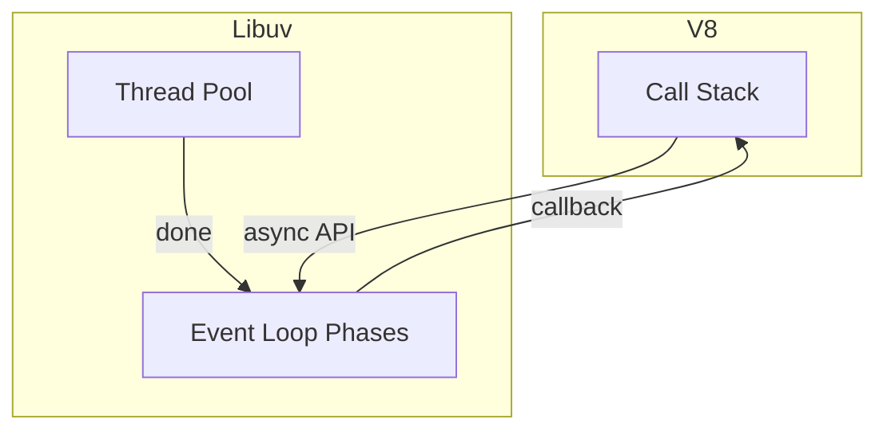
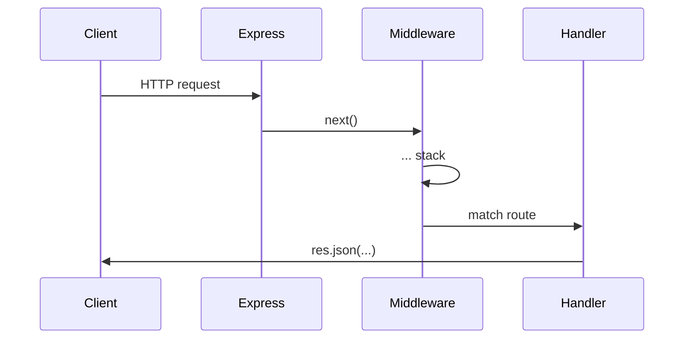
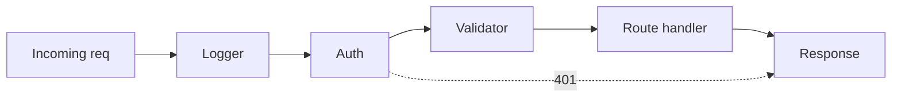

# Node.js + Express.js Complete Interview Guide

An interview-focused handbook for backend, MERN, and full-stack roles—from the event loop to production Express APIs.

---

## Table of Contents

1. [Introduction to Node.js](#1-introduction-to-nodejs)
2. [Node.js Runtime Architecture](#2-nodejs-runtime-architecture)
3. [Installing and Setting Up Node.js](#3-installing-and-setting-up-nodejs)
4. [Modules in Node.js](#4-modules-in-nodejs)
5. [Core Modules](#5-core-modules)
6. [Asynchronous Programming](#6-asynchronous-programming)
7. [EventEmitter](#7-eventemitter)
8. [Streams and Buffers](#8-streams-and-buffers)
9. [The Process Object](#9-the-process-object)
10. [Express.js Introduction](#10-expressjs-introduction)
11. [Creating Your First Server](#11-creating-your-first-server)
12. [Routing](#12-routing)
13. [Middleware](#13-middleware)
14. [Request and Response Objects](#14-request-and-response-objects)
15. [REST API Design](#15-rest-api-design)
16. [Error Handling](#16-error-handling)
17. [Environment Variables](#17-environment-variables)
18. [Authentication](#18-authentication)
19. [Authorization](#19-authorization)
20. [Security Best Practices](#20-security-best-practices)
21. [Validation](#21-validation)
22. [File Uploads](#22-file-uploads)
23. [Database Integration](#23-database-integration)
24. [MVC Architecture](#24-mvc-architecture)
25. [Advanced Architecture](#25-advanced-architecture)
26. [Logging and Monitoring](#26-logging-and-monitoring)
27. [Performance Optimization](#27-performance-optimization)
28. [WebSockets](#28-websockets)
29. [Testing](#29-testing)
30. [Deployment](#30-deployment)
31. [Scaling Node Applications](#31-scaling-node-applications)
32. [Node.js Internals](#32-nodejs-internals)
33. [Common Design Patterns](#33-common-design-patterns)
34. [Production Folder Structure](#34-production-folder-structure)
35. [Common Node.js Interview Questions (100+)](#35-common-nodejs-interview-questions-100)
36. [Practical Coding Interview Questions (30+)](#36-practical-coding-interview-questions-30)
37. [Real-World Project Discussion](#37-real-world-project-discussion)
38. [Common Mistakes Developers Make](#38-common-mistakes-developers-make)
39. [Express vs NestJS](#39-express-vs-nestjs)
40. [Final Revision Cheatsheet](#40-final-revision-cheatsheet)

---

## 1. Introduction to Node.js

### What is Node.js?

**Node.js** is a **JavaScript runtime** built on **Chrome’s V8 engine**. It lets you run JavaScript **outside the browser**—typically for servers, CLIs, tooling, and IoT.

**Interview tip:** Say “runtime,” not “framework.” Express is a framework *on top of* Node.

### Why Node.js was created

Ryan Dahl (2009) aimed to build **non-blocking, event-driven** servers using a single language (JS) on client and server—reducing context switching and enabling huge concurrency for **I/O-bound** workloads.

### How Node.js works internally (high level)

1. **V8** compiles JS to machine code.
2. Your code runs on a **main thread** with a **call stack**.
3. **Blocking system work** (file, network, DNS) is offloaded—often via **libuv**—and results come back as **callbacks**.
4. The **event loop** schedules those callbacks when the stack is clear.

**Analogy:** A restaurant with **one waiter** (main thread) taking many orders; the **kitchen** (OS / thread pool) cooks; the waiter keeps serving other tables instead of standing idle at the fryer.

### V8 engine

Google’s open-source JS engine: parses, compiles (JIT), runs JS, handles garbage collection. Node embeds V8 and adds **APIs** (`fs`, `http`, etc.) that browsers don’t provide.

### Event-driven architecture

Programs react to **events**: HTTP connections, timers, data on sockets. You register **handlers**; the runtime invokes them when events fire.

### Non-blocking I/O

Calling async APIs **returns quickly**; completion is signaled later. Contrast with **blocking** reads that freeze the thread until data arrives.

### Single-threaded event loop

Your **JavaScript executes on one thread** for a given process (main thread). **Libuv** can use a **thread pool** for some work (e.g. file I/O on Windows/Linux depending on operation), but **your JS** stays single-threaded—protect it from CPU-heavy tasks.

### When to use Node.js

- **I/O-heavy** APIs (JSON, proxies, real-time, chat, webhooks).
- **Same language** as React/React Native teams.
- **Rapid iteration** with npm ecosystem.

### When NOT to use Node.js

- **CPU-bound** tasks dominating request latency (video transcoding, heavy ML on main thread)—offload to **workers**, other services, or languages better suited.

---

## 2. Node.js Runtime Architecture

### Call stack

Where synchronous JS execution frames are pushed/popped.

### Callback queue (task queue)

Macrotasks: timers (`setTimeout`), I/O callbacks completed in libuv phases, etc.

### Microtask queue

`process.nextTick` queue (highest priority in Node—**before** other microtasks), then `Promise` reactions.

**Node ordering (simplified):** `nextTick` → microtasks (Promises) → macrotasks / event loop phases.

### Libuv

Cross-platform library Node uses for the **event loop**, **thread pool** (default size 4, configurable), async I/O abstractions.

### Thread pool

Used for some file operations, DNS (`dns.lookup`), crypto (`pbkdf2`), compression—**not** for all async work (many network ops are non-blocking at OS level).

### Execution diagram (conceptual)



### Event loop phase overview (Node)

1. **Timers** (`setTimeout` / `setInterval`)
2. **Pending callbacks** (some I/O deferred)
3. **Idle / prepare** (internal)
4. **Poll** (fetch new I/O events; execute I/O callbacks)
5. **Check** (`setImmediate` callbacks)
6. **Close callbacks** (e.g. `socket.on('close')`)

Between each phase, microtasks and `nextTick` run (details are nuanced—know the **gist** for interviews).

---

## 3. Installing and Setting Up Node.js

- **Install:** [nodejs.org](https://nodejs.org) LTS, or **nvm** / **fnm** for version switching.
- **npm:** Node’s default package manager (`npm install`, `npm run`).
- **npx:** Runs package binaries without global install (`npx create-react-app ...`).
- **package.json:** Project manifest—scripts, dependencies, `type: "module"` for ESM-by-default.
- **package-lock.json:** **Lockfile** with exact resolved versions—commit it for reproducible installs.
- **Semantic versioning:** `^1.2.3` minor/patch updates allowed; `~1.2.3` patch only; exact pin for max stability.

---

## 4. Modules in Node.js

### CommonJS (default historically)

```javascript
const fs = require("fs");
module.exports = { foo: 1 };
```

### ES Modules

```javascript
import fs from "node:fs";
export const foo = 1;
export default main;
```

**`require` vs `import`:** `require` is dynamic/sync loading in CJS; `import` is static in ESM (with limited dynamic `import()`).

### `module.exports` vs `export default`

- CJS: **`module.exports`** is the exported object/function.
- ESM: **`export default`** + optional named exports.

**Interview tip:** In mixed projects, know **`"type": "module"`** in `package.json` switches `.js` to ESM.

---

## 5. Core Modules

### `fs` (filesystem)

```javascript
import fs from "node:fs/promises";
const data = await fs.readFile("file.txt", "utf8");
```

Prefer **`fs/promises`** over callback style in new code.

### `path`

```javascript
import path from "node:path";
path.join(__dirname, "data", "a.json"); // safe segments
```

### `os`

`os.cpus()`, `os.platform()`, `os.freemem()`—health checks / metrics.

### `events`

`EventEmitter` base class—used heavily inside Node (`http`, streams).

### `http` / `https`

Low-level server and client; Express builds on these.

### `crypto`

Hashing, HMAC, random bytes, `timingSafeEqual` for comparing secrets.

### `stream`

Handle large data incrementally (see Section 8).

### `util`

`promisify` (legacy helper), `inspect`, etc.

---

## 6. Asynchronous Programming

### Error-first callbacks

```javascript
fs.readFile("a.txt", (err, data) => {
  if (err) return handle(err);
  console.log(data);
});
```

Convention: **`(err, result)`** — check `err` first.

### Promises

```javascript
import fs from "node:fs/promises";
await fs.readFile("a.txt", "utf8");
```

### Async/await

Syntactic sugar over Promises; use **`try/catch`** for errors.

**Common mistake:** Forgetting **`return next(err)`** in async Express handlers (see Section 16).

---

## 7. EventEmitter

```javascript
import { EventEmitter } from "node:events";

const bus = new EventEmitter();
bus.on("order:placed", payload => console.log(payload));
bus.emit("order:placed", { id: 1 });
```

**Pattern:** Decouple modules; used in **domain events**, logging, real-time gateways.

---

## 8. Streams and Buffers

### Why streams

Process **large files** without loading everything into RAM.

### Types

- **Readable** — source (`createReadStream`)
- **Writable** — sink (`createWriteStream`)
- **Duplex** — both ways (TCP)
- **Transform** — read, modify, write (zlib, CSV parsing)

### Pipe

```javascript
import fs from "node:fs";
fs.createReadStream("in.txt").pipe(fs.createWriteStream("out.txt"));
```

### Buffer

Raw binary allocation in memory; streams often work with Buffer chunks (`Buffer.from`, `buf.toString("utf8")`).

---

## 9. The Process Object

```javascript
process.env.NODE_ENV;
process.argv.slice(2); // CLI args
process.exit(1);       // non-zero = error (use sparingly in libs)
```

**Best practice:** Validate required env vars at startup—**fail fast**.

---

## 10. Express.js Introduction

### What is Express?

**Minimal, unopinionated** HTTP framework for Node: routing, middleware, responses—small surface area, huge ecosystem.

### Why it’s popular

Fast to learn, middleware composable, works everywhere from **MVPs** to large systems (with discipline).

### Express architecture

**App** → **router stacks** → **middleware pipeline** → **route handlers** → **`req` / `res`**.

---

## 11. Creating Your First Server

```javascript
import express from "express";

const app = express();
const PORT = process.env.PORT || 3000;

app.get("/", (req, res) => {
  res.send("OK");
});

app.listen(PORT, () => console.log(`Listening on ${PORT}`));
```

### Request–response cycle

Client → **HTTP parse** → **middleware chain** → **route** → **`res`** sent → connection may close or stay alive (keep-alive).



---

## 12. Routing

```javascript
app.get("/users/:id", (req, res) => {
  res.json({ id: req.params.id });
});

app.get("/search", (req, res) => {
  // /search?q=foo
  res.json({ q: req.query.q });
});

app.post("/users", (req, res) => res.sendStatus(201));
app.put("/users/:id", (req, res) => res.sendStatus(204));
app.patch("/users/:id", (req, res) => res.sendStatus(204));
app.delete("/users/:id", (req, res) => res.sendStatus(204));
```

### Nested routes

Use **`express.Router({ mergeParams: true })`** for `/users/:userId/posts/:postId` style.

---

## 13. Middleware

### What is middleware?

`(req, res, next) => { ... }` functions that **run in order**. They can **end** the response or call **`next()`**.

### Built-in

`express.json()`, `express.urlencoded()`, `express.static()`.

### Third-party

`cors`, `helmet`, `morgan`, `compression`, rate limiters.

### Custom

```javascript
function requestId(req, res, next) {
  req.id = crypto.randomUUID();
  next();
}
```

### Error middleware

**4 arguments** `(err, req, res, next)` — must be **after** routes.

### Middleware pipeline diagram



**Rule:** Order matters. Mount **specific** routes before **catch-all** error handlers.

---

## 14. Request and Response Objects

| API | Purpose |
|-----|---------|
| `req.params` | Route path parameters (`:id`) |
| `req.query` | Querystring (strings; parse numbers yourself) |
| `req.body` | JSON/body (after `express.json()`) |
| `req.headers` | Incoming headers |
| `req.get('X-Request-Id')` | Single header |
| `res.status(404)` | Set HTTP status |
| `res.json(obj)` | JSON body + sets Content-Type |
| `res.send(buf \| str)` | Flexible body |
| `res.setHeader` / `res.append` | Headers |

**Pitfall:** `req.body` is **undefined** until body-parser middleware runs **and** `Content-Type` is correct.

---

## 15. REST API Design

### Principles

Resources as **nouns**, HTTP verbs for actions, **stateless** server, **consistent** status codes.

### Naming

`/users`, `/users/:id/orders` — plural collections; avoid verbs in URLs when possible.

### Status codes (cheat)

- **200** OK (GET/PUT/PATCH)
- **201** Created
- **204** No Content (delete)
- **400** Bad Request (validation)
- **401** Unauthenticated
- **403** Forbidden
- **404** Not found
- **409** Conflict
- **422** Unprocessable (validation detail—common convention)
- **500** Server error

### Best practices

- **Pagination** for lists (`?cursor=` or `?page=&limit=`).
- **Idempotency** for PUT/DELETE; careful with POST retries—use **idempotency keys** for payments.

---

## 16. Error Handling

### Centralized handler

```javascript
app.use((err, req, res, next) => {
  const status = err.status || 500;
  res.status(status).json({
    error: err.message,
    requestId: req.id,
  });
});
```

### Custom error class

```javascript
class HttpError extends Error {
  constructor(status, message) {
    super(message);
    this.status = status;
  }
}
```

### Async wrapper

```javascript
export const asyncHandler = fn => (req, res, next) =>
  Promise.resolve(fn(req, res, next)).catch(next);
```

**Usage:** `app.get('/x', asyncHandler(async (req,res) => { ... }));`

---

## 17. Environment Variables

```bash
NODE_ENV=production PORT=4000 JWT_SECRET=...
```

```javascript
import "dotenv/config"; // loads .env early (install dotenv)

const port = Number(process.env.PORT) || 3000;
```

**Never** commit `.env` with secrets. Use `.env.example` with dummy keys.

---

## 18. Authentication

### JWT (JSON Web Token)

Signed payload: **header.payload.signature**. **Verify signature** server-side; **don’t trust** payload without verification.

```javascript
import jwt from "jsonwebtoken";
const token = jwt.sign({ sub: userId }, process.env.JWT_SECRET, { expiresIn: "15m" });
const payload = jwt.verify(token, process.env.JWT_SECRET);
```

### Access vs refresh

- **Access token:** short-lived, sent per request (header).
- **Refresh token:** long-lived, **HTTP-only Secure cookie** or rotation store—**revocable**.

### Cookies vs Authorization header

| Approach | Pros | Cons |
|----------|------|------|
| Bearer JWT in header | Simple for SPAs/mobile | XSS if stored in localStorage |
| HttpOnly cookie | JS can’t read token—mitigates XSS theft | Needs CSRF strategy for cookie auth |

### Session vs token

- **Session:** server stores session id; cookie holds **opaque** id.
- **Token:** self-contained state; server **stateless** unless you blocklist/rotate.

---

## 19. Authorization

### RBAC

Roles: `admin`, `editor`, `viewer`. Map roles → allowed actions.

```javascript
function requireRole(...roles) {
  return (req, res, next) => {
    if (!roles.includes(req.user.role)) return res.sendStatus(403);
    next();
  };
}
```

### Permission-based

Finer-grained: `post:write`, `invoice:read`—store on user or resolve via policy service.

---

## 20. Security Best Practices

| Topic | Mitigation |
|-------|------------|
| Headers | `helmet()` |
| CORS | `cors` with explicit `origin` in prod |
| Brute force | Rate limiting (`express-rate-limit`) |
| XSS | Sanitize output; set CSP; HttpOnly cookies |
| CSRF | SameSite cookies; CSRF tokens for cookie sessions |
| Input | **Validate all** inputs (Section 21) |
| Injection | Parameterized queries (mongoose properly); never concatenate user input into raw queries |

---

## 21. Validation

### Comparison

| Library | Style | Notes |
|---------|-------|-------|
| **express-validator** | Middleware chaining | Express-native ergonomics |
| **Joi** | Schema objects | Very common, mature |
| **Zod** | TypeScript-first, infer types | Great DX with TS |

**Example (Zod):**

```javascript
import { z } from "zod";

const CreateUser = z.object({
  email: z.string().email(),
  name: z.string().min(1),
});

const body = CreateUser.parse(req.body); // throws ZodError
```

**Best practice:** Validate **params, query, body** separately—don’t trust any client input.

---

## 22. File Uploads

### Multer (multipart)

```javascript
import multer from "multer";
const upload = multer({ dest: "uploads/" });

app.post("/avatar", upload.single("file"), (req, res) => {
  res.json({ path: req.file.path });
});
```

**Production:** stream to **S3/Cloudinary**; validate MIME/size; scan for malware at scale; never trust filename.

### Cloudinary (sketch)

Upload buffer or path via SDK → receive **secure URL**; store URL in DB.

---

## 23. Database Integration

### MongoDB + Mongoose

```javascript
import mongoose from "mongoose";

await mongoose.connect(process.env.MONGO_URI);

const userSchema = new mongoose.Schema(
  { email: { type: String, unique: true }, name: String },
  { timestamps: true }
);
export const User = mongoose.model("User", userSchema);
```

### Connection pooling

Mongoose manages a pool; **one** long-lived connection per app instance—don’t connect per request.

### Schema design

Embed vs reference: **embed** for bounded one-to-few; **reference** (`ref`) for unbounded / reused entities.

### Relationships

```javascript
orderSchema = new Schema({ userId: { type: ObjectId, ref: "User" } });
await Order.find().populate("userId", "name email");
```

---

## 24. MVC Architecture

| Layer | Responsibility |
|-------|----------------|
| **Routes** | HTTP path + method → controller |
| **Controller** | Parse request, call services, set status |
| **Services** | Business logic, orchestration |
| **Models** | Persistence schema / repository calls |
| **Utils** | Pure helpers |

**Thin controllers, fat services** is a common team rule.

---

## 25. Advanced Architecture

### Layered architecture

Routes → controllers → services → repositories → database.

### Repository pattern

Hide Mongoose/ORM behind `UserRepository.findByEmail`—easier testing and swaps.

### Dependency injection

Pass dependencies into services (`new OrderService(userRepo, paymentClient)`) or use a DI container in larger apps.

---

## 26. Logging and Monitoring

- **Morgan:** HTTP access logs (dev `dev`, prod `combined`).
- **Winston / Pino:** structured JSON logs, levels (`info`, `warn`, `error`).
- **Error tracking:** Sentry, OpenTelemetry, APM (Datadog, New Relic).

**Best practice:** Include **request id** on every log line in prod.

---

## 27. Performance Optimization

| Technique | Purpose |
|-----------|---------|
| **Caching** | Redis for hot reads, HTTP Cache-Control for static |
| **Compression** | `compression()` middleware |
| **Clustering** | `cluster` module or PM2 fork mode—use all CPUs |
| **Load balancing** | Nginx/ cloud LB in front of multiple Node processes |
| **Worker threads** | Offload CPU work from main event loop |

---

## 28. WebSockets

### Socket.IO basics

Fallback transports, rooms, namespaces—great for **chat**, live dashboards.

```javascript
import { Server } from "socket.io";

const io = new Server(httpServer, { cors: { origin: "*" } });
io.on("connection", socket => {
  socket.on("msg", payload => io.emit("msg", payload));
});
```

**Authentication:** validate JWT during handshake (`socket.handshake.auth`).

---

## 29. Testing

### Jest + Supertest

```javascript
import request from "supertest";
import app from "../app.js";

test("GET /health", async () => {
  const res = await request(app).get("/health").expect(200);
  expect(res.body.ok).toBe(true);
});
```

### Unit vs integration

- **Unit:** pure functions, services with mocked DB.
- **Integration:** real HTTP + test DB (container) or in-memory Mongo.

---

## 30. Deployment

| Tool | Role |
|------|------|
| **PM2** | Process manager, restart, logs |
| **Docker** | Immutable images, same prod/dev shape |
| **Nginx** | Reverse proxy, TLS termination, static files |
| **Azure / Render / Railway** | Managed hosting, env vars, auto deploy |

**Checklist:** `NODE_ENV=production`, health route, graceful shutdown (`SIGTERM`).

---

## 31. Scaling Node Applications

- **Horizontal scaling:** more instances behind LB; **stateless** app servers.
- **Microservices:** split by bounded context; use **queues** for async work.
- **Message queues:** RabbitMQ, SQS, Redis streams—decouple peak load, retries, DLQs.

---

## 32. Node.js Internals

### Event loop phases (deep interview)

Know timers vs poll vs check; `setImmediate` vs `setTimeout(0)` ordering is **context-dependent**—in I/O callbacks, `setImmediate` often runs before timers.

### Memory & GC

Objects in **heap**; short-lived vs long-lived generations; avoid accidental **global caches** growing forever.

### Common leak sources

Closures holding large graphs, event listeners not removed, unbounded arrays on `req` context.

---

## 33. Common Design Patterns

| Pattern | Node/Express use |
|---------|------------------|
| **Singleton** | One DB connection (module cache) |
| **Factory** | Create strategies (payment providers) |
| **Observer** | EventEmitter, domain events |
| **Middleware** | Express stack—chain of responsibility |

---

## 34. Production Folder Structure

```
src/
  config/          # env validation
  routes/
  controllers/
  services/
  models/          # mongoose schemas
  middlewares/
  utils/
  validators/
  app.js           # create express app
  server.js        # listen + graceful shutdown
tests/
```

Feature-based variant: `src/features/users/{routes,service,model}.js`.

---

## 35. Common Node.js Interview Questions (100+)

> **Study tip:** Cover **model answers**, then drill the rapid Q&A like flashcards.

### Model answers (full sentences)

**Explain the Node event loop in one minute.**  
JavaScript runs on a **single thread** with a call stack. When we call async operations, Node offloads work to the operating system or **libuv’s thread pool**. When work completes, callbacks schedule on the **event loop**. Between phases, microtasks and `process.nextTick` callbacks run. The important interview point is: **never block the thread** with heavy CPU synchronous code, or I/O completion can’t be processed promptly.

**What is middleware in Express?**  
Middleware functions run **in order** for each request. They can read `req`, write `res`, or call `next()` to pass control. Error-handling middleware has four parameters and runs when `next(err)` is called.

**How do you secure a REST API?**  
Validate inputs, use **helmet** and strict **CORS**, rate limit auth routes, hash passwords with **bcrypt/argon2**, sign and verify **JWTs** with secrets in env, prefer **HttpOnly** cookies for refresh tokens when using cookies, protect against **CSRF** for cookie-based session flows, use parameterized queries, and log with **request IDs** for audits.

### Beginner (1–40)

**Q1.** What is Node.js? **A.** JS runtime on V8 for servers/tools.  
**Q2.** What is npm? **A.** Package manager + registry client.  
**Q3.** What is `package.json`? **A.** Project metadata and dependencies.  
**Q4.** Why `package-lock.json`? **A.** Deterministic installs.  
**Q5.** CommonJS vs ESM? **A.** `require`/`module.exports` vs `import`/`export`.  
**Q6.** What is V8? **A.** Google JS engine inside Node/Chrome.  
**Q7.** Is Node multi-threaded? **A.** JS main thread is single-threaded; libuv uses thread pool for some ops.  
**Q8.** What is non-blocking I/O? **A.** Async APIs return fast; completion via callback/Promise.  
**Q9.** What is `__dirname`? **A.** Directory of current module file (CJS).  
**Q10.** `path.join` vs `path.resolve`? **A.** Join concatenates; resolve builds absolute.  
**Q11.** What is `Buffer`? **A.** Binary data in memory.  
**Q12.** `fs.readFile` sync good? **A.** Avoid on server hot paths—blocks event loop.  
**Q13.** What is middleware? **A.** `(req,res,next)=>` pipeline function.  
**Q14.** `app.use` vs `app.get`? **A.** `use` prefix/mount; `get` HTTP GET + path.  
**Q15.** What is `req.params`? **A.** Route path parameters.  
**Q16.** What is `req.query`? **A.** Querystring parsed as object.  
**Q17.** `res.json` vs `res.send`? **A.** `json` sets JSON content-type.  
**Q18.** Status 201 meaning? **A.** Created resource.  
**Q19.** Status 204? **A.** Success, no body.  
**Q20.** What is REST? **A.** Resource-oriented HTTP API style.  
**Q21.** What is JWT? **A.** Signed JSON claims token.  
**Q22.** Why HttpOnly cookie? **A.** JS cannot read—reduces XSS token theft.  
**Q23.** What is CORS? **A.** Browser cross-origin policy; server headers allow origins.  
**Q24.** What does `helmet` do? **A.** Sets security-related HTTP headers.  
**Q25.** What is `dotenv`? **A.** Load `.env` into `process.env`.  
**Q26.** `NODE_ENV=production` effect? **A.** Libraries optimize; hide stack traces if configured.  
**Q27.** What is Mongoose? **A.** MongoDB ODM for Node.  
**Q28.** Schema vs model? **A.** Schema defines shape; model is constructor + collection.  
**Q29.** What is `ObjectId`? **A.** MongoDB BSON id type.  
**Q30.** `populate`? **A.** Join-like fetch referenced docs.  
**Q31.** What is `express.json()`? **A.** Parses JSON bodies into `req.body`.  
**Q32.** Multer purpose? **A.** Multipart file uploads.  
**Q33.** `process.env`? **A.** Environment variables map.  
**Q34.** `npm run`? **A.** Runs scripts from package.json.  
**Q35.** Semantic versioning MAJOR? **A.** Breaking changes.  
**Q36.** `^` in semver? **A.** Allow minor/patch updates.  
**Q37.** `npx`? **A.** Execute package binary without global install.  
**Q38.** What is `cluster`? **A.** Fork workers to use multiple CPU cores.  
**Q39.** PM2? **A.** Production process manager.  
**Q40.** Supertest? **A.** HTTP assert library for Express tests.  

### Intermediate (41–80)

**Q41.** `setImmediate` vs `process.nextTick`? **A.** `nextTick` runs before event loop continues; highest priority.  
**Q42.** Phases of event loop? **A.** Timers, pending, idle/prepare, poll, check, close.  
**Q43.** What blocks event loop? **A.** Long sync CPU, huge JSON.parse, sync fs on hot path.  
**Q44.** When use worker threads? **A.** CPU-heavy parallel work.  
**Q45.** Streams benefit? **A.** Memory efficiency for large payloads.  
**Q46.** `pipe` backpressure? **A.** Streams coordinate flow to avoid memory spikes.  
**Q47.** Error-first callback convention? **A.** `(err, data)` with err check first.  
**Q48.** Why promisify? **A.** Bridge callback APIs to async/await (older code).  
**Q49.** Express error middleware signature? **A.** Four args `(err,req,res,next)`.  
**Q50.** Why async errors need `next(err)`? **A.** Uncaught promise rejections don’t hit error middleware automatically.  
**Q51.** JWT stored in localStorage risk? **A.** XSS can exfiltrate token.  
**Q52.** Refresh token rotation? **A.** New refresh per use; detect reuse/replay.  
**Q53.** bcrypt vs plain? **A.** Never store plain passwords—salted slow hash.  
**Q54.** RBAC vs ABAC? **A.** Roles vs attribute/policy-based access.  
**Q55.** Rate limiting where? **A.** Edge/LB + app; stricter on login.  
**Q56.** SQL injection prevention? **A.** Parameterized queries/ORM.  
**Q57.** NoSQL injection? **A.** Don’t pass raw user objects into query operators without validation.  
**Q58.** `trust proxy`? **A.** Behind Nginx/LB—needed for correct `req.ip` and secure cookies.  
**Q59.** Idempotency key? **A.** Client header to make retries safe for payments.  
**Q60.** Pagination cursors vs offset? **A.** Cursors scale better on large collections.  
**Q61.** Connection pooling? **A.** Reuse DB connections—don’t connect per request.  
**Q62.** `express.Router`? **A.** Modular route groups.  
**Q63.** `mergeParams`? **A.** Preserve parent `:param` in child routers.  
**Q64.** `res.locals`? **A.** Per-request template data inside middleware chain.  
**Q65.** Content-Type for JSON? **A.** `application/json`.  
**Q66.** 401 vs 403? **A.** Unauthenticated vs authenticated but not allowed.  
**Q67.** `http.Agent` pooling? **A.** Reuse TCP connections for outgoing HTTP.  
**Q68.** Keep-alive benefit? **A.** Fewer handshakes for many requests.  
**Q69.** Graceful shutdown steps? **A.** Stop accepting, finish in-flight, close DB, exit.  
**Q70.** Health vs readiness? **A.** Process up vs dependencies OK.  
**Q71.** Structured logging why? **A.** Queryable JSON in log aggregators.  
**Q72.** Correlation id? **A.** Trace request across services.  
**Q73.** `compression()` caveat? **A.** CPU cost; often at reverse proxy instead.  
**Q74.** Redis cache stampede? **A.** Lock/single-flight on miss.  
**Q75.** JWT algorithm `none` attack? **A.** Reject `alg` none; enforce allowed algs.  
**Q76.** XSS vs CSRF? **A.** Inject script vs forge requests using cookies.  
**Q77.** SameSite cookie values? **A.** Strict/Lax/None (+Secure).  
**Q78.** File upload validation? **A.** MIME sniff limits, size caps, sanitize names.  
**Q79.** `dns.lookup` thread pool? **A.** Can block pool—careful under load.  
**Q80.** `cluster` shared port? **A.** Master listens; workers share via OS scheduling.  

### Advanced (81–115)

**Q81.** Libuv thread pool size impact? **A.** Increase for heavy crypto/fs parallelism; can starve other pool users.  
**Q82.** `Promise` vs `nextTick` ordering? **A.** `nextTick` runs before Promises microtasks in Node.  
**Q83.** What is libuv? **A.** Cross-platform async I/O + event loop + thread pool.  
**Q84.** Zero-copy buffers? **A.** Advanced stream/socket optimization—know at high level.  
**Q85.** Backpressure handling? **A.** `pause`/`resume` or `pipeline` with error handling.  
**Q86.** Recommending Nest when? **A.** Large teams wanting DI, modules, graph-first structure.  
**Q87.** GraphQL with Express? **A.** Apollo/GraphQL Yoga middleware—different validation/caching story.  
**Q88.** SSRF risks in server fetches? **A.** Block internal IPs; allowlist domains.  
**Q89.** Timing attacks on secrets? **A.** Use `crypto.timingSafeEqual` for comparisons.  
**Q90.** Bcrypt cost factor? **A.** Tune for ~250ms verify on hardware.  
**Q91.** OAuth2 vs JWT? **A.** OAuth2 is framework; JWT is token format often used with OAuth2.  
**Q92.** Session fixation mitigation? **A.** Regenerate session id on login.  
**Q93.** Distributed rate limiting? **A.** Redis token bucket vs in-memory per instance.  
**Q94.** Outbox pattern? **A.** Reliable domain events + DB transaction.  
**Q95.** Saga vs 2PC? **A.** Distributed compensations vs two-phase commit.  
**Q96.** CQRS mention? **A.** Separate read/write models—advanced architecture.  
**Q97.** OpenAPI value? **A.** Contract-first API docs + codegen.  
**Q98.** Zod + TS inference? **A.** `z.infer<typeof Schema>` types from schema.  
**Q99.** Mongoose `$where` risk? **A.** Arbitrary JS—dangerous with user input.  
**Q100.** Change streams? **A.** MongoDB real-time data sync.  
**Q101.** Transaction in Mongo? **A.** Multi-doc transactions with replica sets.  
**Q102.** Memory leak in closures? **A.** Accidentally retaining `req` or huge caches.  
**Q103.** `GLOBAL` pollution? **A.** Avoid globals; use modules.  
**Q104.** `uncaughtException` handler? **A.** Log and exit—uncertain state risk.  
**Q105.** `unhandledRejection`? **A.** Must log; convert to crash in strict setups.  
**Q106.** PM2 cluster mode? **A.** Multi-process on all CPUs with restart policies.  
**Q107.** Docker multi-stage builds? **A.** Smaller final image without dev deps.  
**Q108.** Nginx as TLS terminator? **A.** Certificates at edge; HTTP to Node internally.  
**Q109.** Webhook signature verification? **A.** HMAC of raw body with shared secret.  
**Q110.** Raw body for Stripe? **A.** Need unparsed buffer for signature—mount route before `json()`.  
**Q111.** `http2` with Express? **A.** Possible with `spdy` or Node http2—framework-specific.  
**Q112.** DNS cache in Node? **A.** Understand `dns.promises` vs cached resolvers at LB.  
**Q113.** V8 isolate? **A.** Concept for workers/serverless—advanced.  
**Q114.** WASM in Node? **A.** Heavy compute offload path.  
**Q115.** Observability pillars? **A.** Metrics, logs, traces.  

---

## 36. Practical Coding Interview Questions (30+)

### 1) Minimal Express server with JSON + 404

```javascript
import express from "express";

const app = express();
app.use(express.json());

app.get("/health", (req, res) => res.json({ ok: true }));

app.use((req, res) => res.status(404).json({ error: "Not found" }));

export default app;
```

### 2) Logger middleware (request id + duration)

```javascript
import { randomUUID } from "node:crypto";

export function requestLogger(req, res, next) {
  const id = req.get("X-Request-Id") || randomUUID();
  req.id = id;
  res.setHeader("X-Request-Id", id);
  const start = performance.now();
  res.on("finish", () => {
    const ms = Math.round(performance.now() - start);
    console.log(JSON.stringify({ id, method: req.method, path: req.path, status: res.statusCode, ms }));
  });
  next();
}
```

### 3) asyncHandler helper

```javascript
export const asyncHandler = fn => (req, res, next) =>
  Promise.resolve(fn(req, res, next)).catch(next);
```

### 4) Central error middleware

```javascript
export function errorMiddleware(err, req, res, next) {
  const status = err.status || err.statusCode || 500;
  const body = {
    error: err.message || "Internal error",
    requestId: req.id,
  };
  if (process.env.NODE_ENV !== "production" && err.stack) body.stack = err.stack.split("\n");
  res.status(status).json(body);
}
```

### 5) JWT auth middleware (Bearer)

```javascript
import jwt from "jsonwebtoken";

export function requireAuth(req, res, next) {
  const h = req.get("Authorization") || "";
  const [, token] = h.split(" ");
  if (!token) return res.status(401).json({ error: "Missing" });
  try {
    req.user = jwt.verify(token, process.env.JWT_SECRET);
    next();
  } catch {
    res.status(401).json({ error: "Invalid" });
  }
}
```

### 6) Role middleware

```javascript
export const requireRole = role => (req, res, next) => {
  if (!req.user || req.user.role !== role) return res.sendStatus(403);
  next();
};
```

### 7) Simple in-memory rate limiter (per IP)

```javascript
const hits = new Map();

export function rateLimit({ windowMs, max }) {
  return (req, res, next) => {
    const ip = req.ip;
    const now = Date.now();
    const slot = hits.get(ip) || { count: 0, reset: now + windowMs };
    if (now > slot.reset) {
      slot.count = 0;
      slot.reset = now + windowMs;
    }
    slot.count++;
    hits.set(ip, slot);
    res.setHeader("X-RateLimit-Remaining", String(Math.max(0, max - slot.count)));
    if (slot.count > max) return res.status(429).json({ error: "Too many" });
    next();
  };
}
```

*Production:* use **Redis** for distributed limits.

### 8) Pagination helper (offset)

```javascript
export function paginate(req) {
  const page = Math.max(1, Number(req.query.page) || 1);
  const limit = Math.min(100, Math.max(1, Number(req.query.limit) || 20));
  const skip = (page - 1) * limit;
  return { page, limit, skip };
}
```

```javascript
// Express route sketch (Mongoose)
app.get("/items", async (req, res, next) => {
  try {
    const { page, limit, skip } = paginate(req);
    const [total, items] = await Promise.all([
      Item.countDocuments(),
      Item.find().sort({ _id: -1 }).skip(skip).limit(limit).lean(),
    ]);
    res.json({ page, limit, total, items });
  } catch (e) { next(e); }
});
```

### 9) Cursor pagination (ID-based)

```javascript
export async function listAfter(Model, { after, limit }) {
  const q = after ? { _id: { $gt: after } } : {};
  const items = await Model.find(q).sort({ _id: 1 }).limit(limit + 1).lean();
  const hasMore = items.length > limit;
  const page = hasMore ? items.slice(0, limit) : items;
  const nextCursor = hasMore ? String(page[page.length - 1]._id) : null;
  return { items: page, nextCursor };
}
```

### 10) Validate body with Zod middleware factory

```javascript
import { z } from "zod";

export const validateBody = schema => (req, res, next) => {
  const parsed = schema.safeParse(req.body);
  if (!parsed.success) return res.status(400).json({ issues: parsed.error.flatten() });
  req.body = parsed.data;
  next();
};

export const CreateUserSchema = z.object({ email: z.string().email(), name: z.string().min(1) });
```

### 11) Multer single file + size limit

```javascript
import multer from "multer";

const upload = multer({
  storage: multer.memoryStorage(),
  limits: { fileSize: 2 * 1024 * 1024 },
});

app.post("/upload", upload.single("file"), (req, res) => {
  if (!req.file) return res.status(400).json({ error: "file required" });
  res.json({ size: req.file.size, mime: req.file.mimetype });
});
```

### 12) Cloudinary upload sketch (buffer)

```javascript
// npm i cloudinary
import { v2 as cloudinary } from "cloudinary";

cloudinary.config({
  cloud_name: process.env.CLOUDINARY_CLOUD_NAME,
  api_key: process.env.CLOUDINARY_API_KEY,
  api_secret: process.env.CLOUDINARY_API_SECRET,
});

export async function uploadBuffer(buf, folder) {
  return new Promise((resolve, reject) => {
    const stream = cloudinary.uploader.upload_stream({ folder }, (err, result) =>
      err ? reject(err) : resolve(result)
    );
    stream.end(buf);
  });
}
```

### 13) Simple Redis GET cache wrapper

```javascript
import { createClient } from "redis";

const redis = createClient({ url: process.env.REDIS_URL });
await redis.connect();

export async function cachedJson(key, ttlSec, fetcher) {
  const hit = await redis.get(key);
  if (hit) return JSON.parse(hit);
  const data = await fetcher();
  await redis.setEx(key, ttlSec, JSON.stringify(data));
  return data;
}
```

### 14) Express + helmet + cors (production-safe sketch)

```javascript
import helmet from "helmet";
import cors from "cors";

app.use(helmet());
app.use(cors({ origin: process.env.CLIENT_ORIGIN, credentials: true }));
```

### 15) Raw body route for webhooks (Stripe-style)

```javascript
import express from "express";

const raw = express.raw({ type: "application/json" });

app.post("/webhook", raw, (req, res) => {
  const sig = req.get("Stripe-Signature"); // or provider header
  const payload = req.body; // Buffer
  // verify HMAC(sig, payload, secret) ...
  res.sendStatus(200);
});
```

*Mount this route **before** `express.json()` or use `verify` option on `express.json` for that path.*

### 16) Singleton mongoose connect module

```javascript
import mongoose from "mongoose";

let conn = null;

export async function connectDb() {
  if (conn) return conn;
  conn = await mongoose.connect(process.env.MONGO_URI);
  return conn;
}
```

### 17) Graceful shutdown

```javascript
export function graceful(server) {
  const shutdown = signal => () => {
    console.log(signal);
    server.close(() => process.exit(0));
    setTimeout(() => process.exit(1), 10_000).unref();
  };
  process.on("SIGINT", shutdown("SIGINT"));
  process.on("SIGTERM", shutdown("SIGTERM"));
}
```

### 18) Repository pattern sketch

```javascript
export class UserRepository {
  constructor(UserModel) { this.User = UserModel; }
  findByEmail(email) { return this.User.findOne({ email }).lean(); }
  create(data) { return this.User.create(data); }
}
```

### 19) Factory for payment strategies

```javascript
export function createPayment(provider) {
  if (provider === "stripe") return new StripeGateway();
  if (provider === "paypal") return new PayPalGateway();
  throw new Error("unknown");
}
```

### 20) Timeout middleware

```javascript
export function timeout(ms) {
  return (req, res, next) => {
    const t = setTimeout(() => {
      if (!res.headersSent) res.status(503).json({ error: "timeout" });
    }, ms);
    res.on("finish", () => clearTimeout(t));
    next();
  };
}
```

### 21) Basic HTTP client with fetch + timeout

```javascript
export async function getJson(url, { timeoutMs = 5000, signal } = {}) {
  const ac = new AbortController();
  const t = setTimeout(() => ac.abort(), timeoutMs);
  try {
    const res = await fetch(url, { signal: signal ?? ac.signal });
    if (!res.ok) throw new Error(`HTTP ${res.status}`);
    return await res.json();
  } finally {
    clearTimeout(t);
  }
}
```

### 22) `requireApiKey` middleware

```javascript
export function requireApiKey(req, res, next) {
  const key = req.get("X-Api-Key");
  if (!key || key !== process.env.API_KEY) return res.sendStatus(401);
  next();
}
```

### 23) ETag / conditional GET (sketch)

```javascript
import crypto from "node:crypto";

app.get("/data", (req, res) => {
  const body = JSON.stringify({ ok: true });
  const etag = '"' + crypto.createHash("sha1").update(body).digest("hex") + '"';
  if (req.get("If-None-Match") === etag) return res.status(304).end();
  res.setHeader("ETag", etag);
  res.type("json").send(body);
});
```

### 24) Chunked JSON lines logger (stream-ish pattern)

```javascript
import fs from "node:fs";

const log = fs.createWriteStream("app.log", { flags: "a" });
export function logLine(obj) {
  log.write(JSON.stringify({ ts: Date.now(), ...obj }) + "\n");
}
```

### 25) Route version prefix

```javascript
import { Router } from "express";

const v1 = Router();
v1.get("/users", (req, res) => res.json({ v: 1 }));
app.use("/api/v1", v1);
```

### 26) Content negotiation JSON vs text

```javascript
app.get("/hello", (req, res) => {
  res.format({
    "application/json": () => res.json({ msg: "hi" }),
    "text/plain": () => res.send("hi"),
    default: () => res.status(406).send("Not acceptable"),
  });
});
```

### 27) Basic CSRF double-submit (conceptual)

Issue random token in cookie + require same in header `X-CSRF-Token` on mutating routes—**frameworks** often handle this; know the pattern.

### 28) `aggregate` error mapper for mongoose

```javascript
export function mongoError(err, req, res, next) {
  if (err.code === 11000) return res.status(409).json({ error: "Duplicate" });
  next(err);
}
```

### 29) Worker thread pool sketch for CPU work

```javascript
import { Worker } from "node:worker_threads";

export function runWorker(filename, data) {
  return new Promise((resolve, reject) => {
    const w = new Worker(filename, { workerData: data });
    w.on("message", resolve);
    w.on("error", reject);
    w.on("exit", c => (c !== 0 ? reject(new Error(`exit ${c}`)) : null));
  });
}
```

### 30) Socket.IO auth middleware (sketch)

```javascript
import jwt from "jsonwebtoken";

export function socketAuth(socket, next) {
  try {
    const token = socket.handshake.auth.token;
    socket.user = jwt.verify(token, process.env.JWT_SECRET);
    next();
  } catch {
    next(new Error("unauthorized"));
  }
}
```

### 31–32) Bonus talking points

- **31:** `express-async-errors` package auto-forwards rejections (alternative to wrapper).  
- **32:** **OpenTelemetry** instrumentation for HTTP spans in prod.  

---

## 37. Real-World Project Discussion

### Pitch structure

1. **Problem & users** — what the API supported.  
2. **Architecture** — Express layers, DB, cache, queues.  
3. **Security** — authn/z, validation, rate limits, secrets.  
4. **Reliability** — idempotency, retries, DLQ, monitoring.  
5. **Scale** — horizontal instances, stateless design, DB indexes.  
6. **Tradeoffs** — why Express over Nest; Mongo vs Postgres; sync vs async processing.

### Metrics interviewers like

p95 latency, error rate before/after caching, cost per million requests, incident MTTR.

---

## 38. Common Mistakes Developers Make

| Mistake | Fix |
|---------|-----|
| **Blocking event loop** | Avoid sync fs/crypto on hot paths; use workers |
| **No async error handling** | `asyncHandler` or try/catch + `next(err)` |
| **Trusting `req.body`** | Validate with Zod/Joi first |
| **Global mutable state** | Use DB/Redis for shared state across instances |
| **Leaked listeners / timers** | Cleanup on shutdown |
| **JWT in localStorage for sensitive apps** | Prefer HttpOnly strategy + XSS hardening |
| **CORS wildcard (`*`) with credentials** | Invalid together—use explicit origins |
| **Logging secrets** | Redact Authorization cookies |

---

## 39. Express vs NestJS

| | Express | NestJS |
|---|---------|--------|
| Style | Minimal, flexible | Opinionated, Angular-like modules |
| DI | Manual / community | Built-in |
| Structure | You choose | Strong defaults |
| Learning curve | Low | Higher |
| Best for | Small/medium APIs, microservices | Large teams, enterprise patterns |

**When Nest:** You want **first-class DI**, decorators, GraphQL integration, standardized module graph.  
**When Express:** Maximum simplicity, existing ecosystem, edge functions, quick services.

---

## 40. Final Revision Cheatsheet

### Must-know phrases

- **“Don’t block the event loop.”**  
- **“Validate at the boundary; fail closed.”**  
- **“Use centralized error middleware and structured logs.”**  
- **“Stateless servers behind a load balancer.”**

### Frequently forgotten

- `next()` omission hangs request.  
- Order of middleware matters.  
- Async route errors need forwarding.  
- `trust proxy` for secure cookies behind LB.  
- Webhook signature needs **raw** body.

### Best practices one-liner list

Helmet, CORS allowlist, rate limit auth, Zod/Joi, JWT secrets in env, bcrypt passwords, parameterized DB ops, PM2/Docker + Nginx, health checks, graceful shutdown, Redis cache where hot, queues for slow work.

---

**End of guide.** For browser/event-loop symmetry, cross-study `JavaScript-Complete-Interview-Guide.md`; for full-stack UX, pair with `ReactJS-Complete-Interview-Guide.md`.
