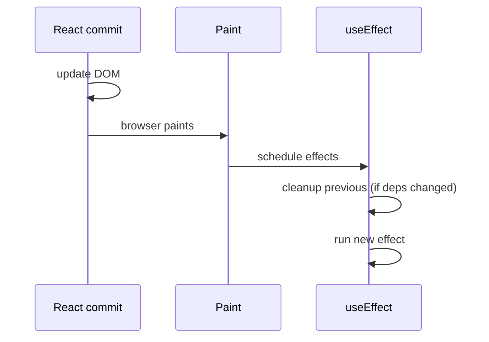

# React.js Complete Interview Guide

The ultimate interview-focused handbook for React—from fundamentals to production—aimed at frontend, MERN, and full-stack roles.

---

## Table of Contents

1. [Introduction to React](#1-introduction-to-react)
2. [React Fundamentals](#2-react-fundamentals)
3. [Components](#3-components)
4. [Props](#4-props)
5. [State](#5-state)
6. [Event Handling](#6-event-handling)
7. [Conditional Rendering](#7-conditional-rendering)
8. [Lists and Keys](#8-lists-and-keys)
9. [Forms](#9-forms)
10. [useEffect](#10-useeffect)
11. [React Hooks](#11-react-hooks)
12. [Component Lifecycle](#12-component-lifecycle)
13. [State Management](#13-state-management)
14. [Routing](#14-routing)
15. [API Integration](#15-api-integration)
16. [Performance Optimization](#16-performance-optimization)
17. [Advanced Patterns](#17-advanced-patterns)
18. [Reconciliation Algorithm](#18-reconciliation-algorithm)
19. [Context API](#19-context-api)
20. [Redux Toolkit](#20-redux-toolkit)
21. [Error Boundaries](#21-error-boundaries)
22. [Portals](#22-portals)
23. [Refs](#23-refs)
24. [Custom Hooks](#24-custom-hooks)
25. [Testing React Applications](#25-testing-react-applications)
26. [React Security](#26-react-security)
27. [React Best Practices](#27-react-best-practices)
28. [Common React Interview Questions (100+)](#28-common-react-interview-questions-100)
29. [React Coding Interview Questions (30+)](#29-react-coding-interview-questions-30)
30. [React Tricky Questions](#30-react-tricky-questions)
31. [React with TypeScript (Conceptual)](#31-react-with-typescript-conceptual)
32. [React in Production](#32-react-in-production)
33. [React Project Architecture](#33-react-project-architecture)
34. [React + JavaScript Concepts](#34-react--javascript-concepts)
35. [Real-World Interview Project Discussion](#35-real-world-interview-project-discussion)
36. [Revision Summaries](#36-revision-summaries)

---

## 1. Introduction to React

### What is React?

**React** is a JavaScript library for building user interfaces, especially **component-based** web apps. You describe **what** the UI should look like for a given state; React handles **how** to update the DOM efficiently.

**Interview tip:** Say “library, not a framework” unless your team treats it as the core of a stack (Next.js is a framework *on top of* React).

### Why React was created

Facebook (Meta) needed a way to build large, interactive UIs without **error-prone manual DOM manipulation**. React popularized a **declarative** model and a **unidirectional data flow** mental model.

### Problems React solves

| Problem | How React helps |
|--------|------------------|
| Spaghetti DOM updates | Declarative UI + reconciliation |
| Unpredictable UI state | Single source of truth per feature; predictable renders |
| Unreusable UI | Components + composition |
| Performance at scale | Batching, memoization, concurrent features (React 18+) |

### SPA vs MPA

- **SPA (Single Page Application):** One HTML shell; client-side routing swaps views. Fast transitions; heavier initial JS.
- **MPA (Multi Page Application):** Full server round-trips per page. Simpler caching/SEO for static content unless augmented.

**Analogy:** SPA is like a **desktop app shell** where panels swap; MPA is like **new rooms** you walk into from the server.

### Virtual DOM

The **Virtual DOM (VDOM)** is a lightweight **in-memory tree of React elements** (descriptions), not real DOM nodes. On each render, React builds a new tree and **diffs** it against the previous one to compute minimal updates.

**Common mistake:** Claiming “VDOM is always faster than direct DOM.” Reality: **direct DOM can be faster for micro-updates**; React wins on **developer experience and predictable batching** at scale.

### Reconciliation

**Reconciliation** is React’s process of **matching** the new element tree with the old and **patching** the real DOM. It uses **heuristics** (same type at same position → update; different type → replace subtree).

### Declarative programming

You write `UI = f(state)` in spirit: **given state, return JSX**. You don’t imperatively `appendChild` everywhere.

### Component-based architecture

UI is split into **nested components** with clear boundaries. Data flows **down** via props; events and callbacks flow **up**.

---

## 2. React Fundamentals

### JSX

JSX looks like HTML in JavaScript. It compiles to `React.createElement` (or `_jsx` in modern transforms).

```jsx
const el = <h1 className="title">Hello</h1>;
```

**Rules:** One parent (or Fragment); `className` not `class`; camelCase props.

### Expressions in JSX

Use `{}` for any JavaScript expression.

```jsx
const x = 2;
return <p>{x * 2}</p>;
```

### Rendering elements

```jsx
import { createRoot } from "react-dom/client";
const root = createRoot(document.getElementById("root"));
root.render(<App />);
```

### ReactDOM

`react-dom` bridges React to the browser DOM. `createRoot` (React 18) supports **concurrent features** and replaces legacy `ReactDOM.render`.

### Strict Mode

`<StrictMode>` **double-invokes** certain lifecycles in development only (e.g. effects, constructors) to surface **impure/side-effect** bugs.

```jsx
<StrictMode>
  <App />
</StrictMode>
```

**Interview tip:** It does **not** change production behavior.

---

## 3. Components

### Functional components

```jsx
function Welcome({ name }) {
  return <h1>Hi {name}</h1>;
}
```

### Class components

```jsx
class Welcome extends React.Component {
  render() {
    return <h1>Hi {this.props.name}</h1>;
  }
}
```

### Why functional components dominate

Hooks give **state and effects** without classes; simpler mental model; better tree-shaking and typing ecosystems favor functions.

### Component composition

Prefer **composition** over inheritance: pass **children** or **render props** to customize.

```jsx
function Card({ title, children }) {
  return (
    <section>
      <h2>{title}</h2>
      {children}
    </section>
  );
}
```

---

## 4. Props

### Passing props

```jsx
<Welcome name="Ada" age={36} />
```

### Default props

```jsx
function Badge({ text = "New" }) {
  return <span>{text}</span>;
}
// or defaultParameters above — preferred in modern code
```

### `children` prop

Everything between tags becomes `props.children`.

### Props drilling

Passing props through many layers. **Mitigate** with Context, composition, or state management—only when it hurts.

**When to use Context:** Cross-cutting **theme, auth, locale**—not every piece of local UI state.

---

## 5. State

### What is state?

**State** is data that **changes over time** and should **trigger a re-render** when updated (via `setState` / hooks).

### `useState`

```jsx
const [count, setCount] = useState(0);
```

### State updates

Updates may be **asynchronous** and **batched**. Never assume the variable updates immediately after `setCount`.

### Functional updates

```jsx
setCount(c => c + 1); // safe when next state depends on previous
```

### Batching

React **batches** multiple `setState` calls in one event handler into **one re-render** (React 18 also batches in promises/timeouts in many cases).

**Pitfall:** Reading state right after set in the same tick often sees **stale** values—use functional updates or `useEffect` with deps.

---

## 6. Event Handling

### Synthetic events

React wraps native events in a **SyntheticEvent** for cross-browser consistency and pooling (older behavior—know the term in interviews).

### Passing arguments

```jsx
<button onClick={() => handleClick(id)}>Go</button>
```

**Mistake:** `onClick={handleClick(id)}` invokes immediately unless it returns a function.

### Common patterns

- **Controlled** inputs: state drives `value`.
- **Toggle:** `setOpen(o => !o)`.

---

## 7. Conditional Rendering

### `if` / early return

```jsx
if (!user) return <Login />;
return <Dashboard user={user} />;
```

### Ternary

```jsx
{isAdmin ? <AdminBar /> : null}
```

### Logical AND

```jsx
{isNew && <Badge />}
```

**Pitfall:** `count && <List/>` breaks when `count` is `0` (falsy)—use `count > 0`.

---

## 8. Lists and Keys

### Rendering arrays

```jsx
{items.map(item => (
  <Row key={item.id} data={item} />
))}
```

### Importance of keys

Keys tell React **identity** across renders. Stable keys preserve state inside list items; wrong keys cause **bugs and janky animations**.

### Common mistakes

- Using **array index** as key when list **reorders** or inserts.
- Using **random** keys per render.

**Best:** Stable IDs from data.

---

## 9. Forms

### Controlled components

React state is the source of truth.

```jsx
const [v, setV] = useState("");
<input value={v} onChange={e => setV(e.target.value)} />
```

### Uncontrolled components

Use **refs** + default values for one-off forms or file inputs.

```jsx
const ref = useRef(null);
<input ref={ref} defaultValue="hi" />
```

### Form validation

Validate on submit or on blur; show errors from state; disable submit while invalid/async.

### Best practices

- One source of truth per field (controlled vs uncontrolled—don’t mix blindly).
- Accessible labels and error announcements.

---

## 10. `useEffect`

### Lifecycle equivalent

`useEffect` is for **synchronizing** with **external systems**: subscriptions, timers, data fetching, DOM measurements—not for “every render” derived values (use the render body or `useMemo`).

### Dependency array

```jsx
useEffect(() => {
  // effect
  return () => {
    /* cleanup */
  };
}, [a, b]);
```

- **No array:** runs every render (rare, usually wrong).
- **`[]`:** mount + unmount cleanup.
- **`[deps]`:** when deps change—**stale closure** risk if deps incomplete.

### Cleanup functions

Cancel subscriptions, abort fetches, clear timers—prevents leaks and **race conditions**.

### Common bugs

- **Missing deps** → stale state in async callbacks.
- **Object/function deps** recreated each render → infinite loops.
- **Fetching without cleanup** → out-of-order responses overwrite UI.

### Infinite loops

Often: `useEffect(() => setX(x+1), [x])` or `setState` without stable condition.

### Execution flow (interview walkthrough)

1. React commits DOM updates.
2. **Layout effects** (`useLayoutEffect`) run synchronously before paint.
3. **Passive effects** (`useEffect`) run after paint (async scheduling).
4. On re-render: **cleanup** from previous effect runs **before** the next effect (for the same hook slot), then new effect runs if deps changed.



---

## 11. React Hooks

### Rules of Hooks

Only call hooks:

1. At the **top level** of a React function (not inside loops/conditions/nested functions arbitrarily).
2. From **React functions** or **custom hooks**.

**Why:** Hooks rely on **call order** to associate state with components.

### Hook quick reference

| Hook | Purpose |
|------|---------|
| `useState` | Local state |
| `useEffect` | Side effects / sync |
| `useRef` | Mutable box + DOM refs |
| `useMemo` | Memoize expensive compute |
| `useCallback` | Stable function identity |
| `useContext` | Read context |
| `useReducer` | Complex state transitions |
| Custom | Reuse stateful logic |

---

## 12. Component Lifecycle

### Class lifecycle phases

**Mount:** `constructor` → `render` → `componentDidMount`  
**Update:** `render` → `componentDidUpdate`  
**Unmount:** `componentWillUnmount`

### Functional equivalents

| Class | Function hooks |
|-------|----------------|
| `componentDidMount` | `useEffect(() => {}, [])` |
| `componentDidUpdate` | `useEffect(() => {}, [deps])` |
| `componentWillUnmount` | cleanup in `useEffect` |
| `getSnapshotBeforeUpdate` | `useLayoutEffect` patterns |

**Interview nuance:** `useEffect` is **not** identical to `componentDidMount`—effects are post-paint and model **synchronization**, not “after every paint for every reason.”

---

## 13. State Management

### Lifting state up

Move shared state to the **nearest common ancestor**; pass props down.

### Context API

Global-ish **read path** without prop drilling; still need **memoization** for performance (`useMemo` value, split contexts).

### Redux Toolkit

Opinionated Redux with **slices**, less boilerplate; **DevTools**, middleware, predictable updates.

### Zustand

Minimal store with hooks; less ceremony than Redux for medium apps.

### When to choose each

| Approach | Good when |
|----------|-----------|
| Local `useState` | UI-only, isolated |
| Lifted state | Few shared consumers |
| Context | Theme, auth, i18n—**low-frequency updates** or split contexts |
| Redux Toolkit | Large app, time-travel debugging, strict data flow, many contributors |
| Zustand / Jotai / Recoil | Want simplicity or atomic models |

---

## 14. Routing

### React Router (v6+)

```jsx
import { BrowserRouter, Routes, Route, Link } from "react-router-dom";

<BrowserRouter>
  <Routes>
    <Route path="/" element={<Home />} />
    <Route path="/users/:id" element={<User />} />
  </Routes>
</BrowserRouter>
```

### Dynamic routes

`/users/:id` → `useParams()`.

### Nested routes

`Outlet` + parent `Route` with nested children.

### Protected routes

Wrap `element` with auth guard or **loader** (data router) / redirect.

```jsx
<Route
  path="/dash"
  element={user ? <Dashboard /> : <Navigate to="/login" replace />}
/>
```

### Route parameters

`useParams`, `useSearchParams`, `useLocation`.

---

## 15. API Integration

### Fetch

```jsx
useEffect(() => {
  const ac = new AbortController();
  (async () => {
    const res = await fetch("/api/items", { signal: ac.signal });
    if (!res.ok) throw new Error(String(res.status));
    const data = await res.json();
    setItems(data);
  })().catch(e => {
    if (e.name !== "AbortError") setErr(e);
  });
  return () => ac.abort();
}, []);
```

### Axios

Interceptors, JSON default; still use **cancellation** (`AbortSignal` in modern axios).

### Loading / error / empty states

Structured UI for each; **never** leave users staring at a blank screen.

### Cancellation

**Always abort** on unmount or param change to avoid **race conditions**.

---

## 16. Performance Optimization

| Tool | Use when |
|------|-----------|
| `React.memo` | Pure child re-renders too often due to parent |
| `useMemo` | Expensive calculation; stable reference for deps |
| `useCallback` | Stable fn passed to memo child / effect deps |
| `lazy` + `Suspense` | Route-level code splitting |
| Virtualization (`react-window`) | Long lists |

**Common mistake:** Slapping `memo` everywhere—**measure first** (React Profiler).

---

## 17. Advanced Patterns

### Higher-Order Components (HOC)

```jsx
function withAuth(Wrapped) {
  return function AuthGate(props) {
    if (!user) return <Login />;
    return <Wrapped {...props} />;
  };
}
```

**Downside:** Indirection, prop name collisions—hooks often replace HOCs.

### Render props

Share logic via a function child:

```jsx
<DataFetcher render={data => <List items={data} />} />
```

### Compound components

`Tabs`, `Tab`, `Panel` share implicit state via Context—flexible API (Radix-style).

### Controlled vs uncontrolled

Already covered; interviews love **when** you’d pick each.

---

## 18. Reconciliation Algorithm

React walks the tree **breadth/depth** with rules:

1. **Same element type** at same position → **update props**, recurse children.
2. **Different type** → tear down subtree, mount new.
3. **Lists:** **keys** decide identity—reorder moves nodes instead of remounting when possible.

**Interview line:** “React sacrifices perfect minimal diff for **O(n) heuristic** that’s fast enough in practice.”

---

## 19. Context API

```jsx
const ThemeCtx = createContext("light");

function App() {
  const [theme, setTheme] = useState("dark");
  return (
    <ThemeCtx.Provider value={theme}>
      <Toolbar />
    </ThemeCtx.Provider>
  );
}

function Toolbar() {
  const theme = useContext(ThemeCtx);
  return <Button theme={theme} />;
}
```

**Performance:** Changing `value` re-renders **all consuming descendants** unless children are memoized or you **split contexts**.

---

## 20. Redux Toolkit

### Store

```js
import { configureStore } from "@reduxjs/toolkit";
export const store = configureStore({ reducer: { user: userSlice.reducer } });
```

### Slice

`createSlice` bundles **reducers + actions**.

### Reducers

Must be **immutable updates** (Immer inside RTK allows “mutative” syntax safely).

### Async thunks

`createAsyncThunk` for request lifecycle actions.

### RTK Query

Data fetching + caching as **API slices**—reduces hand-written `useEffect` fetch logic.

**When to mention in interview:** “We used RTK Query for **cache invalidation tags** and avoided duplicate requests.”

---

## 21. Error Boundaries

### What they solve

Catch **render errors** in children; show fallback UI instead of white screen.

### Implementation

Class component with `static getDerivedStateFromError` and `componentDidCatch`—**no hook equivalent yet** for catching child render errors.

### Limitations

Does **not** catch:

- Event handler errors (use `try/catch`).
- Async errors (use error state).
- SSR errors in the same way (framework-dependent).

---

## 22. Portals

Render children **outside** parent DOM hierarchy—modals, tooltips, dropdowns to avoid `overflow: hidden` clipping.

```jsx
import { createPortal } from "react-dom";
return createPortal(<Modal />, document.getElementById("modal-root"));
```

**Modal pattern:** portal + `aria-modal` + focus trap + Esc handling.

---

## 23. Refs

### `useRef`

```jsx
const inputRef = useRef(null);
useEffect(() => inputRef.current?.focus(), []);
return <input ref={inputRef} />;
```

### `forwardRef`

Lets parent pass ref to child DOM/component.

```jsx
const Input = forwardRef((props, ref) => <input ref={ref} {...props} />);
```

### `useImperativeHandle`

Expose a **limited API** to parent (discipline over `ref.current` soup).

---

## 24. Custom Hooks

### Why they matter

Extract **stateful logic** with shared conventions; test in isolation.

### Examples

- `useDebounce(value, delay)`
- `useMediaQuery("(max-width: 600px)")`
- `useToggle()`
- `useFetch(url)`

**Rule:** Name starts with `use`.

---

## 25. Testing React Applications

### Jest

Test runner, assertions, mocking.

### React Testing Library (RTL)

Test **behavior** users see—**not implementation details**.

```jsx
render(<Counter />);
fireEvent.click(screen.getByRole("button", { name: /add/i }));
expect(screen.getByText("1")).toBeInTheDocument();
```

### Unit vs integration

**Unit:** small pieces. **Integration:** page flows, router, data. Prefer **RTL integration-style** for components.

### Best practice

`getByRole` first; `userEvent` over `fireEvent` when available.

---

## 26. React Security

### XSS prevention

- Avoid `dangerouslySetInnerHTML` with untrusted HTML.
- Sanitize if you must render rich text (DOMPurify).

### Safe rendering

**Never** pipe user input into URLs/hrefs without validation (`javascript:` URLs).

### Auth practices

Store tokens **HttpOnly Secure** cookies when possible; avoid **localStorage** for sensitive tokens in XSS-risk apps.

---

## 27. React Best Practices

- **Colocate** state; don’t globalize prematurely.
- **Stable keys**; predictable effects with correct deps (`eslint-plugin-react-hooks`).
- **Accessible** components by default (`role`, labels, keyboard).
- **Folder structure:** see Section 33.
- **Naming:** `handleX` for handlers, `is/has` for booleans, components `PascalCase`.

---

## 28. Common React Interview Questions (100+)

> **Format:** Dense answers for rapid revision. Use **Section 36** and the **model answers** below for full-sentence interview delivery.

### Model answers (speak at full length)

**What happens when you call `setState`?**  
React **schedules an update**. In many cases it **batches** multiple updates from the same event into one re-render. The function component runs again; React **reconciles** the new element tree; commits DOM changes; then runs effects. The state variable in the *current* closure doesn’t change mid-function—you see the new value on the **next render**.

**Why do we need keys in lists?**  
Keys identify **which item is which** across renders. If keys are unstable or wrong, React may **reuse DOM nodes incorrectly**, causing **lost focus**, wrong animations, or corrupted component state inside list rows.

**Explain `useEffect` vs `useLayoutEffect`.**  
`useLayoutEffect` runs **synchronously after DOM mutations** but **before the browser paints**—use when you must measure layout or avoid visual flicker. `useEffect` runs **after paint**—better for subscriptions and fetches that shouldn’t block painting.

### Beginner (1–40)

**Q1.** What is React? **A.** UI library using components and declarative rendering.

**Q2.** Who maintains React? **A.** Meta + open-source community.

**Q3.** What is JSX? **A.** Syntax sugar for `React.createElement`.

**Q4.** What is a component? **A.** Reusable UI piece; function or class returning elements.

**Q5.** Functional vs class? **A.** Functions + hooks are standard now.

**Q6.** What are props? **A.** Inputs to a component; read-only from child’s perspective.

**Q7.** What is state? **A.** Mutable data owned by component (hook/s class state) triggering re-renders.

**Q8.** Can you modify props? **A.** Don’t mutate—treat as immutable; compute new state upstream.

**Q9.** What is unidirectional data flow? **A.** Data down, events up—predictable updates.

**Q10.** Controlled input? **A.** Value controlled by React state.

**Q11.** Uncontrolled input? **A.** DOM holds value; ref reads it.

**Q12.** What is `key`? **A.** Stable identity hint for list reconciliation.

**Q13.** Fragment? **A.** `<>...</>` groups children without extra DOM.

**Q14.** Strict Mode purpose? **A.** Dev-only extra checks/double render to find impurity.

**Q15.** What is `createRoot`? **A.** React 18 root API supporting concurrent rendering.

**Q16.** What is VDOM? **A.** In-memory element tree for diffing.

**Q17.** What is reconciliation? **A.** Diff process producing DOM updates.

**Q18.** What is a SPA? **A.** Single shell; client routing for views.

**Q19.** Why not mutate state directly? **A.** React won’t know to re-render; bugs + broken batching assumptions.

**Q20.** How to update based on previous state? **A.** Functional updater `setX(x => x + 1)`.

**Q21.** What is event pooling? **A.** Historical synthetic event optimization—know term only.

**Q22.** SyntheticEvent? **A.** Wrapper around native events.

**Q23.** Conditional render patterns? **A.** `if`, ternary, `&&` with boolean care.

**Q24.** `&&` pitfall with `0`? **A.** Renders `0`; use `> 0`.

**Q25.** Lifting state? **A.** Move shared state to common parent.

**Q26.** Props drilling? **A.** Many layers passing props—fix with composition/context.

**Q27.** What is composition? **A.** Build complex UI from simple `children` slots.

**Q28.** `children` prop? **A.** Nested JSX passed to parent.

**Q29.** Default props modern way? **A.** Default parameters in function signature.

**Q30.** `className` vs `class`? **A.** `className` in JSX (JS reserved word).

**Q31.** Inline styles in React? **A.** Objects with camelCase keys.

**Q32.** Why keys shouldn’t be index? **A.** Reorder breaks identity/state.

**Q33.** What rerenders a component? **A.** Parent rerender (usually), state change, context change.

**Q34.** `React.memo`? **A.** Skip rerender if props shallow-equal.

**Q35.** Shallow compare? **A.** Same reference for objects/functions—not deep equality.

**Q36.** `useCallback` purpose? **A.** Stable function reference for deps/memo children.

**Q37.** `useMemo` purpose? **A.** Cache computed value.

**Q38.** Custom hook rules? **A.** `use` prefix; top-level only.

**Q39.** Can hooks be conditional? **A.** No—breaks call order.

**Q40.** What is Fast Refresh? **A.** Dev HMR preserving component state where safe.

### Intermediate (41–80)

**Q41.** Batching in React 18? **A.** More automatic batching across async boundaries.

**Q42.** `flushSync`? **A.** Force synchronous flush—escape hatch rare.

**Q43.** `useRef` vs `useState`? **A.** Ref mutates without rerender; state triggers rerender.

**Q44.** Refs for DOM vs generic box? **A.** Same hook; `current` holds value.

**Q45.** `forwardRef` why? **A.** Libraries expose inner DOM to parents.

**Q46.** `useImperativeHandle`? **A.** Custom ref surface.

**Q47.** Controlled vs uncontrolled tradeoff? **A.** Controlled—single source; uncontrolled—less code for simple cases.

**Q48.** Error boundary catches what? **A.** Render/lifecycle errors in tree below.

**Q49.** Error boundary misses what? **A.** Async + event handler errors.

**Q50.** Portal benefit? **A.** Escape DOM/overflow for modals.

**Q51.** Context performance issue? **A.** Broad providers rerender many consumers.

**Q52.** Split contexts pattern? **A.** Separate frequently changing vs stable values.

**Q53.** `useReducer` vs `useState`? **A.** Complex next-state logic + multiple subvalues.

**Q54.** Redux vs Context? **A.** Redux—predictable store, middleware, DevTools; Context—simple distribution.

**Q55.** RTK benefit? **A.** Less boilerplate; Immer; conventions.

**Q56.** Thunk vs RTK Query? **A.** Thunk general async; RTK Query caching/data layer.

**Q57.** `useLayoutEffect` SSR warning? **A.** LayoutEffect warns on server—use `useEffect` or guard.

**Q58.** `Suspense` for data? **A.** Framework-dependent (Relay/Next); generic Suspense for lazy.

**Q59.** Code splitting how? **A.** `React.lazy` + dynamic `import()`.

**Q60.** `lazy` caveat? **A.** Needs `Suspense` fallback boundary.

**Q61.** Router v6 nested routes? **A.** `Outlet` composition.

**Q62.** Data routers? **A.** `createBrowserRouter` loaders/actions (advanced).

**Q63.** Race in fetch? **A.** Out-of-order responses—abort or ignore stale requests.

**Q64.** `AbortController`? **A.** Cancel fetch on unmount.

**Q65.** Optimistic UI? **A.** Update UI before server confirms; rollback on error.

**Q66.** Virtualization? **A.** Render window of large lists.

**Q67.** `key` on fragments? **A.** Possible when mapping fragments with multiple roots.

**Q68.** `useId`? **A.** Stable unique IDs SSR-safe.

**Q69.** Hydration? **A.** Attach React to server HTML; mismatch errors if HTML differs.

**Q70.** Server Components (concept)? **A.** RSC run on server; async components—framework feature.

**Q71.** HOC problems? **A.** Wrapper hell; use hooks.

**Q72.** Render props vs HOC? **A.** Both compose behavior; hooks often replace.

**Q73.** Compound components? **A.** Related subcomponents sharing private context.

**Q74.** Controlled file input? **A.** Can’t set value from state reliably—often uncontrolled.

**Q75.** `defaultValue` vs `value`? **A.** Uncontrolled start vs controlled ongoing.

**Q76.** Accessibility in lists? **A.** Roles, keyboard nav, activedescendant patterns.

**Q77.** Focus management modal? **A.** Trap focus, return focus, Esc.

**Q78.** `aria-*` importance? **A.** Screen reader semantics.

**Q79.** Profiler API? **A.** Measure render commits.

**Q80.** Production profiling? **A.** Use React DevTools production profiling builds carefully.

### Advanced (81–110)

**Q81.** Fiber architecture (high level)? **A.** Incremental reconciler enabling concurrency/priority.

**Q82.** `startTransition`? **A.** Mark updates lower priority vs urgent.

**Q83.** `useDeferredValue`? **A.** Defer expensive UI to keep input responsive.

**Q84.** `useSyncExternalStore`? **A.** Safe external store subscription for concurrent mode.

**Q85.** Time slicing (concept)? **A.** Interruptible rendering work.

**Q86.** `<Offscreen>` (experimental naming changes)? **A.** Deprioritize hidden UI—know as advanced API.

**Q87.** Automatic batching exceptions? **A.** Rare; know `flushSync` escapes batching.

**Q88.** Stale closures in effects? **A.** Wrong/missing deps capture old values.

**Q89.** ESLint exhaustive deps philosophy? **A.** Forces correct deps; sometimes needs refactor not disable.

**Q90.** Deriving state anti-pattern? **A.** Don’t sync state ↔ state with effects—derive in render.

**Q91.** `reset` keys pattern? **A.** Change `key` to remount subtree for fresh state.

**Q92.** Controlled pagination caching? **A.** Keep cache map keyed by page in state/store.

**Q93.** Normalized entities (Redux)? **A.** `entities` map by id reduces duplication.

**Q94.** Selector memoization? **A.** `reselect`/`createSelector` avoids recompute.

**Q95.** Middleware use? **A.** Logging, async, analytics in Redux.

**Q96.** Immutability in reducers? **A.** Predictability + time travel; Immer helps ergonomics.

**Q97.** `dangerouslySetInnerHTML` risks? **A.** XSS.

**Q98.** CSP with React? **A.** Restrict script sources; nonce/hashes.

**Q99.** Sanitize markdown? **A.** Pipeline to safe HTML.

**Q100.** Token storage tradeoffs? **A.** HttpOnly cookie vs memory vs localStorage.

**Q101.** CSRF if cookie auth? **A.** SameSite + CSRF tokens for mutations.

**Q102.** Testing implementation details bad? **A.** Brittle; test roles/labels.

**Q103.** `waitFor` in RTL? **A.** Async assertions.

**Q104.** MSW for tests? **A.** Mock network at HTTP layer.

**Q105.** Snapshot tests opinion? **A.** Useful sparingly; prefer behavior tests.

**Q106.** Micro-frontends impact? **A.** Isolation, duplicate React copies risk—advanced topic.

**Q107.** Monorepo component sharing? **A.** Packages + Storybook.

**Q108.** Design system integration? **A.** Tokens, theming provider.

**Q109.** Edge SSR (concept)? **A.** Deploy render near user—framework specific.

**Q110.** React Native overlap? **A.** Component model similar; different primitives.

---

## 29. React Coding Interview Questions (30+)

Each solution is **self-contained** and interview-realistic. Adjust imports (`useState` from `"react"`) to your environment.

### 1) Counter (increment, decrement, reset)

```jsx
import { useState } from "react";

export function Counter() {
  const [n, setN] = useState(0);
  return (
    <div>
      <p>{n}</p>
      <button type="button" onClick={() => setN(n - 1)}>−</button>
      <button type="button" onClick={() => setN(0)}>Reset</button>
      <button type="button" onClick={() => setN(n => n + 1)}>+</button>
    </div>
  );
}
```

### 2) Todo list (add, toggle, delete)

```jsx
import { useState } from "react";

let nextId = 1;

export function TodoApp() {
  const [text, setText] = useState("");
  const [items, setItems] = useState([]);

  function add() {
    const t = text.trim();
    if (!t) return;
    setItems(prev => [...prev, { id: nextId++, title: t, done: false }]);
    setText("");
  }

  return (
    <div>
      <form
        onSubmit={e => {
          e.preventDefault();
          add();
        }}
      >
        <input value={text} onChange={e => setText(e.target.value)} placeholder="Task" />
        <button type="submit">Add</button>
      </form>
      <ul>
        {items.map(item => (
          <li key={item.id}>
            <label>
              <input
                type="checkbox"
                checked={item.done}
                onChange={() =>
                  setItems(prev =>
                    prev.map(x => (x.id === item.id ? { ...x, done: !x.done } : x))
                  )
                }
              />
              <span style={{ textDecoration: item.done ? "line-through" : "none" }}>{item.title}</span>
            </label>
            <button type="button" onClick={() => setItems(prev => prev.filter(x => x.id !== item.id))}>
              Delete
            </button>
          </li>
        ))}
      </ul>
    </div>
  );
}
```

### 3) Search filter (client-side)

```jsx
import { useMemo, useState } from "react";

export function SearchList({ items }) {
  const [q, setQ] = useState("");
  const filtered = useMemo(
    () => items.filter(s => s.toLowerCase().includes(q.trim().toLowerCase())),
    [items, q]
  );
  return (
    <div>
      <input value={q} onChange={e => setQ(e.target.value)} placeholder="Search" />
      <ul>{filtered.map(x => <li key={x}>{x}</li>)}</ul>
    </div>
  );
}
```

### 4) Debounced search hook + usage

```jsx
import { useEffect, useState } from "react";

function useDebounce(value, delay) {
  const [v, setV] = useState(value);
  useEffect(() => {
    const t = setTimeout(() => setV(value), delay);
    return () => clearTimeout(t);
  }, [value, delay]);
  return v;
}

export function DebouncedSearch() {
  const [q, setQ] = useState("");
  const debounced = useDebounce(q, 400);
  useEffect(() => {
    if (!debounced) return;
    // simulate API: console.log("query", debounced);
  }, [debounced]);
  return <input value={q} onChange={e => setQ(e.target.value)} placeholder="Type…" />;
}
```

### 5) Infinite scroll (IntersectionObserver)

```jsx
import { useCallback, useEffect, useRef, useState } from "react";

export function InfiniteList({ fetchPage }) {
  const [page, setPage] = useState(1);
  const [rows, setRows] = useState([]);
  const [loading, setLoading] = useState(false);
  const sentinel = useRef(null);

  const load = useCallback(async () => {
    if (loading) return;
    setLoading(true);
    try {
      const next = await fetchPage(page);
      setRows(r => [...r, ...next]);
      setPage(p => p + 1);
    } finally {
      setLoading(false);
    }
  }, [fetchPage, page, loading]);

  useEffect(() => {
    const el = sentinel.current;
    if (!el) return;
    const io = new IntersectionObserver(entries => {
      if (entries[0].isIntersecting) load();
    });
    io.observe(el);
    return () => io.disconnect();
  }, [load]);

  return (
    <ul>
      {rows.map((x, i) => <li key={i}>{String(x)}</li>)}
      <div ref={sentinel} />
      {loading && <li>Loading…</li>}
    </ul>
  );
}
```

### 6) Modal with portal + overlay click

```jsx
import { useEffect } from "react";
import { createPortal } from "react-dom";

export function Modal({ open, onClose, title, children }) {
  useEffect(() => {
    if (!open) return;
    const onKey = e => e.key === "Escape" && onClose();
    window.addEventListener("keydown", onKey);
    return () => window.removeEventListener("keydown", onKey);
  }, [open, onClose]);

  if (!open) return null;
  return createPortal(
    <div
      role="dialog"
      aria-modal="true"
      style={{ position: "fixed", inset: 0, background: "rgba(0,0,0,.4)" }}
      onMouseDown={e => e.target === e.currentTarget && onClose()}
    >
      <div style={{ background: "#fff", margin: "10vh auto", padding: 16, maxWidth: 480 }}>
        <h2>{title}</h2>
        {children}
        <button type="button" onClick={onClose}>Close</button>
      </div>
    </div>,
    document.body
  );
}
```

### 7) Tabs (compound-style simple API)

```jsx
import { useState } from "react";

export function Tabs({ tabs }) {
  const [i, setI] = useState(0);
  return (
    <div>
      <div role="tablist">
        {tabs.map((t, idx) => (
          <button
            key={t.id}
            type="button"
            role="tab"
            aria-selected={i === idx}
            onClick={() => setI(idx)}
          >
            {t.label}
          </button>
        ))}
      </div>
      <div role="tabpanel">{tabs[i].content}</div>
    </div>
  );
}
```

### 8) Accordion (single-open)

```jsx
import { useState } from "react";

export function Accordion({ items }) {
  const [openId, setOpenId] = useState(null);
  return (
    <div>
      {items.map(item => {
        const open = openId === item.id;
        return (
          <section key={item.id}>
            <button type="button" aria-expanded={open} onClick={() => setOpenId(open ? null : item.id)}>
              {item.title}
            </button>
            {open && <div>{item.body}</div>}
          </section>
        );
      })}
    </div>
  );
}
```

### 9) Toggle hook

```jsx
import { useCallback, useState } from "react";

export function useToggle(initial = false) {
  const [v, setV] = useState(!!initial);
  const toggle = useCallback(() => setV(x => !x), []);
  return [v, toggle, setV];
}
```

### 10) Local storage synced state

```jsx
import { useEffect, useState } from "react";

export function useLocalStorage(key, initial) {
  const [v, setV] = useState(() => {
    try {
      const raw = localStorage.getItem(key);
      return raw != null ? JSON.parse(raw) : initial;
    } catch {
      return initial;
    }
  });
  useEffect(() => {
    localStorage.setItem(key, JSON.stringify(v));
  }, [key, v]);
  return [v, setV];
}
```

### 11) Fetch hook with status + abort

```jsx
import { useEffect, useState } from "react";

export function useFetchJson(url) {
  const [data, setData] = useState(null);
  const [err, setErr] = useState(null);
  const [loading, setLoading] = useState(!!url);

  useEffect(() => {
    if (!url) return;
    const ac = new AbortController();
    setLoading(true);
    setErr(null);
    (async () => {
      try {
        const res = await fetch(url, { signal: ac.signal });
        if (!res.ok) throw new Error(String(res.status));
        setData(await res.json());
      } catch (e) {
        if (e.name !== "AbortError") setErr(e);
      } finally {
        setLoading(false);
      }
    })();
    return () => ac.abort();
  }, [url]);

  return { data, err, loading };
}
```

### 12) Star rating input

```jsx
import { useState } from "react";

export function StarRating({ max = 5, value, onChange }) {
  const [hover, setHover] = useState(null);
  const display = hover ?? value;
  return (
    <span>
      {Array.from({ length: max }, (_, i) => {
        const n = i + 1;
        return (
          <button key={n} type="button" onClick={() => onChange(n)} onMouseEnter={() => setHover(n)} onMouseLeave={() => setHover(null)}>
            {n <= display ? "★" : "☆"}
          </button>
        );
      })}
    </span>
  );
}
```

### 13) Progress bar from 0–100

```jsx
export function ProgressBar({ value }) {
  const v = Math.max(0, Math.min(100, value));
  return (
    <div role="progressbar" aria-valuenow={v} style={{ height: 8, background: "#eee" }}>
      <div style={{ width: `${v}%`, height: "100%", background: "#4caf50" }} />
    </div>
  );
}
```

### 14) Checkbox group (multi-select)

```jsx
import { useState } from "react";

export function MultiSelect({ options }) {
  const [sel, setSel] = useState(new Set());
  function toggle(id) {
    setSel(prev => {
      const n = new Set(prev);
      n.has(id) ? n.delete(id) : n.add(id);
      return n;
    });
  }
  return (
    <ul>
      {options.map(o => (
        <li key={o.id}>
          <label>
            <input type="checkbox" checked={sel.has(o.id)} onChange={() => toggle(o.id)} />
            {o.label}
          </label>
        </li>
      ))}
    </ul>
  );
}
```

### 15) `usePrevious` value

```jsx
import { useEffect, useRef } from "react";

export function usePrevious(v) {
  const ref = useRef();
  useEffect(() => {
    ref.current = v;
  }, [v]);
  return ref.current;
}
```

### 16) Click-outside to close

```jsx
import { useEffect, useRef } from "react";

export function useClickOutside(cb) {
  const ref = useRef(null);
  useEffect(() => {
    function onDown(e) {
      if (!ref.current || ref.current.contains(e.target)) return;
      cb(e);
    }
    document.addEventListener("mousedown", onDown);
    return () => document.removeEventListener("mousedown", onDown);
  }, [cb]);
  return ref;
}
```

### 17) Pagination controls

```jsx
export function Pagination({ page, pageCount, onChange }) {
  return (
    <nav>
      <button type="button" disabled={page <= 1} onClick={() => onChange(page - 1)}>Prev</button>
      <span> {page} / {pageCount} </span>
      <button type="button" disabled={page >= pageCount} onClick={() => onChange(page + 1)}>Next</button>
    </nav>
  );
}
```

### 18) Timer / stopwatch

```jsx
import { useEffect, useRef, useState } from "react";

export function Stopwatch() {
  const [ms, setMs] = useState(0);
  const [on, setOn] = useState(false);
  const raf = useRef(null);

  useEffect(() => {
    if (!on) return;
    const start = performance.now() - ms;
    const tick = () => {
      setMs(performance.now() - start);
      raf.current = requestAnimationFrame(tick);
    };
    raf.current = requestAnimationFrame(tick);
    return () => cancelAnimationFrame(raf.current);
  }, [on]); // eslint-disable-line react-hooks/exhaustive-deps — pattern simplified for interview

  return (
    <div>
      <p>{(ms / 1000).toFixed(2)}s</p>
      <button type="button" onClick={() => setOn(o => !o)}>{on ? "Pause" : "Start"}</button>
      <button type="button" onClick={() => { setOn(false); setMs(0); }}>Reset</button>
    </div>
  );
}
```

### 19) Dropdown (keyboard-friendly sketch)

```jsx
import { useEffect, useRef, useState } from "react";

export function Dropdown({ label, options, value, onChange }) {
  const [open, setOpen] = useState(false);
  const ref = useRef(null);

  useEffect(() => {
    if (!open) return;
    function onDown(e) {
      if (ref.current && !ref.current.contains(e.target)) setOpen(false);
    }
    document.addEventListener("mousedown", onDown);
    return () => document.removeEventListener("mousedown", onDown);
  }, [open]);

  return (
    <div ref={ref}>
      <button type="button" aria-haspopup="listbox" aria-expanded={open} onClick={() => setOpen(o => !o)}>
        {label}: {value}
      </button>
      {open && (
        <ul role="listbox">
          {options.map(o => (
            <li key={o} role="option" onClick={() => { onChange(o); setOpen(false); }}>{o}</li>
          ))}
        </ul>
      )}
    </div>
  );
}
```

*Note:* In a real app, add arrow-key handling and `useId` for accessibility.

### 20) Input with validation (email)

```jsx
import { useMemo, useState } from "react";

export function EmailField() {
  const [v, setV] = useState("");
  const err = useMemo(() => {
    if (!v) return "Required";
    return /^[^\s@]+@[^\s@]+\.[^\s@]+$/.test(v) ? "" : "Invalid email";
  }, [v]);
  return (
    <div>
      <input value={v} onChange={e => setV(e.target.value)} aria-invalid={!!err} />
      {err && <p role="alert">{err}</p>}
    </div>
  );
}
```

### 21) `window` width hook

```jsx
import { useEffect, useState } from "react";

export function useWindowWidth() {
  const [w, setW] = useState(() => window.innerWidth);
  useEffect(() => {
    const onR = () => setW(window.innerWidth);
    window.addEventListener("resize", onR);
    return () => window.removeEventListener("resize", onR);
  }, []);
  return w;
}
```

### 22) Copy-to-clipboard button

```jsx
import { useState } from "react";

export function CopyBtn({ text }) {
  const [ok, setOk] = useState(false);
  async function copy() {
    try {
      await navigator.clipboard.writeText(text);
      setOk(true);
      setTimeout(() => setOk(false), 1500);
    } catch {
      setOk(false);
    }
  }
  return <button type="button" onClick={copy}>{ok ? "Copied" : "Copy"}</button>;
}
```

### 23) Light/dark theme toggle (Context mini)

```jsx
import { createContext, useContext, useMemo, useState } from "react";

const ThemeCtx = createContext(null);

export function ThemeProvider({ children }) {
  const [theme, setTheme] = useState("light");
  const value = useMemo(() => ({ theme, toggle: () => setTheme(t => (t === "light" ? "dark" : "light")) }), [theme]);
  return <ThemeCtx.Provider value={value}>{children}</ThemeCtx.Provider>;
}

export function useTheme() {
  const v = useContext(ThemeCtx);
  if (!v) throw new Error("ThemeProvider missing upstream");
  return v;
}
```

### 24) Breadcrumb from path segments

```jsx
export function Breadcrumbs({ segments }) {
  return (
    <nav aria-label="Breadcrumb">
      <ol>
        {segments.map((s, i) => (
          <li key={s.href}>
            {i < segments.length - 1 ? <a href={s.href}>{s.label}</a> : s.label}
          </li>
        ))}
      </ol>
    </nav>
  );
}
```

### 25) File drag-and-drop zone (basic)

```jsx
import { useCallback, useState } from "react";

export function DropZone({ onFiles }) {
  const [over, setOver] = useState(false);
  const onDrop = useCallback(
    e => {
      e.preventDefault();
      setOver(false);
      onFiles?.([...e.dataTransfer.files]);
    },
    [onFiles]
  );
  return (
    <div
      onDragOver={e => { e.preventDefault(); setOver(true); }}
      onDragLeave={() => setOver(false)}
      onDrop={onDrop}
      style={{ border: `2px dashed ${over ? "#333" : "#ccc"}`, padding: 24 }}
    >
      Drop files here
    </div>
  );
}
```

### 26) Two-way synced inputs (shared state)

```jsx
import { useState } from "react";

export function CelsiusFahrenheit() {
  const [c, setC] = useState("");
  const f = c === "" ? "" : String((Number(c) * 9) / 5 + 32);

  function onFChange(v) {
    if (v === "") { setC(""); return; }
    const n = (Number(v) - 32) * (5 / 9);
    setC(String(Math.round(n * 100) / 100));
  }

  return (
    <div>
      <label>C <input value={c} onChange={e => setC(e.target.value)} /></label>
      <label>F <input value={f} onChange={e => onFChange(e.target.value)} /></label>
    </div>
  );
}
```

### 27) Memoized list item component pattern

```jsx
import { memo } from "react";

export const Row = memo(function Row({ title, onSelect }) {
  return <button type="button" onClick={onSelect}>{title}</button>;
});
```

### 28) `React.lazy` route laziness (pattern)

```jsx
import { lazy, Suspense } from "react";
const Dashboard = lazy(() => import("./Dashboard.jsx"));

export function LazyDash() {
  return (
    <Suspense fallback={<p>Loading…</p>}>
      <Dashboard />
    </Suspense>
  );
}
```

### 29) Form with `useReducer`

```jsx
import { useReducer } from "react";

const initial = { name: "", email: "", err: {} };

function reducer(state, action) {
  switch (action.type) {
    case "set":
      return { ...state, [action.field]: action.value, err: {} };
    case "validate": {
      const err = {};
      if (!state.name) err.name = "Required";
      if (!/^[^\s@]+@[^\s@]+\.[^\s@]+$/.test(state.email)) err.email = "Bad email";
      return { ...state, err };
    }
    default:
      return state;
  }
}

export function ReducerForm() {
  const [s, dispatch] = useReducer(reducer, initial);
  return (
    <form onSubmit={e => { e.preventDefault(); dispatch({ type: "validate" }); }}>
      <input value={s.name} onChange={e => dispatch({ type: "set", field: "name", value: e.target.value })} />
      {s.err.name && <span>{s.err.name}</span>}
      <input value={s.email} onChange={e => dispatch({ type: "set", field: "email", value: e.target.value })} />
      {s.err.email && <span>{s.err.email}</span>}
      <button type="submit">Submit</button>
    </form>
  );
}
```

### 30) Simple `useReducer` global counter (mini-store)

```jsx
import { createContext, useContext, useReducer } from "react";

const Ctx = createContext(null);

function reducer(s, a) {
  if (a.type === "inc") return s + 1;
  if (a.type === "dec") return s - 1;
  return s;
}

export function CountProvider({ children }) {
  const v = useReducer(reducer, 0);
  return <Ctx.Provider value={v}>{children}</Ctx.Provider>;
}

export function useCount() {
  return useContext(Ctx);
}
```

### 31–32) Bonus patterns (interview talking points)

- **31 — `useTransition`:** wrap non-urgent state updates so typing stays responsive on heavy lists.
- **32 — `useDeferredValue`:** pass deferred query string to expensive filter to reduce work during fast typing.

---

## 30. React Tricky Questions

### Stale state in rapid clicks

```jsx
setCount(c => c + 1); // good
setCount(count + 1);  // can drop updates if batched oddly in advanced scenarios — functional form is safer
```

### Stale closure in `useEffect`

```jsx
useEffect(() => {
  const id = setInterval(() => {
    // console.log(count); // stale if count not in deps
  }, 1000);
  return () => clearInterval(id);
}, []); // BUG for reading latest count
```

**Fix:** functional updates, refs for latest value, or include deps and reset interval.

### Dependency array: object literal

```jsx
useEffect(() => {}, [{ id: 1 }]); // new object every render → infinite loop
```

**Fix:** depend on primitives (`id`) or memoize object.

### Key swapping bug

Reordering list without stable IDs remounts internals—**loses focus** in inputs.

### `useMemo` for JSX

```jsx
const el = useMemo(() => <Expensive a={a} />, [a]);
```

Usually unnecessary; memoize **data** or wrap child with `React.memo` when profile-proven.

### `children` as dependency

`children` may be new reference each render—effects that list `[children]` may run too often; prefer more specific props.

### Strict Mode double effects in dev

Can make `useEffect` with missing cleanup look buggy (double subscribe)—**fix cleanup**, don’t “fix” Strict Mode off.

---

## 31. React with TypeScript (Conceptual)

### Benefits

Catch prop/contract errors early, safer refactors, better editor support.

### Basic patterns

```tsx
type Props = { title: string; onClose: () => void };
export function Modal({ title, onClose }: Props) { /* ... */ }
```

### Children typing

```tsx
import type { ReactNode } from "react";
type Props = { children: ReactNode };
```

### State typing

```tsx
const [user, setUser] = useState<User | null>(null);
const [items, setItems] = useState<string[]>([]);
```

### Event types

```tsx
function onChange(e: React.ChangeEvent<HTMLInputElement>) {}
```

---

## 32. React in Production

### Deployment

Static hosting (S3, Netlify, Vercel) or Node SSR (Next.js). Configure **SPA fallback** to `index.html` for client routers.

### Environment variables

Create React App / Vite: `REACT_APP_*` or `VITE_*`; **never** embed secrets that ship to browsers—client env is public.

### Build optimization

Code splitting, tree shaking, minification, compression (brotli), cache headers for hashed assets.

### Monitoring

Log frontend errors (Sentry, OpenTelemetry web), **Web Vitals**, API latency dashboards.

---

## 33. React Project Architecture

### Scalable folder structure (example)

```
src/
  app/              # providers, router shell
  features/
    auth/
      api.ts
      components/
      hooks/
      pages/
  components/       # truly shared UI
  lib/              # fetch client, utils
```

### Feature-based architecture

**Colocate** by feature to reduce cross imports; shared UI in `components/`.

### Separation of concerns

- **UI components** vs **data hooks** vs **API layer**
- Avoid fetching inside deep leaf if you can centralize query hooks

---

## 34. React + JavaScript Concepts

| JS idea | In React |
|---------|----------|
| **Closures** | Hooks capture values per render; stale bugs if deps wrong |
| **Promises / async** | Data fetching; `async` event handlers |
| **Event loop** | Batching aligns with task scheduling; concurrent features interleave updates |
| **`this`** | Rare in function components; classes still use it |
| **Destructuring** | `const { data } = props` everywhere |

---

## 35. Real-World Interview Project Discussion

### STAR-style structure for “Tell me about a project”

- **Situation:** product and team size.
- **Task:** your responsibility.
- **Action:** technical choices (routing, state, API).
- **Result:** metrics (LCP, error rate) or maintainability wins.

### Architecture explanation

Mention **feature folders**, **API client layer**, **auth flow**, **error boundaries**, and **how you split bundles**.

### State management decisions

“Local state first; Context for profile/locale; Redux when we needed undo DevTools and predictable cross-page caches.”

### Performance optimizations

Profiler-guided `memo`, virtualization on tables, debounced search, RTK Query cache, image lazy loading.

### Challenges

Hydration mismatch, race conditions fixed with **abort**, Safari quirk, a11y audit fixes—show **debugging process**.

---

## 36. Revision Summaries

### One-minute React mental model

UI is a function of state; updates schedule rerenders; reconciliation patches DOM; effects run after commit to sync the world outside React.

### Hooks cheat card

Top-level only; deps are truth; cleanup mirrors teardown; `useLayoutEffect` before paint.

### Performance cheat card

Measure first; `memo`/`useCallback` fix **unnecessary child renders**, not slow algorithms.

### Data cheat card

Abort fetches; handle loading/error; avoid derived state stored separately.

### Interview project cheat card

Clarify requirements, state ownership, accessibility, and how you validated performance.

---

**End of guide.** Pair this document with `JavaScript-Complete-Interview-Guide.md` (event loop, closures) for full-stack oral exams.
