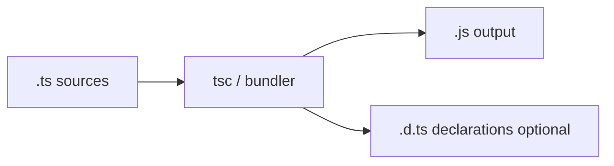

# TypeScript Complete Interview Guide

An interview-focused handbook for TypeScript—from basic types and inference to generics, utility types, React/Node/Mongoose patterns, and production architecture.

---

## Table of Contents

1. [Introduction to TypeScript](#1-introduction-to-typescript)
2. [TypeScript Setup](#2-typescript-setup)
3. [Basic Types](#3-basic-types)
4. [Type Inference](#4-type-inference)
5. [Arrays and Objects](#5-arrays-and-objects)
6. [Union and Intersection Types](#6-union-and-intersection-types)
7. [Type Aliases vs Interfaces](#7-type-aliases-vs-interfaces)
8. [Functions in TypeScript](#8-functions-in-typescript)
9. [Type Narrowing](#9-type-narrowing)
10. [Literal Types](#10-literal-types)
11. [Enums](#11-enums)
12. [Tuples](#12-tuples)
13. [Generics](#13-generics)
14. [Advanced Generics](#14-advanced-generics)
15. [Utility Types](#15-utility-types)
16. [Type Assertions](#16-type-assertions)
17. [Modules in TypeScript](#17-modules-in-typescript)
18. [Classes in TypeScript](#18-classes-in-typescript)
19. [Interfaces Deep Dive](#19-interfaces-deep-dive)
20. [Error Handling](#20-error-handling)
21. [TypeScript with React](#21-typescript-with-react)
22. [TypeScript with Node.js](#22-typescript-with-nodejs)
23. [TypeScript with MongoDB (Mongoose)](#23-typescript-with-mongodb-mongoose)
24. [API Typing](#24-api-typing)
25. [TypeScript Best Practices](#25-typescript-best-practices)
26. [tsconfig Deep Explanation](#26-tsconfig-deep-explanation)
27. [Performance Considerations](#27-performance-considerations)
28. [Common Mistakes](#28-common-mistakes)
29. [TypeScript in Real Projects](#29-typescript-in-real-projects)
30. [Debugging TypeScript](#30-debugging-typescript)
31. [Migration Guide](#31-migration-guide)
32. [Advanced Type Patterns](#32-advanced-type-patterns)
33. [Common Interview Questions (100+)](#33-common-interview-questions-100)
34. [Coding Interview Questions (30+)](#34-coding-interview-questions-30)
35. [Real-World System Design with TypeScript](#35-real-world-system-design-with-typescript)
36. [React + TypeScript Interview Scenarios](#36-react--typescript-interview-scenarios)
37. [Common Interview Traps](#37-common-interview-traps)
38. [Final Revision Cheatsheet](#38-final-revision-cheatsheet)

---

## 1. Introduction to TypeScript

### What is TypeScript?

**TypeScript** is **JavaScript with a static type system**—a **superset** of JS that **compiles (transpiles) to plain JavaScript**. You get editor tooling, safer refactors, and earlier bug detection **before** runtime.

**Interview phrase:** “TypeScript doesn’t run in the browser by itself—we ship **compiled JS**.”

### Why TypeScript was created

Microsoft wanted **large-scale JavaScript** to scale in teams: contracts between modules, safer API evolution, and IDE assistance.

### Problems it solves in JavaScript

| JS pain | TS help |
|--------|---------|
| `undefined` surprises | Catch missing fields at compile time |
| Wrong argument order | Typed parameters |
| Silent refactors break callers | Compiler errors on mismatches |
| Unclear APIs | Types as documentation |
| Large codebases hard to navigate | Jump-to-def, rename |

### TypeScript vs JavaScript

- **JS:** dynamically typed at **runtime**.
- **TS:** adds **static** checking at **compile time**; types **erase** when emitted as JS.

### Compilation concept (TS → JS)



You author `.ts` / `.tsx`; build produces `.js` (and optionally `.d.ts` for libraries).

### Static vs dynamic typing

- **Dynamic (JS):** types of values determined as the program runs.
- **Static (TS):** types checked **before** run; variables/expressions have **predictable** types in the type checker’s model.

**Analogy:** JS is “figure out ingredients while cooking”; TS is “recipe lists ingredients before you start.”

---

## 2. TypeScript Setup

### Installing TypeScript

```bash
npm i -D typescript
npx tsc --init
```

### tsconfig.json explained

The **compiler configuration**: which files, how strict, output module format, JSX, paths.

```json
{
  "compilerOptions": {
    "target": "ES2022",
    "module": "ESNext",
    "moduleResolution": "Bundler",
    "strict": true,
    "jsx": "react-jsx",
    "outDir": "dist",
    "rootDir": "src",
    "skipLibCheck": true
  },
  "include": ["src"]
}
```

### Compiler options (essentials)

- **`strict`:** enables a family of stricter checks (see §26).
- **`target`:** JS language level emitted.
- **`module`:** ESNext vs CommonJS output strategy.
- **`moduleResolution`:** how imports resolve (`Node10`, `NodeNext`, `Bundler`).

### Watch mode

```bash
npx tsc --watch
```

Bundler dev servers (Vite, Next) run TS via **esbuild/swc** with typecheck separate or integrated.

### Project structure

```
src/
  types/        # shared domain types
  lib/
  components/
tsconfig.json
```

---

## 3. Basic Types

```typescript
let s: string = "hi";
let n: number = 1.23; // float + int model
let ok: boolean = true;
let nil: null = null;
let u: undefined = undefined;
```

### `any`

**Opt out** of checking—TS trusts you; defeats safety.

### `unknown`

**Top-safe type**: you must **narrow** before use—preferred over `any`.

```typescript
function parse(input: unknown) {
  if (typeof input === "string") return input.toUpperCase();
  throw new Error("bad");
}
```

### `never`

**No possible value**—exhaustive branches, functions that never return.

### `void`

Function returns **nothing meaningful** (undefined implicitly).

### `any` vs `unknown`

| | `any` | `unknown` |
|---|-------|-----------|
| Assignable from anything | Yes | Yes |
| Assign to most types without checks | Yes | No |
| Safe by default | No | Yes |

**Interview answer:** “Use **`unknown`** for untrusted input; narrow before use.”

---

## 4. Type Inference

TS **infers** types when obvious:

```typescript
const x = 1; // literal 1 (often widened to number depending on context)
let y = "a"; // string
```

### When it works

Initializers, return types of straight-line functions, generic inference.

### When explicit typing helps

Public API exports, empty arrays `[] as User[]`, complex unions, Promise return types for async public functions.

```typescript
async function load(): Promise<User> {
  const res = await fetch("/u");
  return res.json() as User; // or validate with Zod and infer
}
```

---

## 5. Arrays and Objects

```typescript
const nums: number[] = [1, 2];
const names: Array<string> = ["a"];

type User = {
  id: string;
  email: string;
  name?: string; // optional
  readonly role: "admin" | "user";
};

const u: User = { id: "1", email: "a@b.com", role: "user" };
```

### Nested objects

```typescript
type Address = { city: string; zip: string };
type Profile = { user: User; address: Address };
```

### Readonly

```typescript
type RO = Readonly<{ x: number }>;
```

---

## 6. Union and Intersection Types

### Union `|`

Value can be **one of** several types.

```typescript
type Id = string | number;
```

### Intersection `&`

Must satisfy **both** at once.

```typescript
type Timed = { createdAt: Date } & { updatedAt: Date };
```

### Narrowing

```typescript
function fmt(x: string | number) {
  return typeof x === "string" ? x : x.toFixed(2);
}
```

### Real-world

`string | null` for optional server fields; `Success | Error` unions for results.

---

## 7. Type Aliases vs Interfaces

```typescript
type Point = { x: number; y: number };

interface Point2 {
  x: number;
  y: number;
}
```

### Comparison table

| Feature | `interface` | `type` |
|--------|-------------|--------|
| Object shape | Yes | Yes |
| Union / mapped quick | Use `type` | Natural |
| Declaration merging | Yes (same name merges) | No |
| `extends` / `implements` | Yes | `&` for extend-like |
| Performance (large projects) | Slightly faster errors sometimes | Fine |

**Rule of thumb:** **`interface`** for object contracts you may extend; **`type`** for unions, tuples, mapped/conditional gymnastics.

### Interface merging (declaration merging)

```typescript
interface Window {
  myApp: { v: number };
}
```

---

## 8. Functions in TypeScript

```typescript
function add(a: number, b: number): number {
  return a + b;
}

const sub = (a: number, b: number): number => a - b;

function greet(name: string, title?: string): string {
  return title ? `${title} ${name}` : name;
}

function mul(a: number, b = 2): number {
  return a * b;
}
```

### Overloads

```typescript
function fmt(x: string): string;
function fmt(x: number): string;
function fmt(x: string | number): string {
  return typeof x === "string" ? x : String(x);
}
```

---

## 9. Type Narrowing

```typescript
function area(s: string | string[] | Date) {
  if (typeof s === "string") return s.length;
  if (Array.isArray(s)) return s.join(",").length;
  if (s instanceof Date) return s.getTime();
}
```

### `in` operator

```typescript
type A = { kind: "a"; a: number };
type B = { kind: "b"; b: number };
function f(x: A | B) {
  return "a" in x ? x.a : x.b;
}
```

### Custom type guards

```typescript
function isUser(x: unknown): x is User {
  return typeof x === "object" && x !== null && "email" in x;
}
```

---

## 10. Literal Types

```typescript
type Ok = "ok" | "error";
type Dice = 1 | 2 | 3 | 4 | 5 | 6;

let e: "east" = "east";

type Method = "GET" | "POST";
```

Combines with unions for **finite state** modeling.

---

## 11. Enums

### Numeric

```typescript
enum Dir { Up, Down, }
```

### String

```typescript
enum Role {
  Admin = "ADMIN",
  User = "USER",
}
```

### `const enum`

Inlines values—fewer runtime objects; **tradeoffs** with bundlers/isolatedModules.

### When NOT to use enums

Prefer **string literal unions** for simpler emitted JS and tree-shaking ergonomics:

```typescript
type Role2 = "ADMIN" | "USER";
```

**Interview tip:** Many teams ban non-const enums; unions + `as const` objects are idiomatic.

---

## 12. Tuples

Fixed **shape** arrays:

```typescript
type Pair = [string, number];
const p: Pair = ["a", 1];

type RGB = readonly [number, number, number];
```

**Use:** coordinates, CSV row representation, `useState` tuple feel.

---

## 13. Generics

**Parameterize types** like functions parameterize values.

```typescript
function first<T>(xs: T[]): T | undefined {
  return xs[0];
}
```

### Generic interface

```typescript
type ApiResult<T> = { data: T; error?: string };
```

### Generic class

```typescript
class Box<T> {
  constructor(public v: T) {}
}
```

### Constraints

```typescript
function keys<T extends object>(o: T) {
  return Object.keys(o) as (keyof T)[];
}
```

### React + API example

```typescript
type Paginated<T> = { items: T[]; nextCursor: string | null };

async function fetchJson<T>(url: string): Promise<T> {
  const r = await fetch(url);
  if (!r.ok) throw new Error(String(r.status));
  return r.json() as T; // better: Zod parse -> infer
}

async function loadUsers(): Promise<Paginated<User>> {
  return fetchJson("/api/users");
}
```

---

## 14. Advanced Generics

```typescript
type User = { id: string; name: string; age: number };

type K = keyof User; // "id" | "name" | "age"

declare const u: User;
type T = typeof u; // User

type Name = User["name"]; // string

type ReadonlyUser = { readonly [P in keyof User]: User[P] };

type AwaitedType<T> = T extends Promise<infer U> ? U : T;
```

**Indexed access:** pick field types from objects.

**Mapped types:** transform each property.

**Conditional types:** `T extends X ? A : B`.

---

## 15. Utility Types

```typescript
type U = Partial<User>;
type R = Required<User>;
type RO = Readonly<User>;
type P = Pick<User, "id" | "email">;
type O = Omit<User, "age">;
type RMap = Record<string, User>;
type X = Exclude<"a" | "b" | "c", "c">; // "a" | "b"
type E = Extract<"a" | "b" | "c", "a" | "d">; // "a"
```

**`NonNullable<T>`**—removes null/undefined from `T`.

---

## 16. Type Assertions

```typescript
const el = document.getElementById("root") as HTMLDivElement;
```

**Risks:** You can lie to the compiler—**runtime** may still crash.

**Prefer** narrowing, type guards, validation libraries.

**Angle-bracket assertion** (avoid in `.tsx`):

```typescript
const x = <string>unknownValue;
```

---

## 17. Modules in TypeScript

```typescript
export type User = { id: string };
export default function create() {}

import create, { type User } from "./mod";
```

### Namespaces

`namespace` is **legacy** module pattern—prefer **ES modules**.

### ESM vs CJS interop

`moduleResolution` + `esModuleInterop` — know **default import** quirks from CommonJS.

---

## 18. Classes in TypeScript

```typescript
class Greeter {
  public name: string;
  private secret: string;
  protected tag: string;

  constructor(name: string) {
    this.name = name;
    this.secret = "x";
    this.tag = "y";
  }

  greet(): string {
    return `Hi ${this.name}`;
  }
}

abstract class Base {
  abstract id(): string;
}
```

### `readonly` fields

```typescript
class Account {
  readonly id: string;
  constructor(id: string) { this.id = id; }
}
```

### Parameter properties

```typescript
class User2 {
  constructor(public email: string) {}
}
```

---

## 19. Interfaces Deep Dive

```typescript
interface HasId { id: string; }
interface User3 extends HasId { name: string; }

class C implements User3 {
  id = "1";
  name = "A";
}
```

### Advanced: interface vs type

Interfaces **merge** across files for ambient extension (e.g. **module augmentation**).

```typescript
declare module "axios" {
  export interface AxiosRequestConfig {
    requestId?: string;
  }
}
```

---

## 20. Error Handling

```typescript
class HttpError extends Error {
  constructor(public status: number, message: string) {
    super(message);
    this.name = "HttpError";
  }
}

function isHttpError(e: unknown): e is HttpError {
  return e instanceof HttpError;
}

try {
  // ...
} catch (e: unknown) {
  if (isHttpError(e)) console.log(e.status);
  else throw e;
}
```

**Never** `catch (e: any)` in strict code—use `unknown`.

---

## 21. TypeScript with React

### Props

```tsx
type BtnProps = { label: string; onClick?: () => void };

export function Btn({ label, onClick }: BtnProps) {
  return <button onClick={onClick}>{label}</button>;
}
```

### State

```tsx
const [user, setUser] = useState<User | null>(null);
const [items, setItems] = useState<string[]>([]);
```

### Events

```tsx
function Field() {
  const onChange = (e: React.ChangeEvent<HTMLInputElement>) => {
    console.log(e.target.value);
  };
  return <input onChange={onChange} />;
}
```

### `useRef`

```tsx
const r = useRef<HTMLInputElement | null>(null);
r.current?.focus();
```

### `React.FC` vs plain functions

```tsx
// Many teams prefer plain function + explicit props type (no implicit children)
export function Card(props: { title: string; children?: React.ReactNode }) {
  return <section><h2>{props.title}</h2>{props.children}</section>;
}
```

`React.FC` historically adds **`children` optional** implicitly—can surprise; **plain functions** are common in modern codebases.

---

## 22. TypeScript with Node.js

### Express (minimal pattern)

```typescript
import express, { type Request, type Response, type NextFunction } from "express";

const app = express();

app.get("/u/:id", (req: Request<{ id: string }>, res: Response) => {
  res.json({ id: req.params.id });
});

type AuthedReq = Request & { user?: { id: string } };

function requireAuth(req: AuthedReq, res: Response, next: NextFunction) {
  if (!req.user) return res.sendStatus(401);
  next();
}
```

### Env variables

```typescript
const envSchema = z.object({
  NODE_ENV: z.enum(["development", "test", "production"]),
  PORT: z.coerce.number().default(3000),
  JWT_SECRET: z.string().min(10),
});

export const env = envSchema.parse(process.env);
```

Use **Zod** or **envalid**—avoid `as string` on `process.env.X`.

---

## 23. TypeScript with MongoDB (Mongoose)

```typescript
import mongoose, { Schema, type InferSchemaType, type Model } from "mongoose";

const userSchema = new Schema(
  {
    email: { type: String, required: true, unique: true },
    name: { type: String },
  },
  { timestamps: true }
);

type UserDoc = InferSchemaType<typeof userSchema>;
export type User = UserDoc & { _id: mongoose.Types.ObjectId };

export const UserModel: Model<User> = mongoose.model("User", userSchema);
```

### Pitfalls

- `lean()` returns **plain objects**—not full document methods.
- **Populated** fields need **overloads** or separate types (`User & { posts: Post[] }`).
- Avoid **`any`** on `Schema`—use generics + inference.

---

## 24. API Typing

### Request DTO

```typescript
export type CreateUserDto = { email: string; name: string };
```

### Response DTO

```typescript
export type UserDto = { id: string; email: string; name: string | null };
```

### Shared types (monorepo)

`packages/shared-types/src/user.ts` imported by **frontend** and **backend**—**Zod schema** can be single source of truth with `z.infer`.

---

## 25. TypeScript Best Practices

- Enable **`strict`**; avoid `any`.
- **Prefer `unknown`** at boundaries; validate with **Zod/io-ts**.
- **`type` imports:** `import type { X }` to elide value imports.
- **Narrow exports:** export **`type`** for consumers.
- **`satisfies`** operator for inference + checking:

```typescript
const cfg = { port: 3000, host: "0.0.0.0" } as const satisfies { port: number; host: string };
```

---

## 26. tsconfig Deep Explanation

| Flag | Meaning |
|------|---------|
| **`strict`** | Enables `strictNullChecks`, `noImplicitAny`, etc. |
| **`noImplicitAny`** | Error on implicit any |
| **`strictNullChecks`** | `null`/`undefined` separate from all types |
| **`target`** | Output syntax level |
| **`module`** | Module emit style |
| **`baseUrl` / `paths`** | Aliases `@/components` |

```json
{
  "compilerOptions": {
    "baseUrl": ".",
    "paths": { "@/*": ["src/*"] }
  }
}
```

---

## 27. Performance Considerations

- **`skipLibCheck: true`** speeds checks by skipping `.d.ts` validation.
- **`incremental: true`** + `.tsbuildinfo` for faster rebuilds.
- **Project references** split huge repos.
- **IDE:** use the **TypeScript language server**; split oversized files.

---

## 28. Common Mistakes

| Mistake | Fix |
|---------|-----|
| `any` everywhere | `unknown` + guards / Zod |
| `as` to silence errors | Fix types or validate |
| Huge union explosion | Discriminated unions, entities maps |
| Generics for one-off | Concrete types first |
| Ignoring `strictNullChecks` | Model optionality honestly |

---

## 29. TypeScript in Real Projects

### MERN + TS layout

```
apps/web/        # React + Vite/Next
apps/api/        # Express
packages/types/  # shared DTOs + zod
```

### Shared types folder

`packages/types` with **`z.infer`** from canonical schemas avoids drift.

### Scalable architecture

- Domain types **near** features
- **Ports/adapters** typed interfaces for infra (DB/email)

---

## 30. Debugging TypeScript

### Reading errors

Start at the **first** error—later errors often cascade.

### IntelliSense

Hover types, **Go to Definition**, **`tsserver`** restart when stale.

### Common patterns

- `Type 'X' is not assignable to 'Y'` → trace **union** / **`undefined`**.
- `Property does not exist` → typo vs wrong narrowing.
- `Excessive stack depth` → recursive type gone wrong—simplify.

---

## 31. Migration Guide

### Gradual JS → TS

1. **`allowJs: true`**, rename files incrementally to `.ts`.
2. Add **`checkJs`** optionally for JSDoc types.
3. Introduce **strict** file by file or enable team-wide after baseline.
4. Add **`types`** for critical modules first.

### React project

`npm create vite@latest` TS template or Next.js TypeScript flag; convert **leaf components** first; add **shared** types for API contracts.

---

## 32. Advanced Type Patterns

### Discriminated unions + exhaustive check

```typescript
type Ev = { kind: "click"; x: number } | { kind: "key"; key: string };

function handle(e: Ev): string {
  switch (e.kind) {
    case "click":
      return String(e.x);
    case "key":
      return e.key;
    default: {
      const _exhaustive: never = e;
      return _exhaustive;
    }
  }
}
```

### API response modeling

```typescript
type ApiOk<T> = { ok: true; data: T };
type ApiErr = { ok: false; error: string };
type Api<T> = ApiOk<T> | ApiErr;
```

---

## 33. Common Interview Questions (100+)

> **Model answers** for spoken depth; blocks are rapid revision.

### Model answers

**Why TypeScript over JavaScript for teams?**  
Types act as **checked documentation** and catch many bugs at **compile time**—especially around **null**, refactors, and evolving APIs. The cost is tooling setup and occasional friction fighting the compiler, which pays off as the codebase grows.

**When would you use `unknown` instead of `any`?**  
For **any external input**—JSON.parse, HTTP bodies, third-party callbacks—model as `unknown`, then **narrow** with `typeof`, guards, or a schema parser. `any` disables checking and spreads unsafety.

**What is structural typing?**  
TS compares types by **shape** (compatible properties), not nominal names—two interfaces with the same fields are assignable if shapes match. This differs from **nominal** languages (Java/C# names matter).

### Beginner (1–40)

**Q1.** What is TypeScript? **A.** Typed superset of JS compiling to JS.  
**Q2.** Who maintains TS? **A.** Microsoft; open-source.  
**Q3.** `tsc` role? **A.** Typecheck + transpile.  
**Q4.** Is TS a runtime type system? **A.** Types erase at runtime (except decorators/metadata experiments).  
**Q5.** `any` meaning? **A.** Turn off type checking.  
**Q6.** `unknown` meaning? **A.** Safe top type; narrow before use.  
**Q7.** `never` meaning? **A.** Uninhabited type; impossible values.  
**Q8.** `void` vs `undefined` in returns? **A.** `void` for “ignore return”; `undefined` explicit value type.  
**Q9.** Strict mode? **A.** Family of stricter compiler options.  
**Q10.** `null` vs `undefined` in TS? **A.** Often both with `strictNullChecks`; model intent (missing vs absent).  
**Q11.** Type inference example? **A.** `const x = 1` inferred number.  
**Q12.** Why explicit return types? **A.** Public API stability/readability.  
**Q13.** Tuple vs array? **A.** Fixed positions/types vs homogeneous list.  
**Q14.** Union type? **A.** `A | B`.  
**Q15.** Intersection type? **A.** `A & B` must satisfy both.  
**Q16.** Optional property syntax? **A.** `name?: string`.  
**Q17.** `readonly` modifier? **A.** Immutable field at type level.  
**Q18.** Interface vs type object? **A.** Both; interfaces merge; types better for unions.  
**Q19.** Declaration merging example? **A.** Extend `Window` interface.  
**Q20.** Type assertion risk? **A.** Can be wrong at runtime.  
**Q21.** `typeof` narrowing? **A.** typeof operator in condition.  
**Q22.** `instanceof` narrowing? **A.** Class instances.  
**Q23.** `in` narrowing? **A.** Property existence discriminant.  
**Q24.** Literal types? **A.** `"on" | "off"`.  
**Q25.** Why avoid enums? **A.** Use unions/`as const` objects for simpler emit.  
**Q26.** String enum runtime? **A.** Exists as object at runtime.  
**Q27.** `const` assertion? **A.** `as const` freezes literals/types.  
**Q28.** Generics purpose? **A.** Reusable typed containers/functions.  
**Q29.** Constraint keyword? **A.** `extends` on generic.  
**Q30.** `keyof`? **A.** Union of keys of type.  
**Q31.** `Partial<T>`? **A.** All props optional.  
**Q32.** `Pick<T,K>`? **A.** Subset properties.  
**Q33.** `Omit<T,K>`? **A.** Exclude property keys.  
**Q34.** `Record<K,V>`? **A.** Map keys to values type.  
**Q35.** `Exclude` vs `Extract`? **A.** Remove vs keep union members.  
**Q36.** `import type`? **A.** Type-only import elided in emit.  
**Q37.** `public/private` in TS classes? **A.** Erased; only compile-time visibility.  
**Q38.** `abstract` class? **A.** Cannot instantiate; forces subclasses.  
**Q39.** `implements`? **A.** Class checks against interface.  
**Q40.** `unknown` in catch (TS 4.4+ use)? **A.** Prefer `unknown` vs `any`.  

### Intermediate (41–80)

**Q41.** Structural typing example? **A.** `{x:1}` assignable to `{x:number}`.  
**Q42.** Excess property checking? **A.** Object literal extra props error in some contexts.  
**Q43.** Widening vs narrowing? **A.** Generalize vs refine unions.  
**Q44.** Discriminated union? **A.** Common `kind` field.  
**Q45.** Exhaustiveness checking via `never`? **A.** Default branch assignment.  
**Q46.** Function overloads why? **A.** Multiple call signatures, one implementation.  
**Q47.** `this` typing in functions? **A.** `this` parameter first pseudo-parameter.  
**Q48.** `void` callback return ignored? **A.** Substitutability with functions returning values.  
**Q49.** Generic defaults? **A.** `T = string`.  
**Q50.** `infer` keyword? **A.** Introduce type variable in conditional.  
**Q51.** `ReturnType<T>`? **A.** Utility extracts function return.  
**Q52.** `Parameters<T>`? **A.** Tuple of params.  
**Q53.** `Awaited<T>`? **A.** Unwrap Promise-like (modern utility).  
**Q54.** Indexed access `T["k"]`? **A.** Property type lookup.  
**Q55.** Mapped type `in keyof`? **A.** Transform properties.  
**Q56.** `+readonly` / `-readonly`? **A.** Modifier remapping.  
**Q57.** Template literal types? **A.** String pattern types.  
**Q58.** `satisfies` operator? **A.** Check without widening literal.  
**Q59.** `const enum` pitfalls? **A.** `isolatedModules` erasure issues—careful.  
**Q60.** `namespace` vs ES module? **A.** Prefer ES modules.  
**Q61.** Triple-slash references? **A.** Legacy `.d.ts` include.  
**Q62.** `declare` keyword? **A.** Ambient typings without implementation.  
**Q63.** `global` augmentation? **A.** Extend global types.  
**Q64.** `moduleResolution` bundler? **A.** For Vite/esbuild pipelines.  
**Q65.** `esModuleInterop`? **A.** Better CJS default interop.  
**Q66.** `skipLibCheck` tradeoff? **A.** Speed vs skipping `.d.ts` errors.  
**Q67.** Path aliases runtime? **A.** Tooling must resolve (tsconfig-paths/tsx).  
**Q68.** `jsx` option `react-jsx`? **A.** New JSX transform.  
**Q69.** `strictPropertyInitialization`? **A.** Class fields must init.  
**Q70.** definite assignment assertion `!`? **A.** Tell compiler assigned—risky.  
**Q71.** Branded types pattern? **A.** Nominal-like tagging `string & { __brand: "Email" }`.  
**Q72.** Type predicate vs assertion function? **A.** `x is T` custom guard.  
**Q73.** Assertion functions TS 3.7+? **A.** `asserts x is string`.  
**Q74.** Variance concept? **A.** Function params contravariant—advanced.  
**Q75.** Bivariant hack for callbacks (legacy)? **A.** `strictFunctionTypes` nuances.  
**Q76.** `ReadonlyArray<T>`? **A.** Immutable array interface.  
**Q77.** `as const` deep? **A.** Recursive readonly literals.  
**Q78.** `enum` reverse mapping numeric? **A.** Numeric enums bidirectional.  
**Q79.** Declaration maps? **A.** `declarationMap` for jump-to TS in libs.  
**Q80.** Composite projects? **A.** `references` build graph.  

### Advanced (81–120)

**Q81.** Recursive conditional depth limit? **A.** Compiler stops—factor types.  
**Q82.** Higher-kinded types emulation? **A.** Generic workarounds—no real HKT.  
**Q83.** Variance on `strictFunctionTypes`? **A.** Safer callback checking.  
**Q84.** `unique symbol` branding? **A.** Opaque nominal tags.  
**Q85.** Template union distribution? **A.** `Union` distributes over conditionals.  
**Q86.** `noUncheckedIndexedAccess`? **A.** Indexing adds `undefined`.  
**Q87.** Exact types? **A.** Not native—patterns approximate.  
**Q88.** Type-level programming limits? **A.** Turing complete but painful—prefer runtime validation for complex.  
**Q89.** `isolatedModules` why? **A.** Each file isolated for Babel/esbuild transforms.  
**Q90.** `verbatimModuleSyntax`? **A.** Enforce `import type` purity.  
**Q91.** `using` / disposal (TS 5.2)? **A.** Explicit resource management awareness.  
**Q92.** Decorators stage 3 support? **A.** Modern TS versions—config flag.  
**Q93.** `const` type parameters (TS 5.0)? **A.** Infer literals in generics.  
**Q94.** `satisfies` vs `as`? **A.** Safer—doesn't widen incorrectly.  
**Q95.** Project references benefits? **A.** Faster incremental multi-package.  
**Q96.** `types` field in package.json? **A.** Entry for `.d.ts`.  
**Q97.** DefinitelyTyped @types packages? **A.** Community typings.  
**Q98.** Module augmentation axios? **A.** Extend `AxiosRequestConfig`.  
**Q99.** `export =` / `import =` legacy? **A.** CommonJS interop old style.  
**Q100.** `namespace` merge with function? **A.** Advanced pattern—rare.  
**Q101.** Conditional returns in overloads? **A.** Careful overlap.  
**Q102.** Distributive conditional trick? **A.** Wrap `T` in tuple to stop distribution.  
**Q103.** `infer` multiple? **A.** Variadic tuple inference patterns.  
**Q104.** `NoInfer<T>` utility (TS 5.4)? **A.** Block unwanted inference sites.  
**Q105.** satisfies + const enum interplay? **A.** Know project conventions.  
**Q106.** Exact optional property types? **A.** `exactOptionalPropertyTypes` flag nuances.  
**Q107.** Flow comparison? **A.** TS won ecosystem—interview trivia.  
**Q108.** Soundness holes? **A.** TS not fully sound—numbers/indexing quirks.  
**Q109.** Type guards narrowing arrays? **A.** `filter` needs predicate type guard for narrowing.  
**Q110.** User-defined type guard with `filter`? **A.** `.filter((x): x is Foo => ...)`  
**Q111.** Assertion vs guard? **A.** Assertion trusts; guard proves.  
**Q112.** JSON `unknown` pipeline? **A.** Zod `parse`.  
**Q113.** `z.infer<typeof Schema>`? **A.** Types from schema single source.  
**Q114.** `satisfies` Zod schema export? **A.** Keep literal narrowing.  
**Q115.** Express generics `Request<P,ResBody,ReqBody>`? **A.** Params/body typing.  
**Q116.** Prisma generated types? **A.** DB schema → types.  
**Q117.** tRPC end-to-end typing? **A.** Router types to client—mention in full-stack interviews.  
**Q118.** GraphQL codegen? **A.** Generate TS types from schema.  
**Q119.** ESLint `@typescript-eslint` strict? **A.** Lint + type-aware rules.  
**Q120.** `T` naming conventions? **A.** `TData`, `TItem`, `TError` read clearer.  

---

## 34. Coding Interview Questions (30+)

### 1) Typed `pick` clone

```typescript
function pick<T extends object, K extends keyof T>(obj: T, keys: K[]): Pick<T, K> {
  const out = {} as Pick<T, K>;
  for (const k of keys) out[k] = obj[k];
  return out;
}
```

### 2) `isNonNull` guard

```typescript
export function isNonNull<T>(x: T | null | undefined): x is T {
  return x != null;
}
```

### 3) `compact` array

```typescript
export function compact<T>(xs: (T | null | undefined)[]): T[] {
  return xs.filter(isNonNull);
}
```

### 4) API response narrow

```typescript
type Success<T> = { status: "ok"; data: T };
type Fail = { status: "error"; message: string };
type Resp<T> = Success<T> | Fail;

export function unwrap<T>(r: Resp<T>): T {
  if (r.status === "error") throw new Error(r.message);
  return r.data;
}
```

### 5) Deep readonly (one level interview)

```typescript
type DeepRO<T> = { readonly [K in keyof T]: T[K] extends object ? DeepRO<T[K]> : T[K] };
```

### 6) `Entries` helper

```typescript
type Entries<T> = { [K in keyof T]: [K, T[K]] }[keyof T][];

function entries<T extends object>(o: T): Entries<T> {
  return Object.entries(o) as Entries<T>;
}
```

### 7) Event map typing

```typescript
type EvMap = { click: { x: number }; key: { code: string } };

function on<K extends keyof EvMap>(type: K, fn: (p: EvMap[K]) => void) {
  // ...
}
```

### 8) `omit` implementation type-level known

```typescript
function omit<T extends object, K extends keyof T>(obj: T, keys: K[]): Omit<T, K> {
  const out = { ...obj };
  for (const k of keys) delete (out as any)[k];
  return out;
}
```

### 9) `PartialBy` utility

```typescript
type PartialBy<T, K extends keyof T> = Omit<T, K> & Partial<Pick<T, K>>;
```

### 10) `RequiredBy`

```typescript
type RequiredBy<T, K extends keyof T> = Omit<T, K> & Required<Pick<T, K>>;
```

### 11) `PromiseValue`

```typescript
type PromiseValue<T> = T extends Promise<infer U> ? U : T;
```

### 12) `TupleToUnion`

```typescript
type TupleToUnion<T extends readonly unknown[]> = T[number];
```

### 13) Const object to union

```typescript
const Roles = { Admin: "ADMIN", User: "USER" } as const;
type Role = (typeof Roles)[keyof typeof Roles];
```

### 14) Zod parse wrapper

```typescript
import { z } from "zod";

export function parseOrThrow<T extends z.ZodTypeAny>(schema: T, input: unknown): z.infer<T> {
  return schema.parse(input);
}
```

### 15) Express typed async handler factory

```typescript
import type { RequestHandler } from "express";

export const asyncHandler =
  <P = {}, ResBody = any, ReqBody = any, Q = any>(
    fn: (req: Request<P, ResBody, ReqBody, Q>, res: any, next: any) => Promise<void>
  ): RequestHandler<P, ResBody, ReqBody, Q> =>
  (req, res, next) =>
    Promise.resolve(fn(req as any, res, next)).catch(next);
```

### 16) React typed children render prop

```typescript
type Props<T> = { items: T[]; renderItem: (item: T) => React.ReactNode };

export function List<T>({ items, renderItem }: Props<T>) {
  return <ul>{items.map((it, i) => <li key={i}>{renderItem(it)}</li>)}</ul>;
}
```

### 17) `useStableCallback` sketch (typed)

```typescript
import { useCallback, useRef, useEffect } from "react";

export function useStableCallback<T extends (...a: any[]) => any>(fn: T): T {
  const ref = useRef(fn);
  useEffect(() => {
    ref.current = fn;
  }, [fn]);
  return useCallback(((...a: Parameters<T>) => ref.current(...a)) as T, []);
}
```

### 18) Form state typed reducer

```typescript
type S = { email: string; err?: string };
type A = { type: "set"; v: string } | { type: "blur" };

function reducer(s: S, a: A): S {
  switch (a.type) {
    case "set":
      return { ...s, email: a.v, err: undefined };
    case "blur":
      return s.email.includes("@") ? s : { ...s, err: "Bad email" };
    default:
      return s;
  }
}
```

### 19) `Result` type flatMap

```typescript
type Ok<T> = { ok: true; value: T };
type Err<E> = { ok: false; error: E };
type Result<T, E> = Ok<T> | Err<E>;

function map<T, U, E>(r: Result<T, E>, f: (t: T) => U): Result<U, E> {
  return r.ok ? { ok: true, value: f(r.value) } : r;
}
```

### 20) Indexed query builder (safe keys)

```typescript
function orderBy<T extends object, K extends keyof T & string>(field: K, dir: "asc" | "desc") {
  return { field, dir } as const;
}
```

### 21) Mongoose lean typed helper

```typescript
import type { FlattenMaps } from "mongoose";

export type LeanDoc<T> = FlattenMaps<T> & { _id: string };
```

### 22) DTO mapper explicit

```typescript
type UserEntity = { _id: string; email: string; passwordHash: string };
type UserDto = { id: string; email: string };

export function toDto(u: UserEntity): UserDto {
  return { id: u._id, email: u.email };
}
```

### 23) `assert` function

```typescript
export function assert(cond: unknown, msg: string): asserts cond {
  if (!cond) throw new Error(msg);
}
```

### 24) `narrowString`

```typescript
export function isString(x: unknown): x is string {
  return typeof x === "string";
}
```

### 25) `Merge<T,U>`

```typescript
type Merge<T, U> = Omit<T, keyof U> & U;
```

### 26) String join typed (tuple)

```typescript
function join<T extends readonly string[]>(xs: T, sep: string): string {
  return xs.join(sep);
}
```

### 27) `ExtractId` from branded

```typescript
type UserId = string & { readonly brand: unique symbol };
function makeUserId(x: string): UserId {
  return x as UserId;
}
```

### 28) Readonly tuple coords

```typescript
type Point = readonly [number, number];
function move(p: Point, d: Point): Point {
  return [p[0] + d[0], p[1] + d[1]] as const;
}
```

### 29) keyof filter symbols out in practice-interview note

```typescript
type StringKeys<T> = Extract<keyof T, string>;
```

### 30) `Optional` deep one-level

```typescript
type Optional<T> = { [K in keyof T]?: T[K] };
```

### 31–32) Bonus

- **31:** `NoInfer<T>` to stop wrong generic inference at call site (TS 5.4).  
- **32:** `const` type parameters: `function makeArray<const T extends readonly string[]>(xs: T) { return xs; }`  

---

## 35. Real-World System Design with TypeScript

### Scalable type architecture

- **Single source of truth** for API contracts: **Zod/OpenAPI** → types.
- **Boundary validation**: unknown → domain types at IO edges.
- **Layering**: `domain/` pure types, `infra/` adapters implementing ports.

### Shared backend/frontend types

Monorepo package **`@acme/schemas`** consumed by Next and Express; CI fails on drift.

### Monorepo usage

**pnpm workspaces + Turborepo**; `tsconfig` references per package; **one** eslint typescript project service.

---

## 36. React + TypeScript Interview Scenarios

### Props drilling

Use **composition** or **context** typed with `createContext<User | null>(null)` + guard hook `useUser(): User`.

### Custom hooks

```typescript
export function useDebounce<T>(value: T, ms: number): T {
  const [v, setV] = useState(value);
  useEffect(() => {
    const t = setTimeout(() => setV(value), ms);
    return () => clearTimeout(t);
  }, [value, ms]);
  return v;
}
```

### Event typing

Prefer **`React.FormEvent`**, **`ChangeEvent`**, **`MouseEvent`** with element generic.

### Forms

**`react-hook-form` + `zodResolver`** infer `z.infer<typeof schema>` as form values.

---

## 37. Common Interview Traps

| Trap | Reality |
|------|---------|
| “TS types exist at runtime” | Erased except emitted metadata/decorators experiments |
| “`interface` faster than `type` always” | Marginal; choose semantics |
| “`as` fixes it” | Often hides bugs |
| “`any` is fine temporarily” | Spreads through inference |
| “Enums are idiomatic” | Many prefer unions/`as const` |
| “`React.FC` required” | Plain functions common |
| **Structural assignability** | Extra properties on **variables** vs **literals** differ—excess property checks |

---

## 38. Final Revision Cheatsheet

### One-page brain dump

- **`unknown` in, validated, typed out**
- **Discriminated unions + `never` exhaust**
- **Generics with `extends` constraints**
- **`keyof` / mapped / `infer`** for advanced utility types
- **`import type` / `export type`**
- **`satisfies` > careless `as`**
- **Strict on**; **`any` off**
- **Boundary**: Zod at HTTP/JSON
- **React**: props/types for events/refs; minimize Client boundary

### Mini table

| Need | Reach for |
|------|-----------|
| Optional all fields | `Partial<T>` |
| Remove keys | `Omit<T,K>` |
| Subtype keys | `Pick<T,K>` |
| Map structure | `Record<K,V>` |
| Safe unknown | `unknown` + Zod |
| API result | `Result<T,E>` / discriminated union |

---

**End of guide.** Use alongside `JavaScript-Complete-Interview-Guide.md`, `ReactJS-Complete-Interview-Guide.md`, `NextJS-Complete-Interview-Guide.md`, and `NodeJS-ExpressJS-Complete-Interview-Guide.md` for stacked MERN + TS prep.
